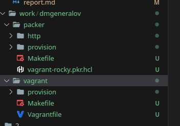
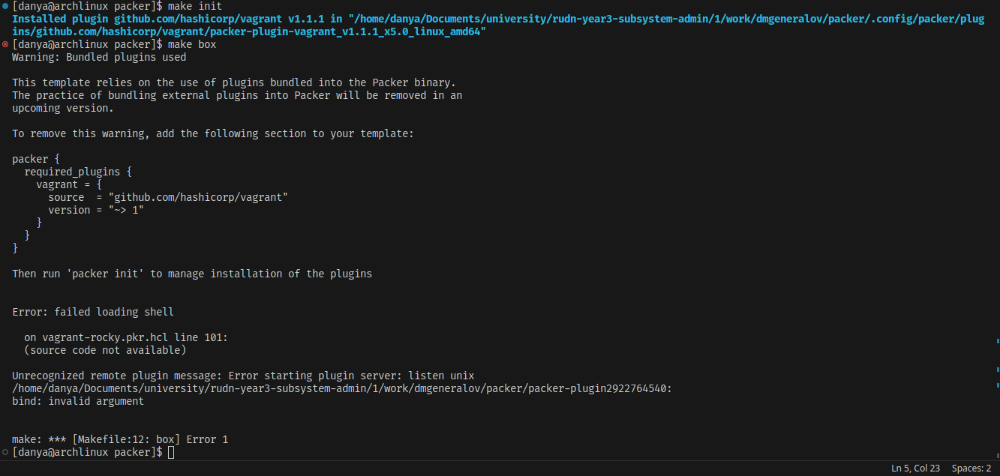
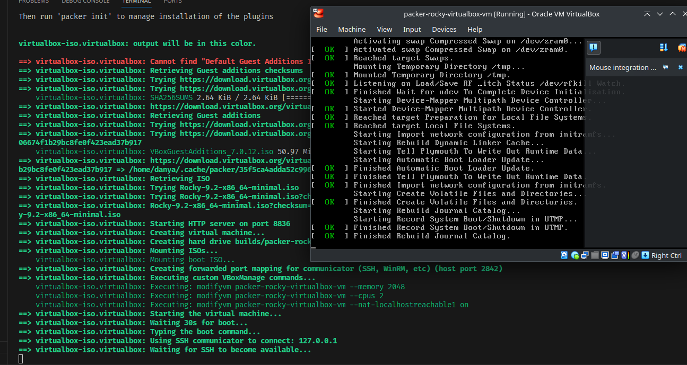
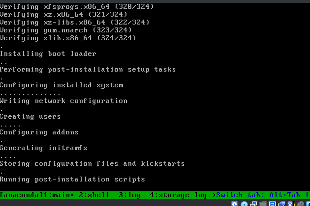
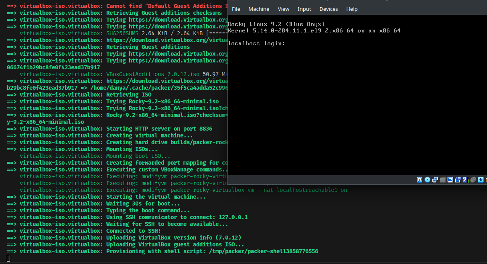
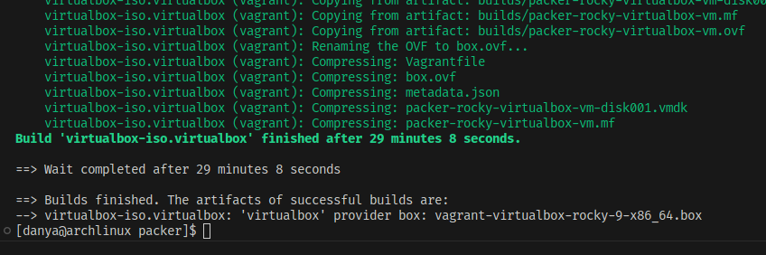
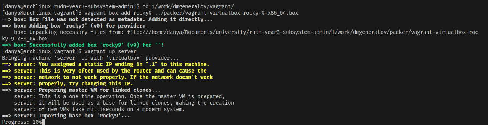
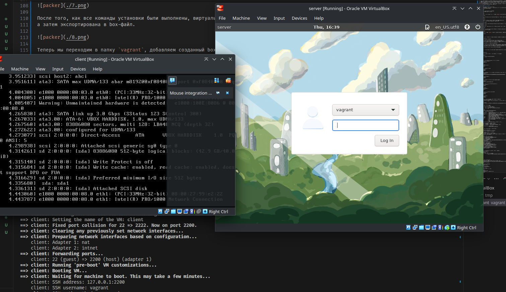

# Цель работы

> Целью данной работы является приобретение практических навыков установки Rocky Linux на виртуальную машину с помощью инструмента Vagrant.

# Задание

> 1. Сформируйте box-файл с дистрибутивом Rocky Linux для VirtualBox (см. раздел 1.4.2 или 1.4.3).
> 2. Запустите виртуальные машины сервера и клиента и убедитесь в их работоспособности.
> 3. Внесите изменения в настройки загрузки образов виртуальных машин server и client, добавив пользователя с правами администратора и изменив названия хостов (см. раздел 1.4.4).
> 4. Скопируйте необходимые для работы с Vagrant файлы и box-файлы виртуальных машин на внешний носитель. Используя эти файлы, вы можете попробовать развернуть виртуальные машины на другом компьютере.

# Выполнение

## Git

## Git

## Packer

## Packer

## Virtualbox

## Virtualbox

## Packer

## Packer

## Vagrant

## Vagrant

# Выводы

Я получил опыт работы с Packer для создания box-файлов и Vagrant для запуска их. 
