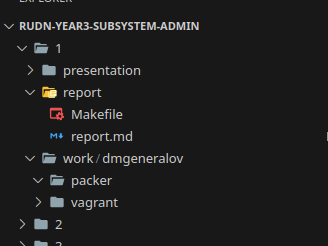
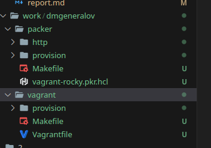
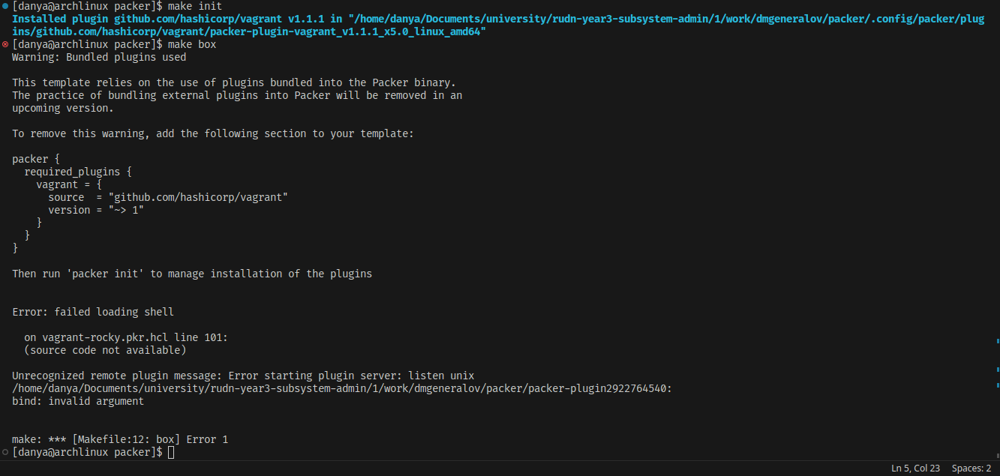
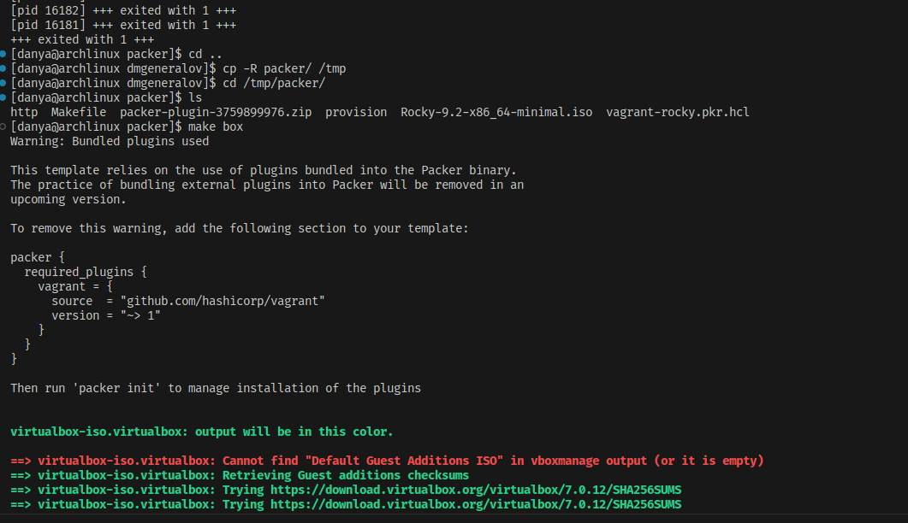
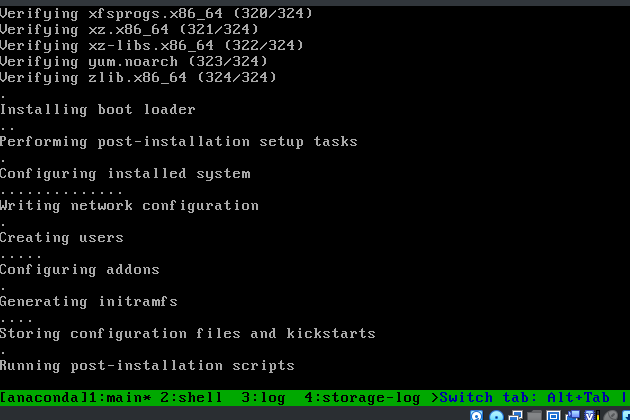
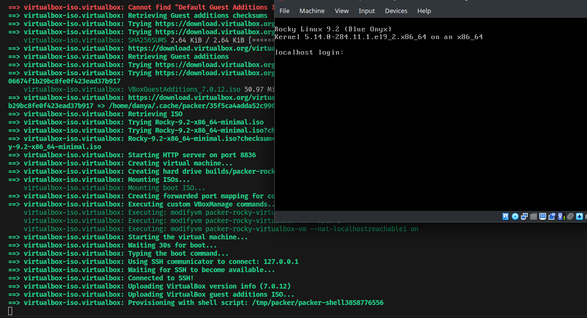
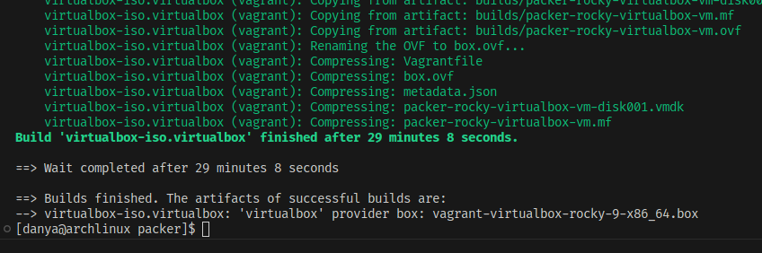
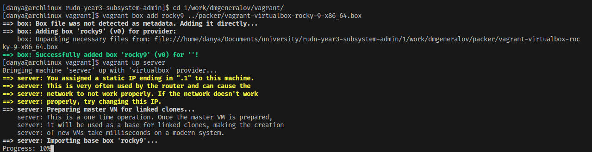
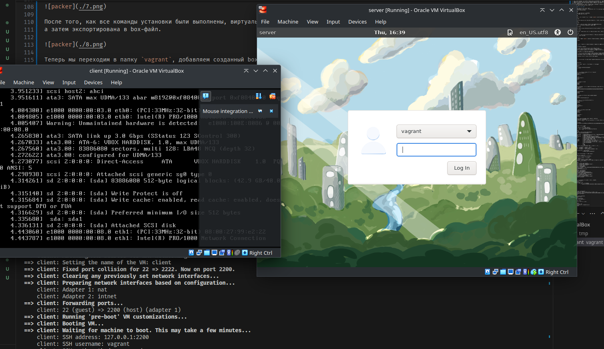

---
## Front matter
title: "Отчет по лабораторной работе 1"
subtitle: ""
author: "Генералов Даниил, НПИбд-01-21, 1032202280"

## Generic otions
lang: ru-RU
toc-title: "Содержание"


## Pdf output format
toc: true # Table of contents
toc-depth: 2
lof: true # List of figures
lot: true # List of tables
fontsize: 12pt
linestretch: 1.5
papersize: a4
documentclass: scrreprt
## I18n polyglossia
polyglossia-lang:
  name: russian
  options:
	- spelling=modern
	- babelshorthands=true
polyglossia-otherlangs:
  name: english
## I18n babel
babel-lang: russian
babel-otherlangs: english
## Fonts
mainfont: PT Serif
romanfont: PT Serif
sansfont: PT Sans
monofont: PT Mono
mainfontoptions: Ligatures=TeX
romanfontoptions: Ligatures=TeX
sansfontoptions: Ligatures=TeX,Scale=MatchLowercase
monofontoptions: Scale=MatchLowercase,Scale=0.9
## Biblatex
biblatex: true
biblio-style: "gost-numeric"
biblatexoptions:
  - parentracker=true
  - backend=biber
  - hyperref=auto
  - language=auto
  - autolang=other*
  - citestyle=gost-numeric
## Pandoc-crossref LaTeX customization
figureTitle: "Рис."
tableTitle: "Таблица"
listingTitle: "Листинг"
lofTitle: "Список иллюстраций"
lotTitle: "Список таблиц"
lolTitle: "Листинги"
## Misc options
indent: true
header-includes:
  - \usepackage{indentfirst}
  - \usepackage{float} # keep figures where there are in the text
  - \floatplacement{figure}{H} # keep figures where there are in the text
---

# Цель работы

> Целью данной работы является приобретение практических навыков установки Rocky Linux на виртуальную машину с помощью инструмента Vagrant.

# Задание

> 1. Сформируйте box-файл с дистрибутивом Rocky Linux для VirtualBox (см. раздел 1.4.2 или 1.4.3).
> 2. Запустите виртуальные машины сервера и клиента и убедитесь в их работоспособности.
> 3. Внесите изменения в настройки загрузки образов виртуальных машин server и client, добавив пользователя с правами администратора и изменив названия хостов (см. раздел 1.4.4).
> 4. Скопируйте необходимые для работы с Vagrant файлы и box-файлы виртуальных машин на внешний носитель. Используя эти файлы, вы можете попробовать развернуть виртуальные машины на другом компьютере.

# Выполнение лабораторной работы

Сначала я создал нужные директории для работы.
Поскольку Vagrant-файлы -- текстовые, я решил положить их в тот же самый git-репозиторий, где также находятся мои отчеты, а именно https://github.com/danya02/rudn-year3-subsystem-admin.



Затем, проверив работоспособность VirtualBox,
я положил в эту папку файлы из архива.



Теперь нужно было решить проблему с тем, что plugin `vagrant` не был установлен для Packer.



Как оказалось, эта проблема на самом деле была вызвана тем, что путь к unix-сокету находился слишком глубоко. Я перенес папку `packer` в `/tmp`, и проблема исчезла.



Теперь запускалась виртуальная машина, и Packer ожидал запуска SSH на ней.
После некоторого времени начали устанавливаться пакеты DNF.


В это время, виртуальная машина выполняла установку системных компонентов вроде загрузчика.



Когда ОС установилась, Packer подключился к виртуальной машине с помощью SSH и выполнил скрипт настройки.



После того, как все команды установки были выполнены, виртуальная машина была выключена,
а затем экспортирована в box-файл.



Теперь мы переходим в папку `vagrant`, добавляем созданный box-файл, и запускаем две ВМ.



Обе машины успешно запускаются и настраиваются. 



# Выводы

Я получил опыт работы с Packer для создания box-файлов и Vagrant для запуска их. 

# Контрольные вопросы
> 1. Для чего предназначен Vagrant?

Vagrant -- инструмент для автоматической настройки виртуальных машин.
Он запускает образ виртуальной машины, затем применяет требуемые изменения,
а затем сохраняет измененный образ ВМ, который затем можно запустить на сервере.

> 2. Что такое box-файл? В чём назначение Vagrantfile?

Box-файл -- это архив, который содержит образ виртуальной машины, а также метаданные для того, чтобы запустить её с помощью Vagrant.
Vagrantfile -- это декларативный формат файла, который используется Vagrant для настройки виртуальной машины. Vagrant запускает box-файл, настраивает его с помощью Vagrantfile, и затем эту виртуальную машину можно использовать для серверных задач (как appliance).

> 3. Приведите описание и примеры вызова основных команд Vagrant.

`vagrant box add` -- добавить box-файл в контекст Vagrant для использования с виртуальными машинами.

`vagrant up <config>` -- запустить виртуальную машину с определенной конфигурацией.

`vagrant up <config> --provision` -- запустить виртуальную машину с определенной конфигурацией и выполнить настройку.

`vagrant halt` -- остановить все виртуальные машины в контексте

`vagrant destroy <config>` -- удалить виртуальную машину с определенной конфигурацией


> 4. Дайте построчные пояснения содержания файлов vagrant-rocky.pkr.hcl, ks.cfg, Vagrantfile, Makefile


```
# vagrant-rocky.pkr.hcl

# Какие plugin для Packer требуются, чтобы выполнить этот hcl-файл?
packer {
  required_plugins {
    vagrant = {
      source  = "github.com/hashicorp/vagrant"
      version = "~> 1"
    }
  }
}

# Как называется та виртуальная машина, которую мы собираем?
variable "artifact_description" {
  type    = string
  default = "Rocky 9.2"
}

# Какая версия ВМ?
variable "artifact_version" {
  type    = string
  default = "9.2"
}

# Какой размер виртуального диска?
variable "disk_size" {
  type    = string
  default = "40960"
}

# Какая чек-сумма ISO-файла, с которого будет идти установка, и какой тип этой чек-суммы?
variable "iso_checksum" {
  type    = string
  default = "06505828e8d5d052b477af5ce62e50b938021f5c28142a327d4d5c075f0670dc"
}

variable "iso_checksum_type" {
  type    = string
  default = "sha256"
}

# Где находится ISO-файл для установки (какое название файла)?
variable "iso_url" {
  type    = string
  default = "Rocky-9.2-x86_64-minimal.iso"
}

# Это RedHat-система, и это её архитектура процессора
variable "redhat_platform" {
  type    = string
  default = "x86_64"
}

# Какой релиз RedHat?
variable "redhat_release" {
  type    = string
  default = "9"
}

# Какой логин и пароль для подключения по SSH?
variable "ssh_password" {
  type    = string
  default = "vagrant"
}

variable "ssh_username" {
  type    = string
  default = "vagrant"
}

# Чтобы установить ISO на VirtualBox, нужно выполнить следующееж
source "virtualbox-iso" "virtualbox" {
  # Нажать на следующие клавиши, чтобы ввести загрузчик в состояние, когда он работает с ks.cfg-файлом.
  boot_command            = [
    "<esc>",
    "<wait><esc><esc>",
    "linux inst.ks=http://{{.HTTPIP}}:{{.HTTPPort}}/ks.cfg biosdevname=0 net.ifnames=0",
    "<enter>"
  ]
  # Ждать загрузки столько времени
  boot_wait               = "30s"
  # Создать виртуальный диск с таким размером
  disk_size               = "${var.disk_size}"
  # Передать эти опции команде экспорта образа после установки
  export_opts             = [
    "--manifest",
    "--vsys", "0",
    "--description", "${var.artifact_description}",
    "--version", "${var.artifact_version}"
  ]
  guest_additions_path    = "VBoxGuestAdditions.iso" # Путь к файлу VBox Guest Additions
  guest_os_type           = "RedHat_64" # тип ОС
  hard_drive_interface    = "sata" # Как подключается жесткий диск?
  http_directory          = "${path.root}/http" # Запустить HTTP-сервер от этой папки
  iso_checksum            = "${var.iso_checksum_type}:${var.iso_checksum}" # чексумма ISO-файла
  iso_url                 = "${var.iso_url}" # путь к ISO
  output_directory        = "builds" # куда сохранять вывод
  shutdown_command        = "sudo -S /sbin/halt -h -p" # как выключить ВМ
  shutdown_timeout        = "5m" # сколько ждать выключения ВМ
  ssh_password            = "${var.ssh_password}" # логин и пароль и параметры для SSH
  ssh_username            = "${var.ssh_username}"
  ssh_port                = 22
  ssh_pty                 = true
  ssh_timeout             = "60m"
  # команды для настройки для Virtualbox: память, процессоры, сеть...
  vboxmanage              = [
    ["modifyvm", "{{.Name}}", "--memory", "2048"],
    ["modifyvm", "{{.Name}}", "--cpus", "2"],
    ["modifyvm", "{{.Name}}", "--nat-localhostreachable1", "on"]
  ] 
  virtualbox_version_file = ".vbox_version"
  vm_name                 = "packer-rocky-virtualbox-vm"
}

# После того, как ОС установленна, что нужно делать?
build {
  # работать над этим образом ВМ
  sources = ["source.virtualbox-iso.virtualbox"]

  # С помощью консоли, выполнить эти команды:
  provisioner "shell" {
    # запустить bash и выполнить команды в файле
    execute_command = "echo 'packer'|{{ .Vars }} sudo -S -E bash '{{ .Path }}'"
    # содержимое которого приводится:
    inline          = [
      "sleep 30",
      "sudo dnf -y install epel-release",
      "sudo dnf -y groupinstall 'Development Tools'",
      "sudo dnf -y install kernel-devel",
      "sudo dnf -y install dkms",
      "sudo mkdir /tmp/vboxguest",
      "sudo mount -t iso9660 -o loop /home/vagrant/VBoxGuestAdditions.iso /tmp/vboxguest",
      "cd /tmp/vboxguest",
      "sudo ./VBoxLinuxAdditions.run",
      "cd /tmp",
      "sudo umount /tmp/vboxguest",
      "sudo rmdir /tmp/vboxguest",
      "rm /home/vagrant/VBoxGuestAdditions.iso",
      "sudo systemctl enable --now vboxadd.service",
      "sudo dnf -y install lightdm",
      "sudo dnf -y groupinstall 'Server with GUI'",
      "sudo dnf install -y mc htop tmux",
      "sudo systemctl set-default graphical.target",
      "echo Image Provisioned!"
    ]
  }

  # после того, как выполнены все команды, с помощью vagrant,
  post-processor "vagrant" {
    # сжать образ
    compression_level = "6"
    # и экспортировать его в этот box-файл
    output            = "vagrant-virtualbox-rocky-${var.redhat_release}-${var.redhat_platform}.box"
  }
}

```

```
# ks.conf

# System bootloader configuration
# Настройка загрузчика: в MBR, серийная консоль, не ждать в меню
bootloader --append="no_timer_check console=tty0 console=ttyS0,115200n8 net.ifnames=0 biosdevname=0 elevator=noop" --location=mbr --timeout=1
# Clear the Master Boot Record
# обнулить MBR
zerombr
# Partition clearing information
# обнулить разделы диска
clearpart --all
# Reboot after installation
# после установки перезагрузиться
reboot
# Use text mode install
# устанавливаться в текстовом режиме
text
# Keyboard layouts
# раскладка русская и США
keyboard --vckeymap=us,ru --xlayouts='us,ru'
# System language
# язык английский
lang en_US.UTF-8

# Network information
# сеть по DHCP
network  --bootproto=dhcp --device=link --activate

# System authorization information
# системный логин через SSSD 
authselect select sssd with-sudo with-mkhomedir --force
authselect apply-changes
# Root password
# создать пользователя и не требовать изменить пароль при загрузке
rootpw vagrant
user --name=vagrant --password=vagrant
firstboot --disable
# Do not configure the X Window System
# не пропускать настройку Xorg
#skipx
# System services
# включить NetworkManager, sshd и chronyd сервисы
services --enabled="NetworkManager,sshd,chronyd"
# System timezone
# время в UTC
timezone UTC --utc
user --name=vagrant --password=vagrant
# Disk partitioning information
# корневой раздел на xfs
part / --fstype="xfs" --size=10239

# после установки, shell-команды
%post
# configure swap to a file
# выделить 2ГБ на swap и монтировать его
fallocate -l 2G /swapfile
chmod 600 /swapfile
mkswap /swapfile
echo "/swapfile none swap defaults 0 0" >> /etc/fstab

# sudo
# разрешить sudo без пароля для vagrant
echo "%vagrant ALL=(ALL) NOPASSWD: ALL" > /etc/sudoers.d/vagrant
chmod 0440 /etc/sudoers.d/vagrant

# Fix for https://github.com/CentOS/sig-cloud-instance-build/issues/38
# настраивать eth0 для DHCP
cat > /etc/sysconfig/network-scripts/ifcfg-eth0 << EOF
DEVICE="eth0"
BOOTPROTO="dhcp"
ONBOOT="yes"
TYPE="Ethernet"
PERSISTENT_DHCLIENT="yes"
EOF

# sshd: disable password authentication and DNS checks
# не выключать вход по паролю для SSH
#ex -s /etc/ssh/sshd_config <<EOF
#:%substitute/^\(PasswordAuthentication\) yes$/\1 no/
#:%substitute/^#\(UseDNS\) yes$/&\r\1 no/
#:update
#:quit
#EOF
#cat >>/etc/sysconfig/sshd <<EOF

# Decrease connection time by preventing reverse DNS lookups
# (see https://lists.centos.org/pipermail/centos-devel/2016-July/014981.html
#  and man sshd for more information)
OPTIONS="-u0"
EOF

# Fix for issue #76, regular users can gain admin privileges via su
# разрешить su для пользователей, кроме root и vagrant
ex -s /etc/pam.d/su <<'EOF'
# allow vagrant to use su, but prevent others from becoming root or vagrant
/^account\s\+sufficient\s\+pam_succeed_if.so uid = 0 use_uid quiet$/
:append
account         [success=1 default=ignore] \\
                                pam_succeed_if.so user = vagrant use_uid quiet
account         required        pam_succeed_if.so user notin root:vagrant

:update
:quit
EOF

# systemd should generate a new machine id during the first boot, to
# avoid having multiple Vagrant instances with the same id in the local
# network. /etc/machine-id should be empty, but it must exist to prevent
# boot errors (e.g.  systemd-journald failing to start).
# очистить machine-id для генерации
:>/etc/machine-id

#echo 'vag' > /etc/yum/vars/infra

# Blacklist the floppy module to avoid probing timeouts
# выключить поддержку дискеты
echo blacklist floppy > /etc/modprobe.d/nofloppy.conf
chcon -u system_u -r object_r -t modules_conf_t /etc/modprobe.d/nofloppy.conf

# Customize the initramfs
pushd /etc/dracut.conf.d
# There's no floppy controller, but probing for it generates timeouts
echo 'omit_drivers+=" floppy "' > nofloppy.conf
popd
# Fix the SELinux context of the new files
restorecon -f - <<EOF
/etc/sudoers.d/vagrant
#/etc/dracut.conf.d/vmware-fusion-drivers.conf
#/etc/dracut.conf.d/hyperv-drivers.conf
/etc/dracut.conf.d/nofloppy.conf
EOF

# Rerun dracut for the installed kernel (not the running kernel):
# сгенерировать новый initramfs
KERNEL_VERSION=$(rpm -q kernel --qf '%{version}-%{release}.%{arch}\n')
dracut -f /boot/initramfs-${KERNEL_VERSION}.img ${KERNEL_VERSION}

# Seal for deployment
# удалить SSH-идентификаторы
rm -rf /etc/ssh/ssh_host_*
hostnamectl set-hostname localhost.localdomain
rm -rf /etc/udev/rules.d/70-*
%end

# При установке, также установить эти пакеты, и не устанавливать какие-то другие.
%packages --inst-langs=en
bash-completion
bzip2
chrony
man-pages
rsync
-dracut-config-rescue
-iwl100-firmware
-iwl1000-firmware    client.vm.provider :virtualbox do |v|
      v.linked_clone = true
      # Customize the amount of memory on the VM
      v.memory = 1024
      v.cpus = 1
      v.name = "client"
      # Display the VirtualBox GUI when booting the machine
      v.gui = true
      # Set the video memory to 12Mb
      v.customize ["modifyvm", :id, "--vram", "12"]
      v.customize ["modifyvm", :id, "--natdnshostresolver1", "on"]
      v.customize ["modifyvm", :id, "--clipboard", "bidirectional"]
      v.customize ["modifyvm", :id, "--draganddrop", "bidirectional"]
      v.customize ["modifyvm", :id, "--accelerate3d", "on"]
    end

-iwl105-firmware
-iwl135-firmware
-iwl2000-firmware
-iwl2030-firmware
-iwl3160-firmware
-iwl3945-firmware
-iwl4965-firmware
-iwl5000-firmware
-iwl5150-firmware
-iwl6000-firmware
-iwl6000g2a-firmware
-iwl6050-firmware
-iwl7260-firmware
-microcode_ctl
-plymouth

%end

# Выключить kdump
%addon com_redhat_kdump --disable --reserve-mb='128'

%end

```

```
# Vagrantfile

# -*- mode: ruby -*-
# vi: set ft=ruby :

# настройка версии 2
Vagrant.configure("2") do |config|

  ## Common configuration
  # перечисляем скрипты, которые надо выполнять всегда
  config.vm.provision "common dummy",
                      type: "shell",
                      preserve_order: true,
                      path: "provision/default/01-dummy.sh"
  
  config.vm.provision "common hostname",
                      type: "shell",
                      preserve_order: true,
                      run: "always",
                      path: "provision/default/01-hostname.sh"
  
  config.vm.provision "common user",
                      type: "shell",
                      preserve_order: true,
                      path: "provision/default/01-user.sh"
  
  ## Server configuration
  # конфигурация только для серверов
  config.vm.define "server", autostart: false do |server|
    # настройки hostname ВМ
    server.vm.box = "rocky9"
    server.vm.hostname = 'server'

    # ждать загрузки столько времени
    server.vm.boot_timeout = 1440
    
    # это логин и пароль для SSH
    server.ssh.insert_key = false
    server.ssh.username = 'vagrant'
    server.ssh.password = 'vagrant'

    # виртуальная машина должна запускаться в этой сети
    server.vm.network :private_network,
                      ip: "192.168.1.1",
                      virtualbox__intnet: true

    # запустить этот скрипт
    server.vm.provision "server dummy",
                        type: "shell",
                        preserve_order: true,
                        path: "provision/server/01-dummy.sh"
    
    # для virtualbox-машин, надо выполнить настройки:
    server.vm.provider :virtualbox do |v|
      # использовать copy on write
      v.linked_clone = true
      # Customize the amount of memory on the VM
      # настроить количество ОЗУ и процессоров на ВМ
      v.memory = 1024
      v.cpus = 1
      v.name = "server"
      # Display the VirtualBox GUI when booting the machine
      # показывать окно ВМ
      v.gui = true
      # Set the video memory to 12Mb
      # настройки свойств virtualbox
      v.customize ["modifyvm", :id, "--vram", "12"]
      v.customize ["modifyvm", :id, "--natdnshostresolver1", "on"]
      v.customize ["modifyvm", :id, "--clipboard", "bidirectional"]
      v.customize ["modifyvm", :id, "--draganddrop", "bidirectional"]
      v.customize ["modifyvm", :id, "--accelerate3d", "on"]
    end
  end

  ## Client configuration
  # конфигурация только для клиентов
  config.vm.define "client", autostart: false do |client|
    # имя машины
    client.vm.box = "rocky9"
    client.vm.hostname = 'client'
    
    # ждать загрузки столько
    client.vm.boot_timeout = 1440

    # логин и пароль для входа в систему
    client.ssh.insert_key = false
    client.ssh.username = 'vagrant'
    client.ssh.password = 'vagrant'

    # сеть -- частная, с DHCP
    client.vm.network :private_network,
                      type: "dhcp",
                      virtualbox__intnet: true

    # запустить эти скрипты
    client.vm.provision "client dummy",
                        type: "shell",
                        preserve_order: true,
                        path: "provision/client/01-dummy.sh"

    client.vm.provision "client routing",
                        type: "shell",
                        preserve_order: true,
                        run: "always",
                        path: "provision/client/01-routing.sh"

    # для virtualbox-машин, надо выполнить настройки:
    server.vm.provider :virtualbox do |v|
      # использовать copy on write
      v.linked_clone = true
      # Customize the amount of memory on the VM
      # настроить количество ОЗУ и процессоров на ВМ
      v.memory = 1024
      v.cpus = 1
      v.name = "server"
      # Display the VirtualBox GUI when booting the machine
      # показывать окно ВМ
      v.gui = true
      # Set the video memory to 12Mb
      # настройки свойств virtualbox
      v.customize ["modifyvm", :id, "--vram", "12"]
      v.customize ["modifyvm", :id, "--natdnshostresolver1", "on"]
      v.customize ["modifyvm", :id, "--clipboard", "bidirectional"]
      v.customize ["modifyvm", :id, "--draganddrop", "bidirectional"]
      v.customize ["modifyvm", :id, "--accelerate3d", "on"]
    end
  end
end


```

```
# Makefile
.PHONY: version

# по умолчанию, делать init и box
all: init box

# установить зависимости для packer в локальную папку
init: ## Install missing plugins for packer
	@mkdir -p "`pwd`/.config/packer/plugins"
	@export PACKER_CONFIG_DIR="`pwd`/.config/packer"; export PACKER_PLUGIN_PATH="`pwd`/.config/packer/plugins"; packer init vagrant-rocky.pkr.hcl

# использовать packer, чтобы собрать box-файл
box:    ## Build box for Rocky Linux
	@VBoxManage setproperty language C
	@VBoxManage setproperty machinefolder `pwd`/vm
	@export TMPDIR="`pwd`"; export PACKER_CONFIG_DIR="`pwd`/.config/packer"; export PACKER_PLUGIN_PATH="`pwd`/.config/packer/plugins"; packer build -only=virtualbox-iso.virtualbox vagrant-rocky.pkr.hcl
	@VBoxManage setproperty machinefolder default

# перечислить команды, которые можно выполнить с этим Makefile
help:
	@echo 'Usage:'
	@echo '  make <target>'
	@echo
	@echo 'Targets:'
	@grep -E '^[a-zA-Z_0-9.-]+:.*?## .*$$' $(MAKEFILE_LIST) | sort | awk 'BEGIN {FS = ":.*?## "}; {printf "  \033[36m%-30s\033[0m %s\n", $$1, $$2}'
	@echo

```