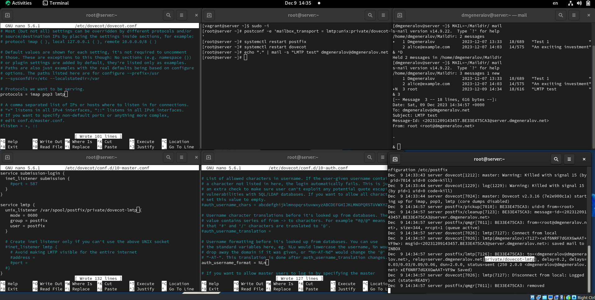
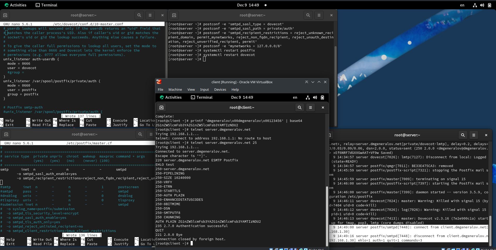
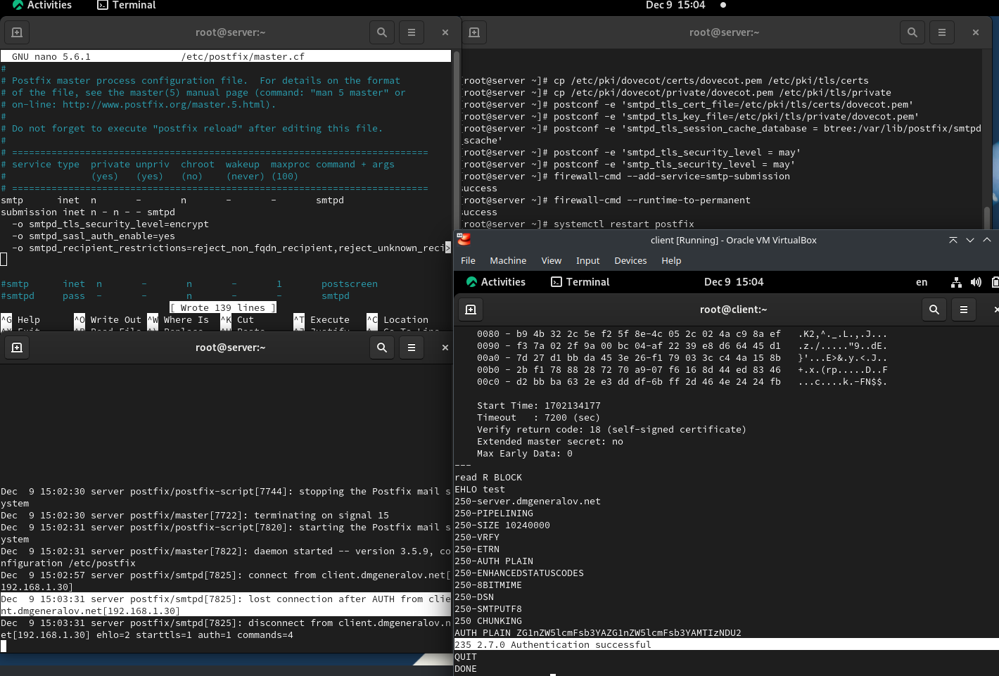
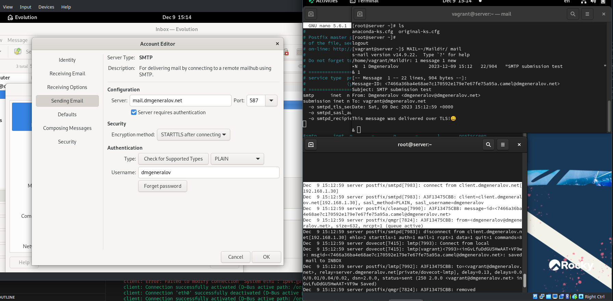
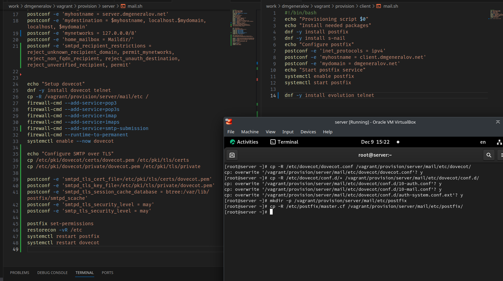

# Задача

> 1. Настройте Dovecot для работы с LMTP (см. раздел 10.4.1).
> 2. Настройте аутентификацию посредством SASL на SMTP-сервере (см. раздел 10.4.2).
> 3. Настройте работу SMTP-сервера поверх TLS (см. раздел 10.4.3).
> 4. Скорректируйте скрипт для Vagrant, фиксирующий действия расширенной настройки SMTP-сервера во внутреннем окружении виртуальной машины server (см. раздел 10.4.4).

# Выполнение 

## Mail

## Mail

## Mail

## Mail

## Vagrant

## Вывод

Я получил опыт работы с настройкой продвинутых свойств Postfix+Dovecot, в том числе SASL и SMTP поверх TLS.
