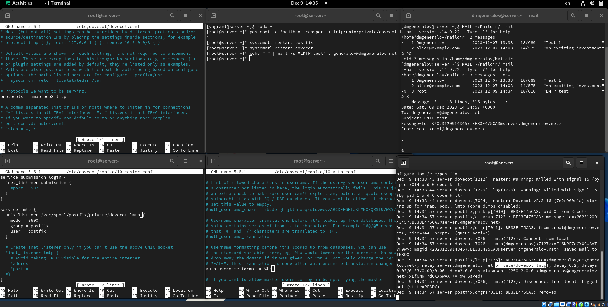
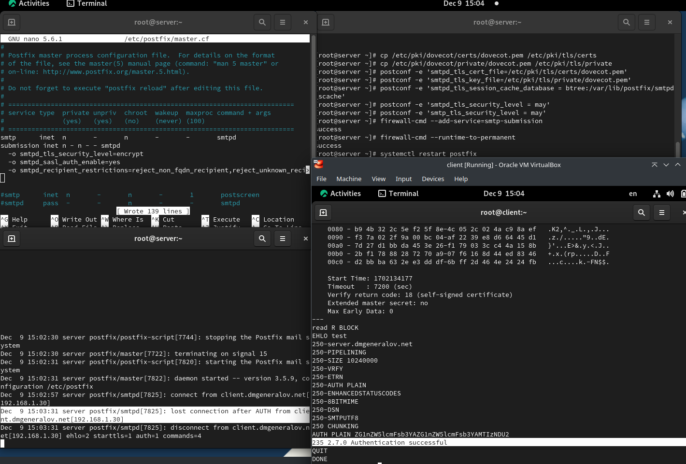
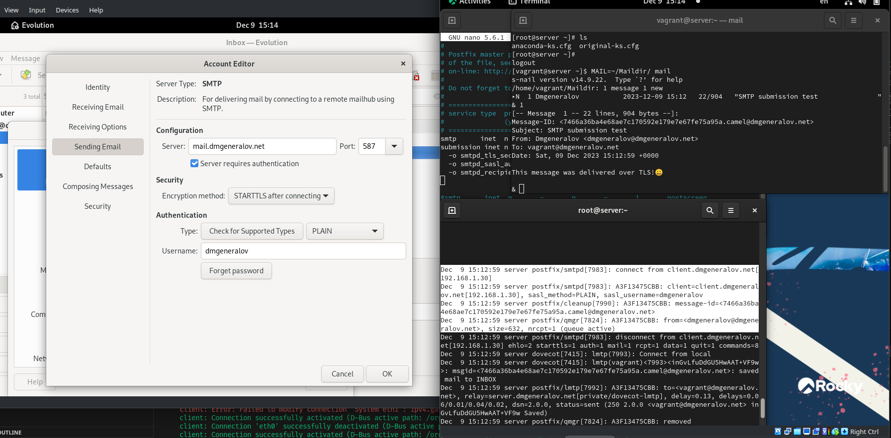

---
## Front matter
title: "Отчет по лабораторной работе 10"
subtitle: ""
author: "Генералов Даниил, НПИбд-01-21, 1032202280"

## Generic otions
lang: ru-RU
toc-title: "Содержание"

## Pdf output format
toc: true # Table of contents
toc-depth: 2
lof: true # List of figures
lot: true # List of tables
fontsize: 12pt
linestretch: 1.5
papersize: a4
documentclass: scrreprt
## I18n polyglossia
polyglossia-lang:
  name: russian
  options:
	- spelling=modern
	- babelshorthands=true
polyglossia-otherlangs:
  name: english
## I18n babel
babel-lang: russian
babel-otherlangs: english
## Fonts
mainfont: PT Serif
romanfont: PT Serif
sansfont: PT Sans
monofont: PT Mono
mainfontoptions: Ligatures=TeX
romanfontoptions: Ligatures=TeX
sansfontoptions: Ligatures=TeX,Scale=MatchLowercase
monofontoptions: Scale=MatchLowercase,Scale=0.9
## Biblatex
biblatex: true
biblio-style: "gost-numeric"
biblatexoptions:
  - parentracker=true
  - backend=biber
  - hyperref=auto
  - language=auto
  - autolang=other*
  - citestyle=gost-numeric
## Pandoc-crossref LaTeX customization
figureTitle: "Рис."
tableTitle: "Таблица"
listingTitle: "Листинг"
lofTitle: "Список иллюстраций"
lotTitle: "Список таблиц"
lolTitle: "Листинги"
## Misc options
indent: true
header-includes:
  - \usepackage{indentfirst}
  - \usepackage{float} # keep figures where there are in the text
  - \floatplacement{figure}{H} # keep figures where there are in the text
---

# Цель работы

Приобретение практических навыков по конфигурированию SMTP-сервера в части настройки аутентификации.

# Задание

> 1. Настройте Dovecot для работы с LMTP (см. раздел 10.4.1).
> 2. Настройте аутентификацию посредством SASL на SMTP-сервере (см. раздел 10.4.2).
> 3. Настройте работу SMTP-сервера поверх TLS (см. раздел 10.4.3).
> 4. Скорректируйте скрипт для Vagrant, фиксирующий действия расширенной настройки SMTP-сервера во внутреннем окружении виртуальной машины server (см. раздел 10.4.4).

# Выполнение лабораторной работы

Первым делом я настроил LMTP.
Для этого, сначала я включил его в список служб Dovecot,
затем указал путь для сокета управления
и разрешил доступ пользователю Postfix.
После этого я указал, чтобы Postfix использовал его для получения писем,
а Dovecot -- чтобы он обрабатывал адреса без указания домена.
После этого я отправил письмо от пользователя root пользователю dmgeneralov,
и оно успешно доставлено,
и логи показывают, что оно было доставлено с помощью LMTP.

После этого мы настроили SMTP-аутентификацию.
Для этого, сначала мы настроили SASL-службу в Dovecot,
чтобы ее сокет была доступен пользователю postfix и находился в папке /var/spool/postfix/private.
(Мы также оставляем сокет для внутреннего использования dovecot.)
После этого мы указываем в настройках Postfix, что теперь стоит использовать SASL от Dovecot, который можно найти в пути private/auth.
Затем, мы ограничиваем SMTP: теперь можно отправлять почту только из mynetworks (который мы теперь ограничиваем только локальным компьютером),
и запрещаем передачу неизвестным назначениям -- с такими настройками теперь можно отправлять почту только от самого сервера, и он перестал быть relay-сервером.
Но мы добавляем временную настройку SMTP-сервера, который дает возможность аутентификации через SASL:
для этого добавляем строчку в /etc/postfix/master.cf, которая запрещает доступ всем отправителям, кроме тех, кто аутентифицировался через SASL.
Наконец, мы перезагружаем Postfix и Dovecot,
и с клиента (то есть не из mynetworks) подключаемся через telnet к серверу.
Мы формируем base64-строку аутентификации для пользователя dmgeneralov,
посылаем ее серверу, и видим, что она принимается -- значит, SASL-аутентификация работает.

После этого мы включаем SMTP, но только с шифрованием.
Для этого мы сначала берем временные сертификаты Dovecot и копируем их, чтобы они стали доступны Postfix.
Затем, настраиваем новый экземпляр SMTP-сервера в /etc/postfix/master.cf:
этот будет использоваться только для отправки писем (submission),
и будет требовать SASL-аутентификацию,
но он также будет требовать шифрования соединения.
Мы затем разрешаем службу SMTP-submission,
перезапускаем Postfix,
а затем с клиента пробуем соединиться через TLS (а именно STARTTLS в SMTP-стиле), и видим, что у нас получилось также авторизоваться серверу.

Также, после того как настроить STARTTLS и аутентификацию по паролю через порт 587,
то Evolution смог отправить письмо на сервер, и оно было успешно доставлено.

Это значит, что мы можем экспортировать настройки в Vagrant.
Как в предыдущий раз, используемые скрипты уже подключены в Vagrantfile,
поэтому нужно только добавить новые строки, соответствующие новой настройке,
и заменить конфигурационные файлы.

# Выводы

Я получил опыт работы с настройкой продвинутых свойств Postfix+Dovecot, в том числе SASL и SMTP поверх TLS.

# Контрольные вопросы

1. Приведите пример задания формата аутентификации пользователя в Dovecot в форме логина с указанием домена.

Чтобы пользователь `vagrant`, подключающийся к серверу `dmgeneralov.net`, должен был использовать имя пользователя `vagrant@dmgeneralov.net`, 
в файле `10-auth.conf` нужно указать `auth_username_format = %Ln@%Ld`

2. Какие функции выполняет почтовый Relay-сервер?

Такой сервер принимает почту по SMTP и затем передает её другому серверу от своего имени.
Это полезно, чтобы централизовать настройки: 
вместо того, чтобы каждое устройство в организации имело доступ к DKIM-ключам и имело одинаковый брендинг у писем (среди прочих),
можно сделать так, чтобы устройства отправляли почту на один relay-сервер, который будет делать все эти вещи, прежде чем направить почту на сторонние сервера.

3. Какие угрозы безопасности могут возникнуть в случае настройки почтового сервера как Relay-сервера?

Поскольку для внешнего мира почта от relay-сервера выглядит, будто она создана этим сервером,
необходимо убедиться, что только разрешенные компьютеры могут отправлять почту через этот сервер.
Если посторонние могут использовать его как open relay, они воспользуются тем, что сервер подписывает почту через DKIM,
и будут использовать его для рассылки спама, который не будет автоматически игнорироваться получателем.