# Задача

> 1. Настройте запрет удалённого доступа на сервер по SSH для пользователя root (см. раздел 11.4.1).
> 2. Настройте разрешение удалённого доступа к серверу по SSH только для пользователей группы vagrant и вашего пользователя (см. раздел 11.4.2).
> 3. Настройте удалённый доступ к серверу по SSH через порт 2022 (см. раздел 11.4.3).
> 4. Настройте удалённый доступ к серверу по SSH по ключу (см. раздел 11.4.4).
> 5. Организуйте SSH-туннель с клиента на сервер, перенаправив локальное соединение с TCP-порта 80 на порт 8080 (см. раздел 11.4.5).
> 6. Используя удалённое SSH-соединение, выполните с клиента несколько команд на сервере (см. раздел 11.4.6).
> 7. Используя удалённое SSH-соединение, запустите с клиента графическое приложение на сервере (см. раздел 11.4.7).
> 8. Напишите скрипт для Vagrant, фиксирующий действия по настройке SSH-сервера во внутреннем окружении виртуальной машины server. Соответствующим образом внесите изменения в Vagrantfile (см. раздел 11.4.8).

# Выполнение 

## SSH

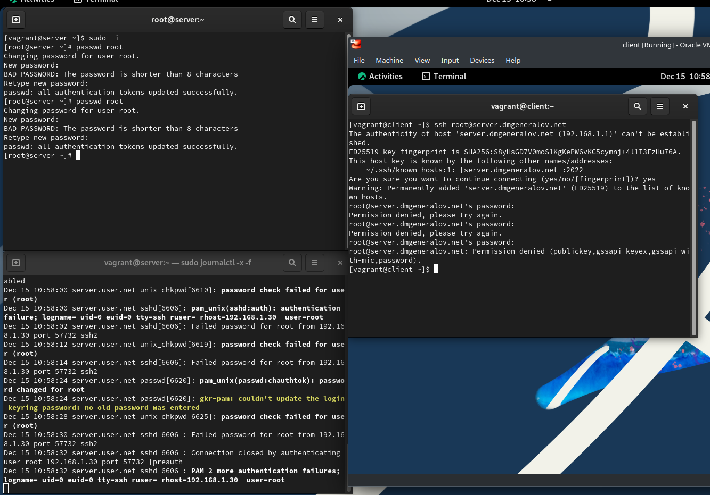

## SSH

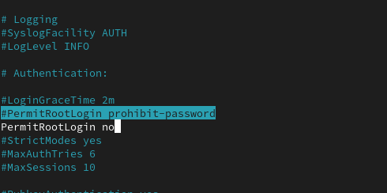

## SSH

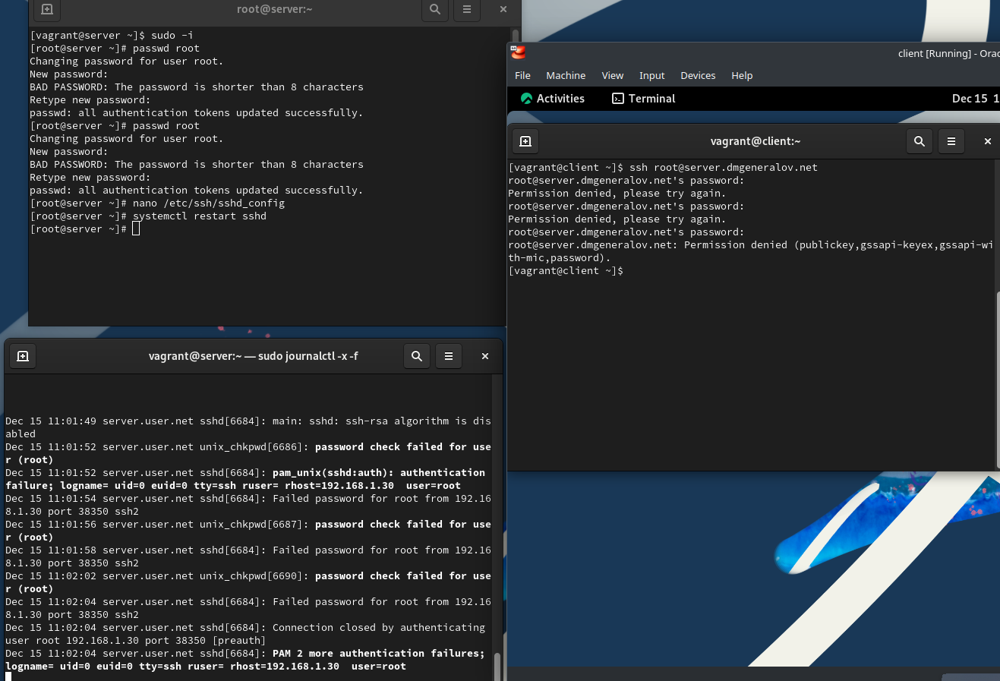

## SSH

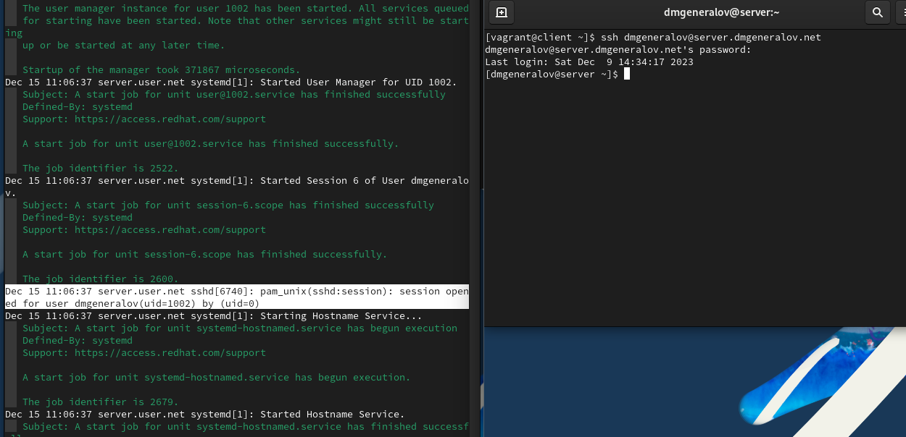

## SSH

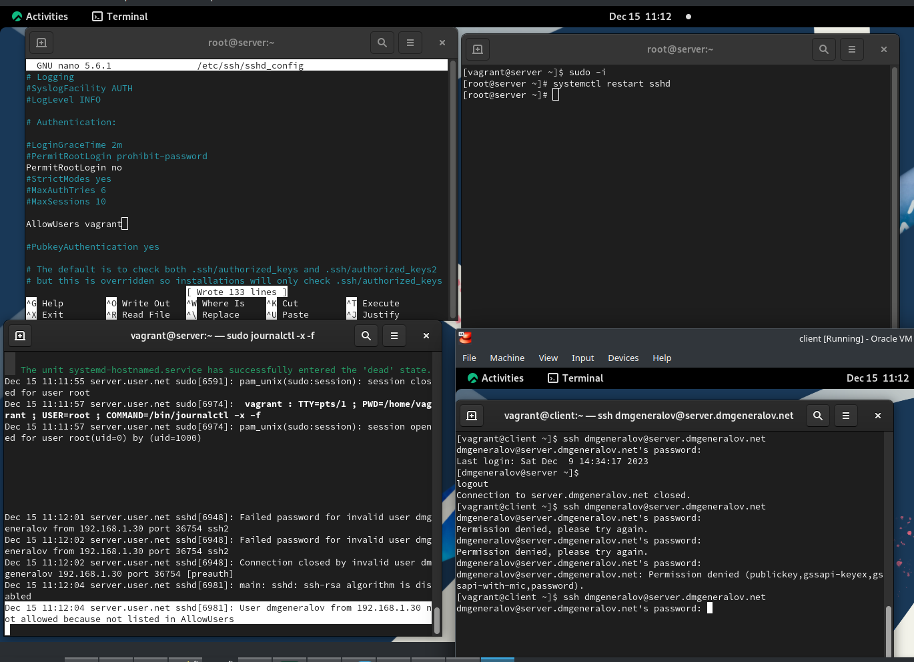

## SSH

## SSH

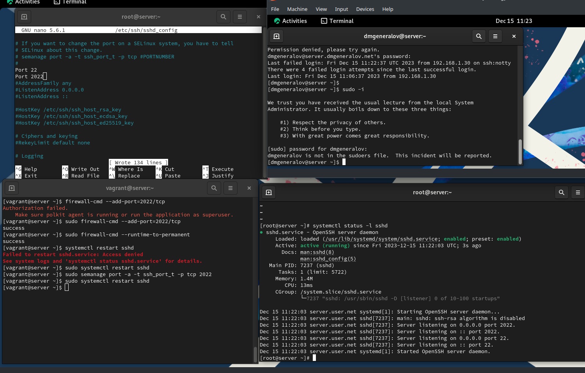

## SSH

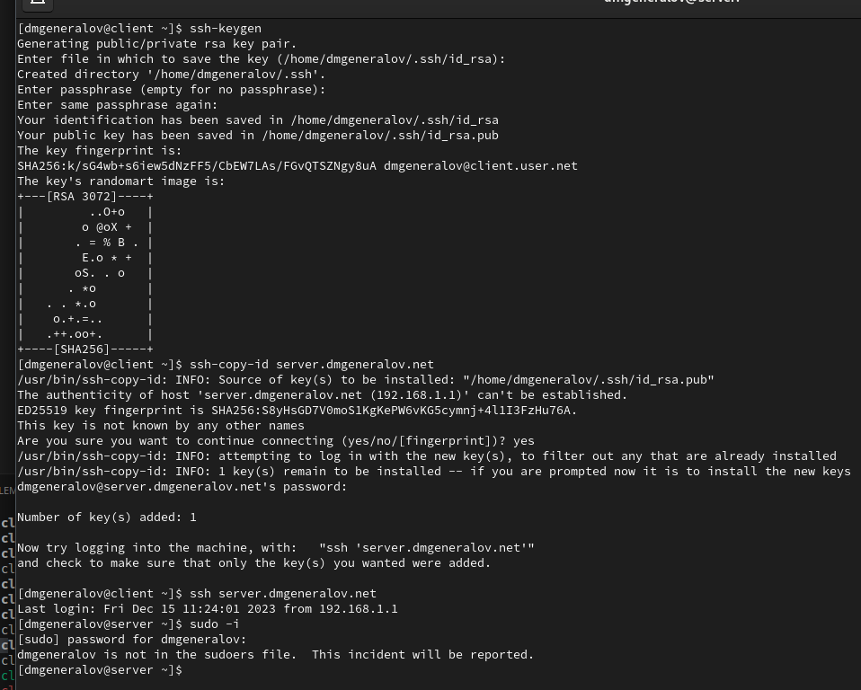

## SSH

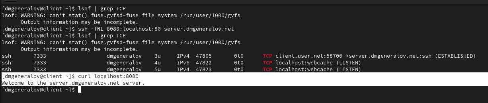

## SSH

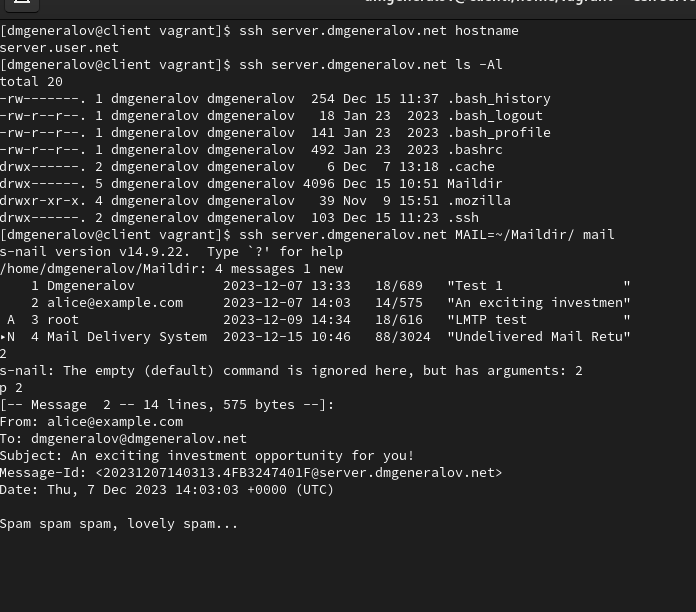

## SSH

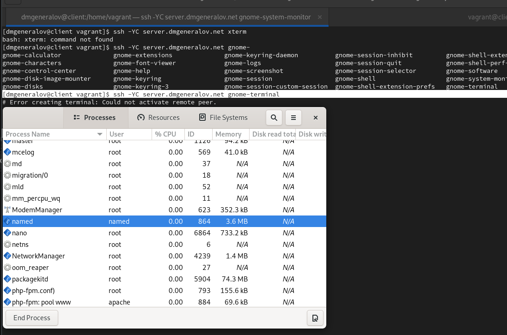

## Vagrant

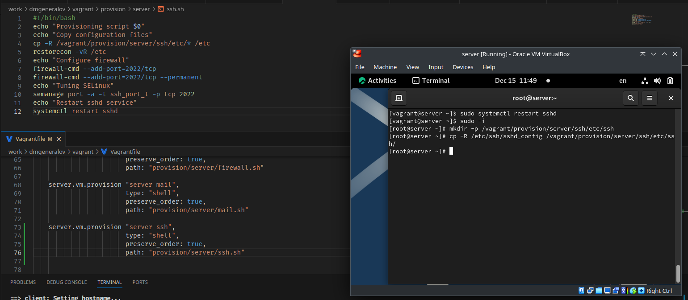

## Вывод

Я получил опыт настройки SSH-сервера.
