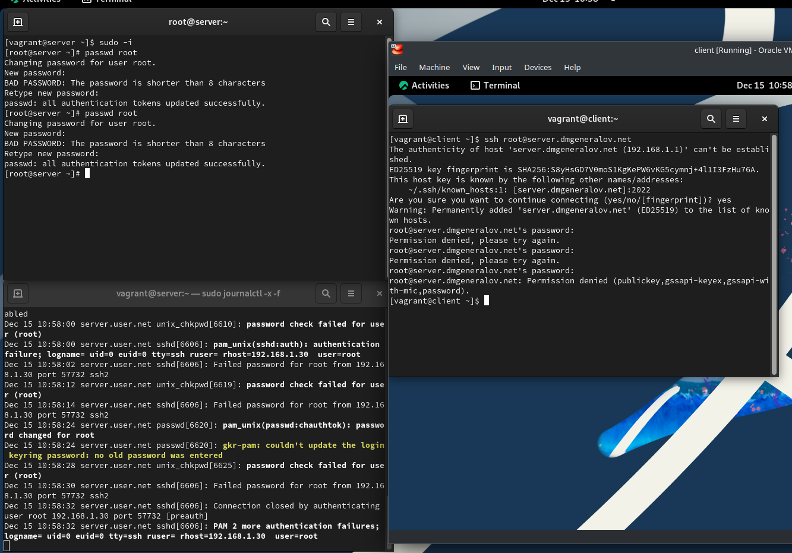
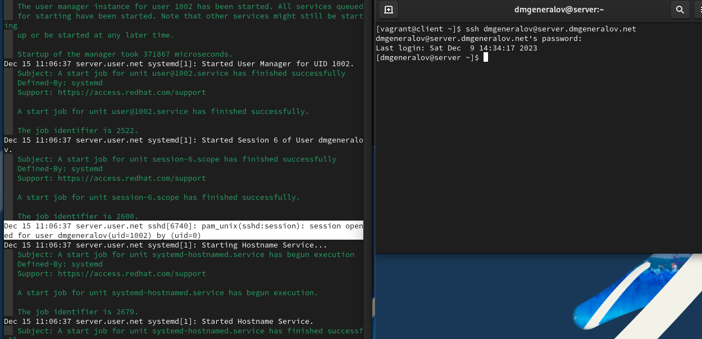
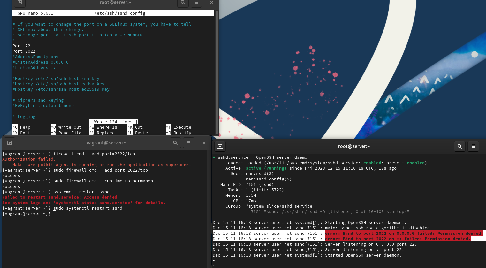
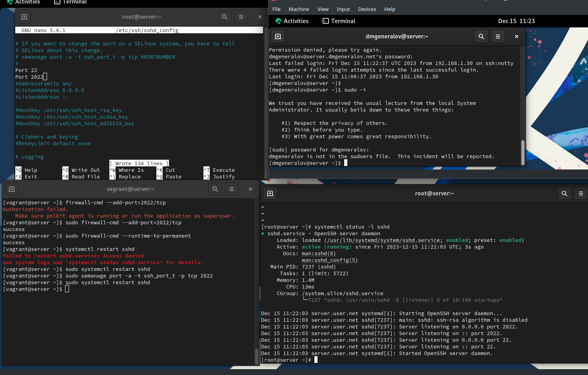
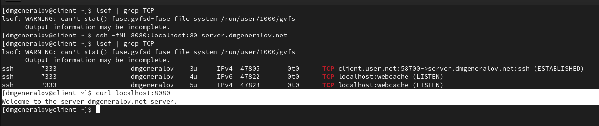

---
## Front matter
title: "Отчет по лабораторной работе 11"
subtitle: ""
author: "Генералов Даниил, НПИбд-01-21, 1032202280"

## Generic otions
lang: ru-RU
toc-title: "Содержание"

## Pdf output format
toc: true # Table of contents
toc-depth: 2
lof: true # List of figures
lot: true # List of tables
fontsize: 12pt
linestretch: 1.5
papersize: a4
documentclass: scrreprt
## I18n polyglossia
polyglossia-lang:
  name: russian
  options:
	- spelling=modern
	- babelshorthands=true
polyglossia-otherlangs:
  name: english
## I18n babel
babel-lang: russian
babel-otherlangs: english
## Fonts
mainfont: PT Serif
romanfont: PT Serif
sansfont: PT Sans
monofont: PT Mono
mainfontoptions: Ligatures=TeX
romanfontoptions: Ligatures=TeX
sansfontoptions: Ligatures=TeX,Scale=MatchLowercase
monofontoptions: Scale=MatchLowercase,Scale=0.9
## Biblatex
biblatex: true
biblio-style: "gost-numeric"
biblatexoptions:
  - parentracker=true
  - backend=biber
  - hyperref=auto
  - language=auto
  - autolang=other*
  - citestyle=gost-numeric
## Pandoc-crossref LaTeX customization
figureTitle: "Рис."
tableTitle: "Таблица"
listingTitle: "Листинг"
lofTitle: "Список иллюстраций"
lotTitle: "Список таблиц"
lolTitle: "Листинги"
## Misc options
indent: true
header-includes:
  - \usepackage{indentfirst}
  - \usepackage{float} # keep figures where there are in the text
  - \floatplacement{figure}{H} # keep figures where there are in the text
---

# Цель работы

Приобретение практических навыков по настройке удалённого доступа к серверу с помощью SSH.

# Задание

> 1. Настройте запрет удалённого доступа на сервер по SSH для пользователя root (см. раздел 11.4.1).
> 2. Настройте разрешение удалённого доступа к серверу по SSH только для пользователей группы vagrant и вашего пользователя (см. раздел 11.4.2).
> 3. Настройте удалённый доступ к серверу по SSH через порт 2022 (см. раздел 11.4.3).
> 4. Настройте удалённый доступ к серверу по SSH по ключу (см. раздел 11.4.4).
> 5. Организуйте SSH-туннель с клиента на сервер, перенаправив локальное соединение с TCP-порта 80 на порт 8080 (см. раздел 11.4.5).
> 6. Используя удалённое SSH-соединение, выполните с клиента несколько команд на сервере (см. раздел 11.4.6).
> 7. Используя удалённое SSH-соединение, запустите с клиента графическое приложение на сервере (см. раздел 11.4.7).
> 8. Напишите скрипт для Vagrant, фиксирующий действия по настройке SSH-сервера во внутреннем окружении виртуальной машины server. Соответствующим образом внесите изменения в Vagrantfile (см. раздел 11.4.8).

# Выполнение лабораторной работыssh

Сначала мы попробовали подключиться к root-аккаунту на сервере, но, несмотря на то, что пароль правильный, сервер не разрешил это сделать.

Это потому, что по умолчанию SSH настроен, чтобы запрещать вход для root по паролю, но он все равно возможен по ключу.
Мы отключаем это.

Ошибка выглядит таким же образом. 

Однако подключаться от имени пользователя dmgeneralov можно, и открывается терминал этого пользователя.

Чтобы запретить это, нужно добавить строчку `AllowUsers` в sshd_config, тогда только указанные пользователи смогут подключаться.
Другим пользователям все равно будет показываться приглашение ввести пароль, но сервер еще в начале соединения решил, что он не даст этому пользователю подключиться, потому что он не в списке `AllowedUsers`. Мы оставляем в этом списке только пользователей `vagrant` и `dmgeneralov`.

Дальше мы настраиваем, чтобы SSH-сервер слушал порт 2022 в дополнение к порту 22. 
Однако, если сделать только это, то SSH-сервер напишет ошибку, что он не может слушать этот порт.

Это из-за SELinux-политики, которая разрешает SSH только на порту 22.
Если изменить это, то можно подключаться к серверу по альтернативному порту.

Дальше мы используем аутентификацию по ключу, которая лучше чем пароли и поэтому включена по умолчанию.
Для этого нужно создать ключ на клиенте с помощью ssh-keygen, добавить его на сервер с помощью ssh-copy-id,
и после этого соединения не требуют пароля.

После этого можно использовать SSH, чтобы создавать туннели TCP.
Сначала на клиенте не было открыто никаких TCP-сокетов.
Но мы подключились к серверу, перенаправив локальный порт 8080 на его порт 80,
и теперь у нас открыто соединение с сервером,
а также мы слушаем порт `webcache` (то есть 8080) по IPv4 и IPv6.
Если подключиться к этому порту, то мы увидим там HTTP-сервер -- тот же самый, который запущен на сервере.

Через SSH можно запускать консольные программы -- как неинтерактивные, так и интерактивные.

Можно даже запускать графические программы, и они будут выглядеть, будто они запущены на этом компьютере.
Например, здесь мы запустили монитор процессов, и он показывается на клиенте, 
хотя он показывает процессы, которые есть только на сервере (вроде `named`).

В конце, как обычно, мы экспортируем настройки в Vagrant.

# Выводы

Я получил опыт настройки SSH-сервера.

# Контрольные вопросы

1. Вы хотите запретить удалённый доступ по SSH на сервер пользователю root и разрешить доступ пользователю alice. Как это сделать?

В файл настройки SSH-сервера надо добавить строки `PermitRootLogin no` и `AllowUsers alice`.

2. Как настроить удалённый доступ по SSH через несколько портов? Для чего это может потребоваться?

Несколько строк `Port` настраивают, чтобы сервер слушал несколько портов, и это полезно, если клиент имеет firewall, который запрещаяет ему использовать стандартный порт.

3. Какие параметры используются для создания туннеля SSH, когда команда ssh устанавливает фоновое соединение и не ожидает какой-либо конкретной команды?

`-N` делает так, чтобы SSH-соединение не открывало терминала, `-n` делает так, что SSH не пытается читать stdin, и `-f` просит SSH перейти в фоновый режим после успешного подключения.

4. Как настроить локальную переадресацию с локального порта 5555 на порт 80 сервера server2.example.com?

`ssh -L 5555:server2.example.com:80 dmgeneralov@server1.dmgeneralov.com`

5. Как настроить SELinux, чтобы позволить SSH связываться с портом 2022?

`semanage port -a -t ssh_port_t -p tcp 2022`

6. Как настроить межсетевой экран на сервере, чтобы разрешить входящие подключения по SSH через порт 2022?

`firewall-cmd --add-port=2022/tcp`
