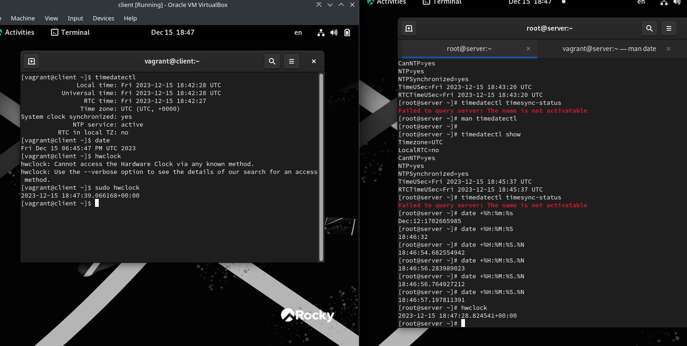
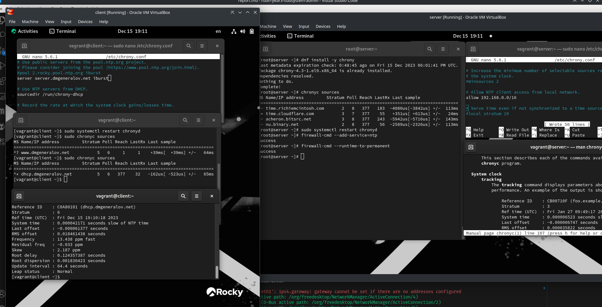
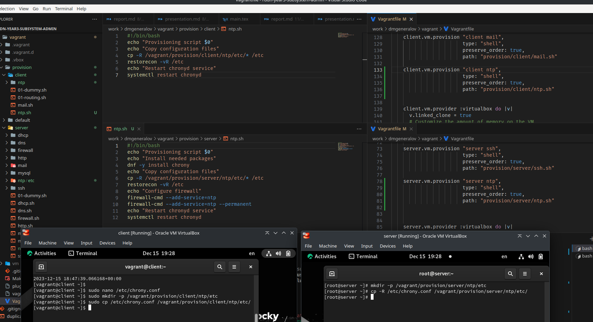

# Задача

> 1. Изучите команды по настройке параметров времени (см. раздел 12.4.1).
> 2. Настройте сервер в качестве сервера синхронизации времени для локальной сети (см. раздел 12.4.2).
> 3. Напишите скрипты для Vagrant, фиксирующие действия по установке и настройке NTP-сервера и клиента (см. раздел 12.4.3).

# Выполнение 

## date

## chronyd

## Vagrant

## Вывод

Я получил опыт настройки локального NTP-сервера.
