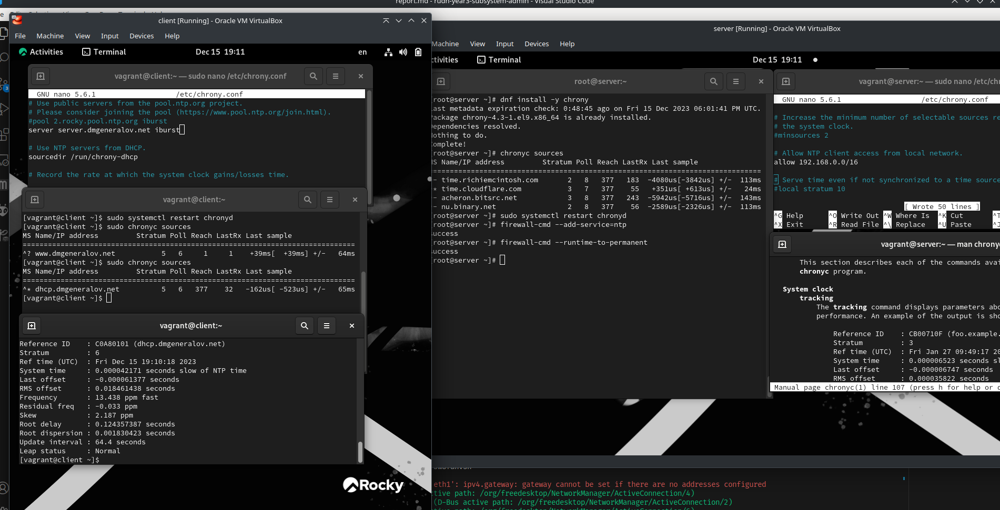
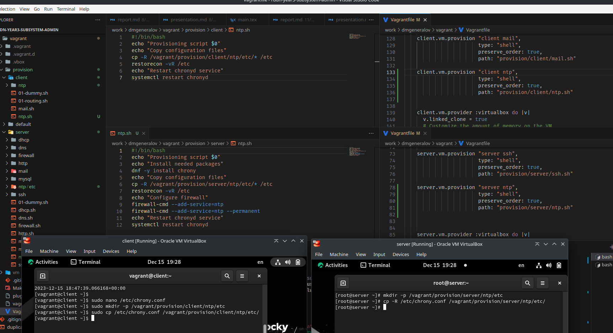

---
## Front matter
title: "Отчет по лабораторной работе 12"
subtitle: ""
author: "Генералов Даниил, НПИбд-01-21, 1032202280"

## Generic otions
lang: ru-RU
toc-title: "Содержание"

## Pdf output format
toc: true # Table of contents
toc-depth: 2
lof: true # List of figures
lot: true # List of tables
fontsize: 12pt
linestretch: 1.5
papersize: a4
documentclass: scrreprt
## I18n polyglossia
polyglossia-lang:
  name: russian
  options:
	- spelling=modern
	- babelshorthands=true
polyglossia-otherlangs:
  name: english
## I18n babel
babel-lang: russian
babel-otherlangs: english
## Fonts
mainfont: PT Serif
romanfont: PT Serif
sansfont: PT Sans
monofont: PT Mono
mainfontoptions: Ligatures=TeX
romanfontoptions: Ligatures=TeX
sansfontoptions: Ligatures=TeX,Scale=MatchLowercase
monofontoptions: Scale=MatchLowercase,Scale=0.9
## Biblatex
biblatex: true
biblio-style: "gost-numeric"
biblatexoptions:
  - parentracker=true
  - backend=biber
  - hyperref=auto
  - language=auto
  - autolang=other*
  - citestyle=gost-numeric
## Pandoc-crossref LaTeX customization
figureTitle: "Рис."
tableTitle: "Таблица"
listingTitle: "Листинг"
lofTitle: "Список иллюстраций"
lotTitle: "Список таблиц"
lolTitle: "Листинги"
## Misc options
indent: true
header-includes:
  - \usepackage{indentfirst}
  - \usepackage{float} # keep figures where there are in the text
  - \floatplacement{figure}{H} # keep figures where there are in the text
---

# Цель работы

> Получение навыков по управлению системным временем и настройке синхронизации времени.

# Задание

> 1. Изучите команды по настройке параметров времени (см. раздел 12.4.1).
> 2. Настройте сервер в качестве сервера синхронизации времени для локальной сети (см. раздел 12.4.2).
> 3. Напишите скрипты для Vagrant, фиксирующие действия по установке и настройке NTP-сервера и клиента (см. раздел 12.4.3).

# Выполнение лабораторной работы

Сначала мы посмотрели на информацию о службе синхронизации времени systemd через timedatectl,
и узнали, что они находятся в UTC+0-зоне времени, и синхронизируют время с сетью.
После этого мы узнали текущую дату и время с точностью до наносекунд, и узнали, что на клиенте RTC-время отстает от системного времени на одну секунду.

После этого мы настроили на сервере chronyd, чтобы он принимал соединения из локальной сети.
Он обрабатывает время из четырех источников -- двух из них имеют стратум 3, а два из них -- 2.
Мы добавляем NTP как службу в firewalld,
а затем настраиваем, чтобы клиент получал синхронизацию только с сервера.
Поскольку сервер вносит неточность в время, он обозначает себя стратумом ниже, чем свои источники -- он становится стратумом 5.
Сначала единственный источник не считается хорошим для синхронизации (что показывает вопросительный знак в его строчке),
но через некоторое время его стабильность измеряется и он выбирается самым хорошим (среди единственного выбора) и выбранным для синхронизации.
Как результат, клиент синхронизировался с сервером до четырех нулей,
и определил, что часы сервера спешат на 13.438 милионных долей.

Наконец, мы экспортируем настройки в Vagrantfile.

# Выводы

Я получил опыт настройки локального NTP-сервера.

# Контрольные вопросы

1. Почему важна точная синхронизация времени для служб баз данных?

Потому, что часто нужно иметь возможность сериализовать события, то есть указать, в каком порядке они произошли.
Если события происходят на разных машинах, и между ними нет точной синхронизации времени,
то они могут записать события, которые произошли в такие времена, чтобы логически противоречить друг другу.

2. Почему служба проверки подлинности Kerberos сильно зависит от правильной синхронизации времени?

Потому что Kerberos выдает подписанные тикеты, которые работают только очень маленькое время, и если между машинами есть слишком большое расхождение, то тикет, который получил клиент только что, сервер может считать уже истекшим.

3. Какая служба используется по умолчанию для синхронизации времени на RHEL 7?

`systemd-timesync` и `chronyd`

4. Какова страта по умолчанию для локальных часов?

По умолчанию это не определено, но параметр `local stratum` говорит серверу, каким стратумом считать его локальные часы.

5. Какой порт брандмауэра должен быть открыт, если вы настраиваете свой сервер как одноранговый узел NTP?

`123/udp`

6. Какую строку вам нужно включить в конфигурационный файл chrony, если вы хотите быть сервером времени, даже если внешние серверы NTP недоступны?

Нужно назначить ему стратум, который относится к локальным часам, и он должен быть сравнительно низким: `local stratum 10`

7. Какую страту имеет хост, если нет текущей синхронизации времени NTP?

Он имеет стратум 16, потому что по протоколу NTP может существовать только стратум 1 до 15.

8. Какую команду вы бы использовали на сервере с chrony, чтобы узнать, с какими серверами он синхронизируется?

`chronyc sources`

9. Как вы можете получить подробную статистику текущих настроек времени для процесса chrony вашего сервера?

`chronyc tracking`