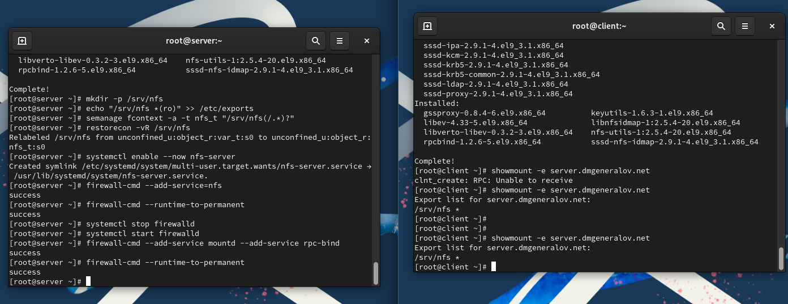
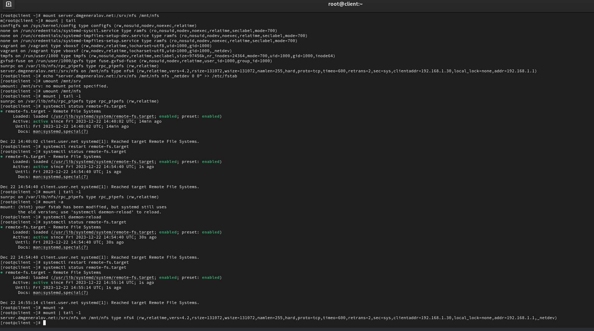
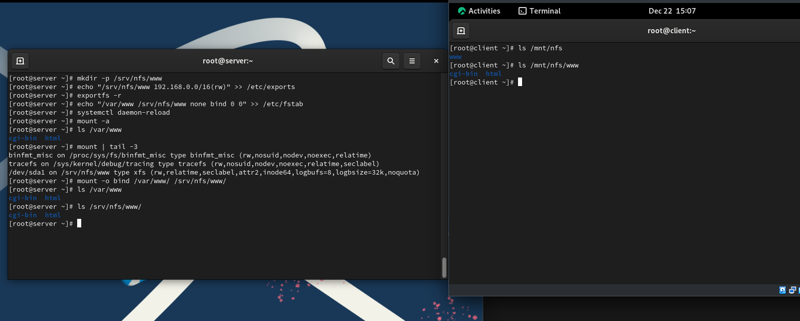
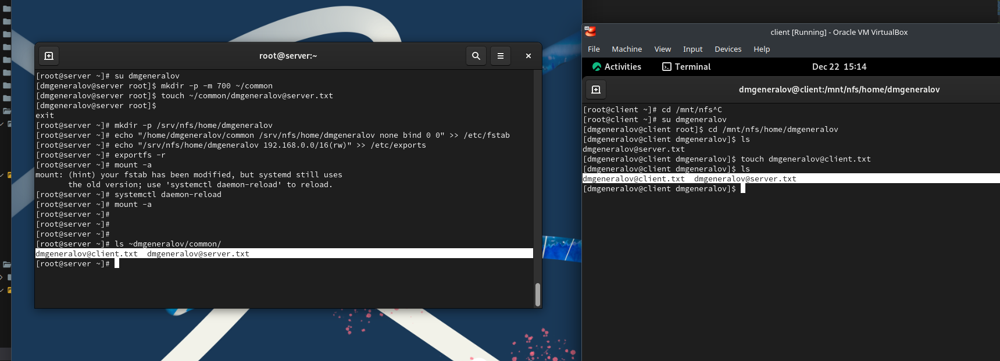
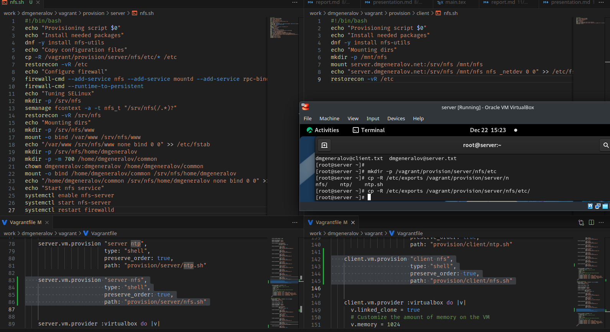

# Задача

> 1. Установите и настройте сервер NFSv4 (см. раздел 13.4.1).
> 2. Подмонтируйте удалённый ресурс на клиенте (см. раздел 13.4.2).
> 3. Подключите каталог с контентом веб-сервера к дереву NFS (см. раздел 13.4.3).
> 4. Подключите каталог для удалённой работы вашего пользователя к дереву NFS (см. раздел 13.4.4).
> 5. Напишите скрипты для Vagrant, фиксирующие действия по установке и настройке сервера NFSv4 во внутреннем окружении виртуальных машин server и client. Соответствующим образом внесите изменения в Vagrantfile (см. раздел 13.4.5).

# Выполнение 

## NFS

## NFS

## NFS

## NFS

## Vagrant

## Вывод

Я получил опыт настройки сервера и клиента NFS.
