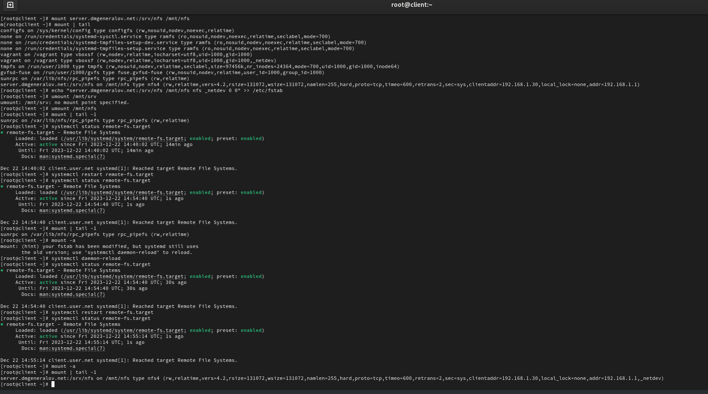
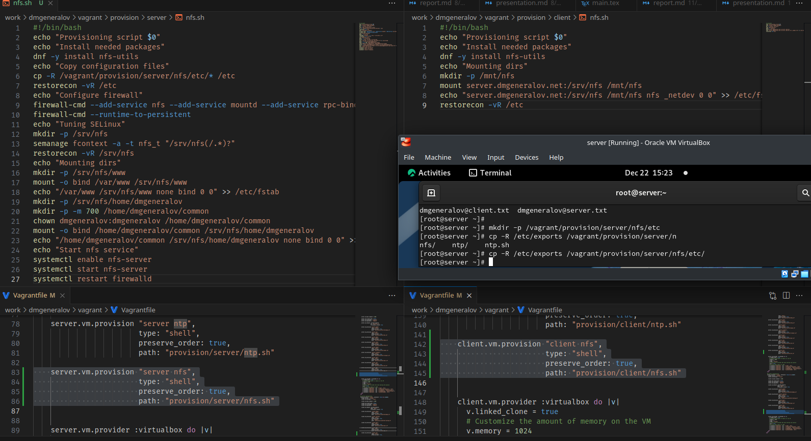

---
## Front matter
title: "Отчет по лабораторной работе 13"
subtitle: ""
author: "Генералов Даниил, НПИбд-01-21, 1032202280"

## Generic otions
lang: ru-RU
toc-title: "Содержание"

## Pdf output format
toc: true # Table of contents
toc-depth: 2
lof: true # List of figures
lot: true # List of tables
fontsize: 12pt
linestretch: 1.5
papersize: a4
documentclass: scrreprt
## I18n polyglossia
polyglossia-lang:
  name: russian
  options:
	- spelling=modern
	- babelshorthands=true
polyglossia-otherlangs:
  name: english
## I18n babel
babel-lang: russian
babel-otherlangs: english
## Fonts
mainfont: PT Serif
romanfont: PT Serif
sansfont: PT Sans
monofont: PT Mono
mainfontoptions: Ligatures=TeX
romanfontoptions: Ligatures=TeX
sansfontoptions: Ligatures=TeX,Scale=MatchLowercase
monofontoptions: Scale=MatchLowercase,Scale=0.9
## Biblatex
biblatex: true
biblio-style: "gost-numeric"
biblatexoptions:
  - parentracker=true
  - backend=biber
  - hyperref=auto
  - language=auto
  - autolang=other*
  - citestyle=gost-numeric
## Pandoc-crossref LaTeX customization
figureTitle: "Рис."
tableTitle: "Таблица"
listingTitle: "Листинг"
lofTitle: "Список иллюстраций"
lotTitle: "Список таблиц"
lolTitle: "Листинги"
## Misc options
indent: true
header-includes:
  - \usepackage{indentfirst}
  - \usepackage{float} # keep figures where there are in the text
  - \floatplacement{figure}{H} # keep figures where there are in the text
---

# Цель работы

Приобретение навыков настройки сервера NFS для удалённого доступа к ресурсам.

# Задание

> 1. Установите и настройте сервер NFSv4 (см. раздел 13.4.1).
> 2. Подмонтируйте удалённый ресурс на клиенте (см. раздел 13.4.2).
> 3. Подключите каталог с контентом веб-сервера к дереву NFS (см. раздел 13.4.3).
> 4. Подключите каталог для удалённой работы вашего пользователя к дереву NFS (см. раздел 13.4.4).
> 5. Напишите скрипты для Vagrant, фиксирующие действия по установке и настройке сервера NFSv4 во внутреннем окружении виртуальных машин server и client. Соответствующим образом внесите изменения в Vagrantfile (см. раздел 13.4.5).

# Выполнение лабораторной работы

Сначала мы устанавливаем на сервере и клиенте nfs-utils,
затем настраиваем на сервере общий доступ для чтения к папке /srv/nfs.
После этого мы открываем службу NFS в firewalld,
и запускаем NFS-сервер.
Но он не доступен из клиента,
и он становится доступен только когда выключен firewalld.
Это потому, что для работы NFS требуются дополнительные службы,
и после открытия их перечисление открытых папок работает правильно.

После этого мы монтируем эту папку на клиенте:
сначала вручную,
а потом с помощью добавления ее в /etc/fstab
(где сначала написано, что нужно монтировать -- путь на сервере, в данном случае;
затем -- куда, в локальную папку;
затем тип файловой системы (NFS),
и затем параметры драйвера этой файловой системы).
Затем мы сделали systemctl daemon-reload,
чтобы эти изменения были замечены systemctl,
а затем перезапустили цель remote-fs.target,
которая отвечает за подключение NFS-папок.
После этого папка также оказалась примонтированной,
что значит, что она теперь автоматически монтируется при запуске системы.

После этого мы создаем новую папку в /srv/nfs на сервере
и связываем ее с папкой /var/www, где хранятся файлы веб-сервера.
Затем, мы разрешаем доступ к этой папке для записи для локальной подсети,
и видим, что на клиенте доступны все те же файлы а /mnt/nfs/www, как и на сервере в /var/www.

Затем, мы создаем папку, к которой может иметь доступ только пользователь dmgeneralov,
и экспортируем ее в NFS для записи.
На клиенте после этого можно зайти в эту папку от пользователя dmgeneralov,
изменить ее содержимое,
и эти изменения сразу будут доступны на сервере.

Наконец, нужно экспортировать эти настройки в Vagrantfile.

# Выводы

Я получил опыт настройки сервера и клиента NFS.

# Контрольные вопросы

1. Как называется файл конфигурации, содержащий общие ресурсы NFS?

`/etc/exports`

2. Какие порты должны быть открыты в брандмауэре, чтобы обеспечить полный доступ к серверу NFS?

2049/tcp, 20048/tcp+udp, 111/tcp+udp.

3. Какую опцию следует использовать в /etc/fstab, чтобы убедиться, что общие ресурсы NFS могут быть установлены автоматически при перезагрузке?

`server.net:/remote/path /local/path nfs _netdev 0 0`