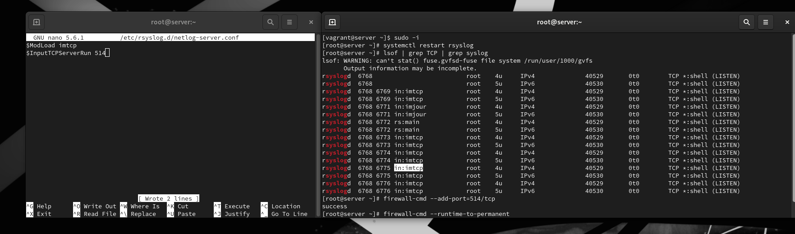
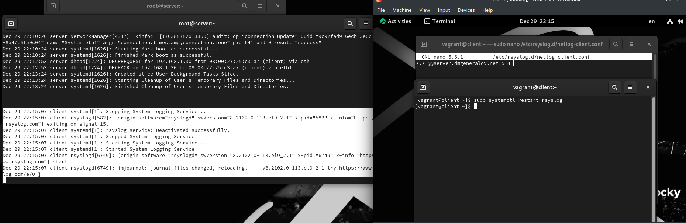
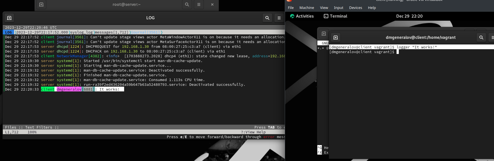
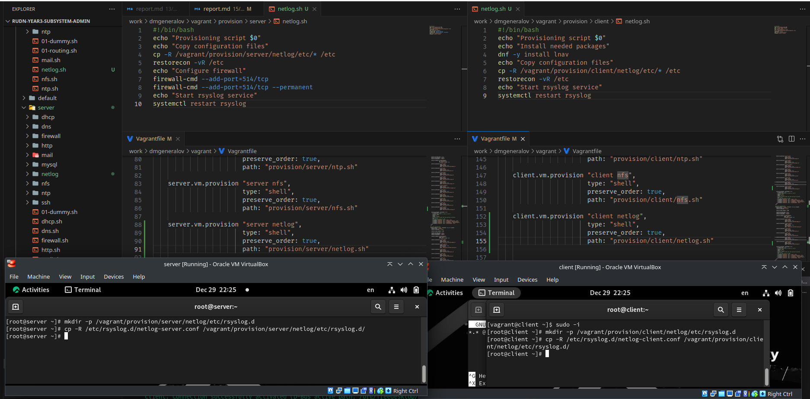

# Задача

> 1. Настройте сервер сетевого журналирования событий (см. раздел 15.4.1).
> 2. Настройте клиент для передачи системных сообщений в сетевой журнал на сервере (см. раздел 15.4.2).
> 3. Просмотрите журналы системных событий с помощью нескольких программ (см. раздел 15.4.3). При наличии сообщений о некорректной работе сервисов исправьте ошибки в настройках соответствующих служб.
> 4. Напишите скрипты для Vagrant, фиксирующие действия по установке и настройке сетевого сервера журналирования (см. раздел 15.4.4).

# Выполнение 

## Syslog

## Syslog

## Syslog

## Vagrant

## Вывод

> Я получил опыт настойки службы сетевых логов rsyslog.
