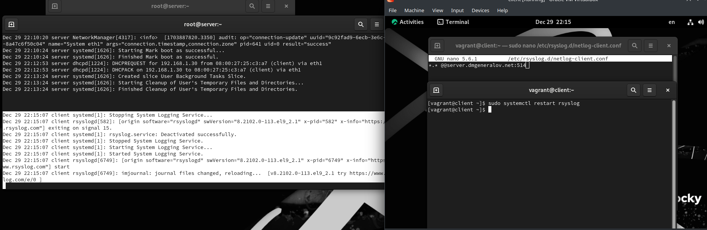

---
## Front matter
title: "Отчет по лабораторной работе 15"
subtitle: ""
author: "Генералов Даниил, НПИбд-01-21, 1032202280"

## Generic otions
lang: ru-RU
toc-title: "Содержание"


## Pdf output format
toc: true # Table of contents
toc-depth: 2
lof: true # List of figures
lot: true # List of tables
fontsize: 12pt
linestretch: 1.5
papersize: a4
documentclass: scrreprt
## I18n polyglossia
polyglossia-lang:
  name: russian
  options:
	- spelling=modern
	- babelshorthands=true
polyglossia-otherlangs:
  name: english
## I18n babel
babel-lang: russian
babel-otherlangs: english
## Fonts
mainfont: PT Serif
romanfont: PT Serif
sansfont: PT Sans
monofont: PT Mono
mainfontoptions: Ligatures=TeX
romanfontoptions: Ligatures=TeX
sansfontoptions: Ligatures=TeX,Scale=MatchLowercase
monofontoptions: Scale=MatchLowercase,Scale=0.9
## Biblatex
biblatex: true
biblio-style: "gost-numeric"
biblatexoptions:
  - parentracker=true
  - backend=biber
  - hyperref=auto
  - language=auto
  - autolang=other*
  - citestyle=gost-numeric
## Pandoc-crossref LaTeX customization
figureTitle: "Рис."
tableTitle: "Таблица"
listingTitle: "Листинг"
lofTitle: "Список иллюстраций"
lotTitle: "Список таблиц"
lolTitle: "Листинги"
## Misc options
indent: true
header-includes:
  - \usepackage{indentfirst}
  - \usepackage{float} # keep figures where there are in the text
  - \floatplacement{figure}{H} # keep figures where there are in the text
---

# Цель работы

> Получение навыков по работе с журналами системных событий.

# Задание

> 1. Настройте сервер сетевого журналирования событий (см. раздел 15.4.1).
> 2. Настройте клиент для передачи системных сообщений в сетевой журнал на сервере (см. раздел 15.4.2).
> 3. Просмотрите журналы системных событий с помощью нескольких программ (см. раздел 15.4.3). При наличии сообщений о некорректной работе сервисов исправьте ошибки в настройках соответствующих служб.
> 4. Напишите скрипты для Vagrant, фиксирующие действия по установке и настройке сетевого сервера журналирования (см. раздел 15.4.4).

# Выполнение лабораторной работы

Сначала мы добавили файл в настройки rsyslog,
который запускает сервер приема логов через IMTCP
по порту 514.
Затем мы перезагружаем rsyslog,
и видим, что он открывает этот порт,
поэтому мы добавляем его в firewalld.


После этого, на клиенте мы добавляем настройку,
которая направляет все логи на сервер.
После этого мы перезагружаем rsyslog,
и сообщения об этом уже можно увидеть на сервере в /var/log/messages.



Теперь сообщения системного лога на клиенте появляются как сообщения лога сервера,
и их можно увидеть в lnav.


Наконец мы экспортируем настройки в Vagrant.


# Выводы

Я получил опыт настойки службы сетевых логов rsyslog.


# Контрольные вопросы

1. Какой модуль rsyslog вы должны использовать для приёма сообщений от journald?

`imjournal`

2. Как называется устаревший модуль, который можно использовать для включения приёма сообщений журнала в rsyslog?

???

3. Чтобы убедиться, что устаревший метод приёма сообщений из journald в rsyslog не используется, какой дополнительный параметр следует использовать?

???

4. В каком конфигурационном файле содержатся настройки, которые позволяют вам настраивать работу журнала?

`/etc/rsyslog.conf`

5. Каким параметром управляется пересылка сообщений из journald в rsyslog?

`module(load="imjournal")`

6. Какой модуль rsyslog вы можете использовать для включения сообщений из файла журнала, не созданного rsyslog?

`imfile`

7. Какой модуль rsyslog вам нужно использовать для пересылки сообщений в базу данных MariaDB?

`ommysql`

8. Какие две строки вам нужно включить в rsyslog.conf, чтобы позволить текущему журнальному серверу получать сообщения через TCP?

```
$ModLoad imtcp
$InputTCPServerRun 514
```

9. Как настроить локальный брандмауэр, чтобы разрешить приём сообщений журнала через порт TCP 514?

`firewall-cmd --add-port=514/tcp`