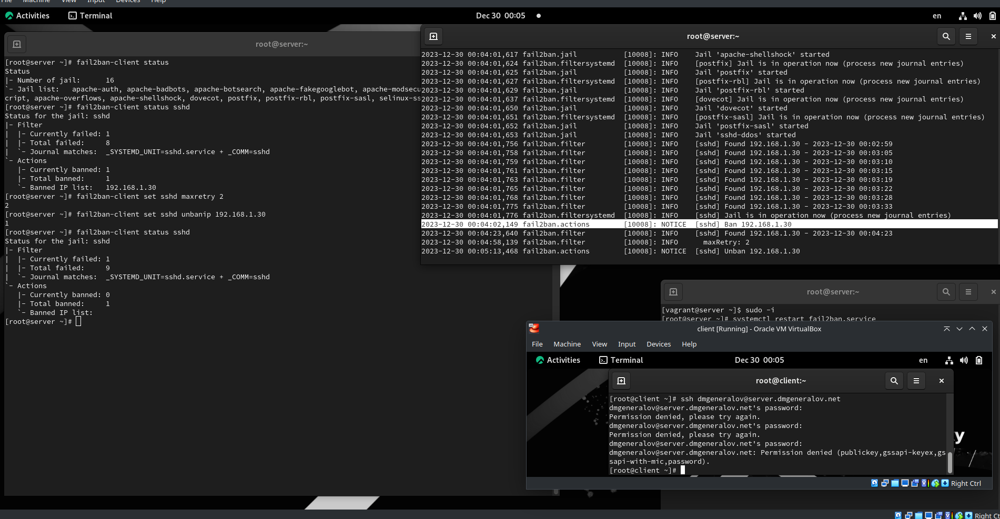
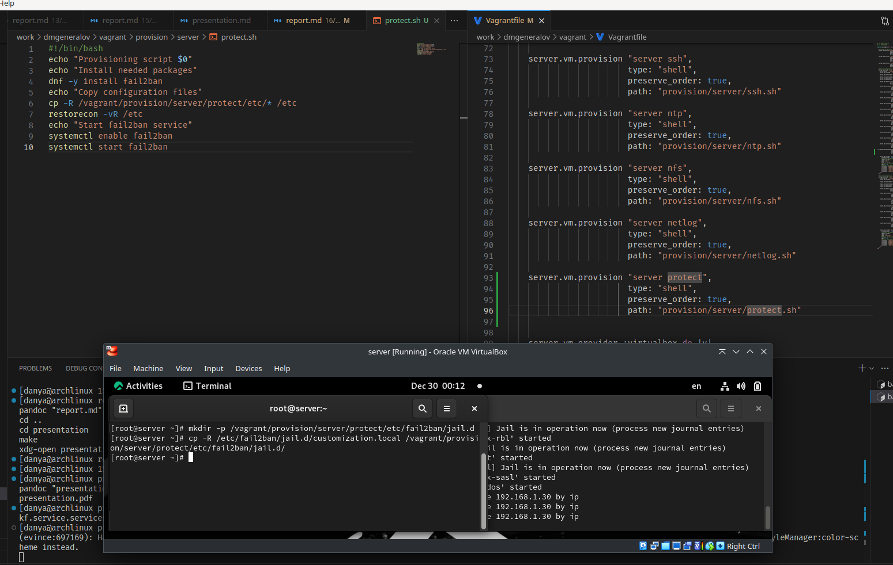

# Задача

> 1. Установите и настройте Fail2ban для отслеживания работы установленных на сервере служб (см. раздел 16.4.1).
> 2. Проверьте работу Fail2ban посредством попыток несанкционированного доступа с клиента на сервер через SSH (см. раздел 16.4.2).
> 3. Напишите скрипт для Vagrant, фиксирующий действия по установке и настройке Fail2ban (см. раздел 16.4.3).

# Выполнение 

## fail2ban

## fail2ban

## fail2ban

## Vagrant

## Вывод

Я получил опыт настройки защиты важных служб с помощью fail2ban.
