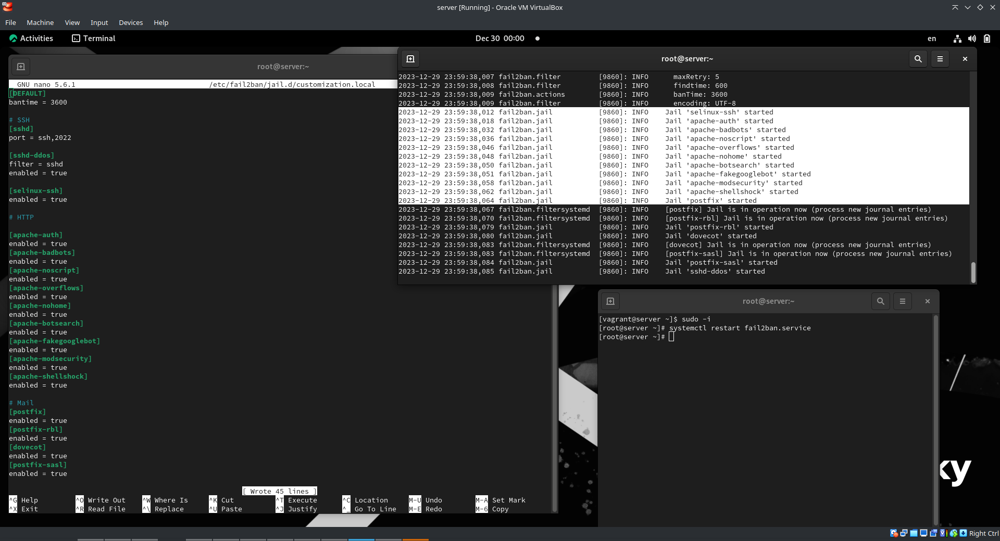

---
## Front matter
title: "Отчет по лабораторной работе 16"
subtitle: ""
author: "Генералов Даниил, НПИбд-01-21, 1032202280"

## Generic otions
lang: ru-RU
toc-title: "Содержание"


## Pdf output format
toc: true # Table of contents
toc-depth: 2
lof: true # List of figures
lot: true # List of tables
fontsize: 12pt
linestretch: 1.5
papersize: a4
documentclass: scrreprt
## I18n polyglossia
polyglossia-lang:
  name: russian
  options:
	- spelling=modern
	- babelshorthands=true
polyglossia-otherlangs:
  name: english
## I18n babel
babel-lang: russian
babel-otherlangs: english
## Fonts
mainfont: PT Serif
romanfont: PT Serif
sansfont: PT Sans
monofont: PT Mono
mainfontoptions: Ligatures=TeX
romanfontoptions: Ligatures=TeX
sansfontoptions: Ligatures=TeX,Scale=MatchLowercase
monofontoptions: Scale=MatchLowercase,Scale=0.9
## Biblatex
biblatex: true
biblio-style: "gost-numeric"
biblatexoptions:
  - parentracker=true
  - backend=biber
  - hyperref=auto
  - language=auto
  - autolang=other*
  - citestyle=gost-numeric
## Pandoc-crossref LaTeX customization
figureTitle: "Рис."
tableTitle: "Таблица"
listingTitle: "Листинг"
lofTitle: "Список иллюстраций"
lotTitle: "Список таблиц"
lolTitle: "Листинги"
## Misc options
indent: true
header-includes:
  - \usepackage{indentfirst}
  - \usepackage{float} # keep figures where there are in the text
  - \floatplacement{figure}{H} # keep figures where there are in the text
---

# Цель работы

Получить навыки работы с программным средством Fail2ban для обеспечения базовой защиты от атак типа «brute force».

# Задание

> 1. Установите и настройте Fail2ban для отслеживания работы установленных на сервере служб (см. раздел 16.4.1).
> 2. Проверьте работу Fail2ban посредством попыток несанкционированного доступа с клиента на сервер через SSH (см. раздел 16.4.2).
> 3. Напишите скрипт для Vagrant, фиксирующий действия по установке и настройке Fail2ban (см. раздел 16.4.3).


# Выполнение лабораторной работы

Сначала я установил fail2ban на сервер,
и добавил в файл конфигурации команды,
включающие защиту SSH, HTTP и почтовых служб.



После этого я попытался подключиться с клиента с неправильным паролем.
Это было замечено, и IP-адрес клиента был заблокирован,
что можно увидеть с помощью логов и команды `status`,
а также отменить с помощью команды `unban`.


Однако, если добавить IP-адрес клиента в игнорируемый список,
то он не будет заблокирован,
даже если он появляется в списке ошибок.


Наконец, экспортируем настройки в Vagrantfile.


# Выводы

Я получил опыт настройки защиты важных служб с помощью fail2ban.

# Контрольные вопросы

1. Поясните принцип работы Fail2ban.

Сервис отслеживает лог-файлы различных веб-служб,
и если строка с IP-адресом появляется чаще настроенного ограничения,
то этот IP-адрес блокируется.

2. Настройки какого файла более приоритетны: jail.conf или jail.local?

Файл jail.conf устанавливает базовые настройки, которые затем могут быть дополнены файлами .local в jail.d

3. Как настроить оповещение администратора при срабатывании Fail2ban?

Надо добавить действие в настройку jail:

`action = iptables[name=SSH,port=22,protocol=tcp] sendmsg`

Затем нужно создать настройку действия `sendmsg.conf`

```
[Definition]
actionstart = 
actionstop = 
actioncheck = 
actionban = curl -X POST https://example.com/webhook/banned/<ip>
actionunban = 
```

4. Поясните построчно настройки по умолчанию в конфигурационном файле /etc/fail2ban/jail.conf, относящиеся к веб-службе.

Они имеют вид:

```
[apache-auth]  # название модуля
port     = http,https  # если блокировать, то эти порты
logpath  = %(apache_error_log)s  # принимать решение о блокировке относительно этих файлов логов
```

5. Поясните построчно настройки по умолчанию в конфигурационном файле /etc/fail2ban/jail.conf, относящиеся к почтовой службе.

Они имеют вид:

```
[sendmail-auth]  # название модуля

port    = submission,465,smtp  # если блокировать, то эти порты
logpath = %(syslog_mail)s      # следить за этим файлом логов 
backend = %(syslog_backend)s   # сообщения будут приходить через syslog
```

6. Какие действия может выполнять Fail2ban при обнаружении атакующего IP-адреса?
Где можно посмотреть описание действий для последующего использования в настройках Fail2ban?

Все действия можно найти в `/etc/fail2ban/action.d` и их описания обычно находятся в начале каждого файла.

7. Как получить список действующих правил Fail2ban?

`fail2ban-client status`

8. Как получить статистику заблокированных Fail2ban адресов?

`fail2ban-client banned`

9. Как разблокировать IP-адрес?

`fail2ban-client unban 1.2.3.4`
