# Задание

> 1. Установите на виртуальной машине server DNS-сервер bind и bind-utils (см. раздел 2.4.1).
> 2. Сконфигурируйте на виртуальной машине server кэширующий DNS-сервер (см. раздел 2.4.2).
> 3. Сконфигурируйте на виртуальной машине server первичный DNS-сервер (см. раздел 2.4.3).
> 4. При помощи утилит dig и host проанализируйте работу DNS-сервера (см. раздел 2.4.4).
> 5. Напишите скрипт для Vagrant, фиксирующий действия по установке и конфигурированию DNS-сервера во внутреннем окружении виртуальной машины server. Соответствующим образом внесите изменения в Vagrantfile (см. раздел 2.4.5).

# Выполнение 

## Vagrant

## DNF

## dig

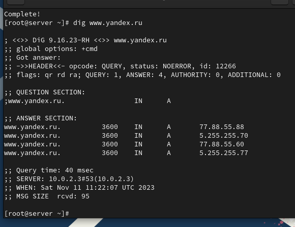

## resolv.conf

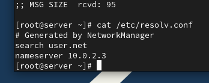

## BIND

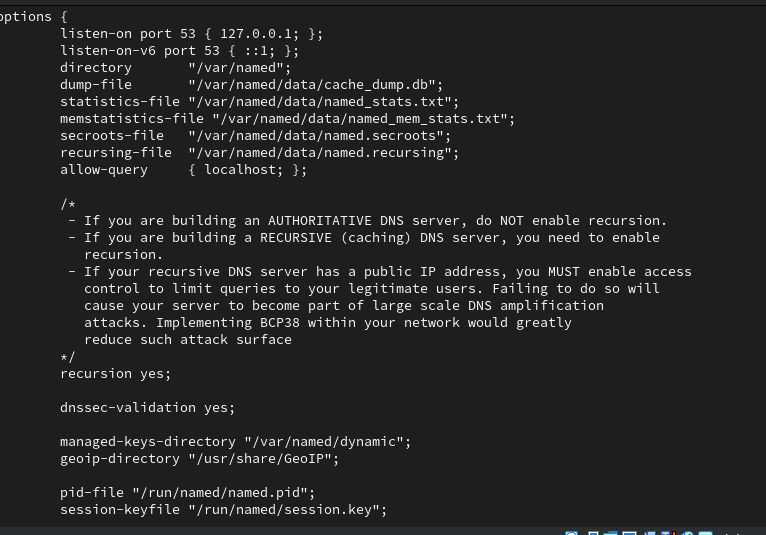

## BIND

## BIND

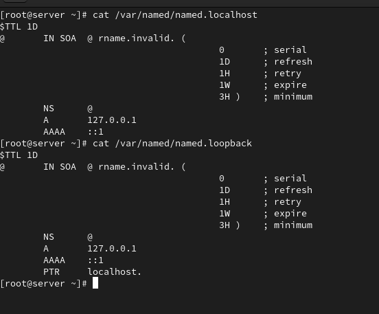

## dig

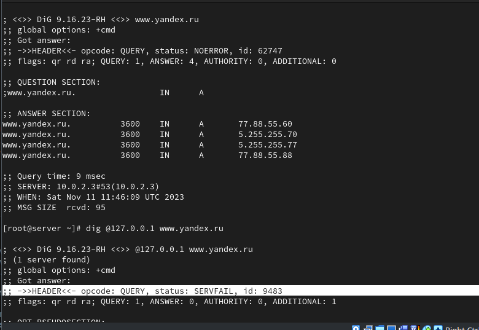

## BIND

## BIND

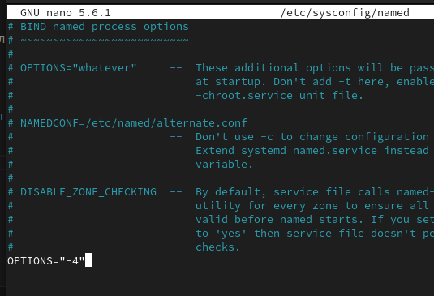

## Wireshark

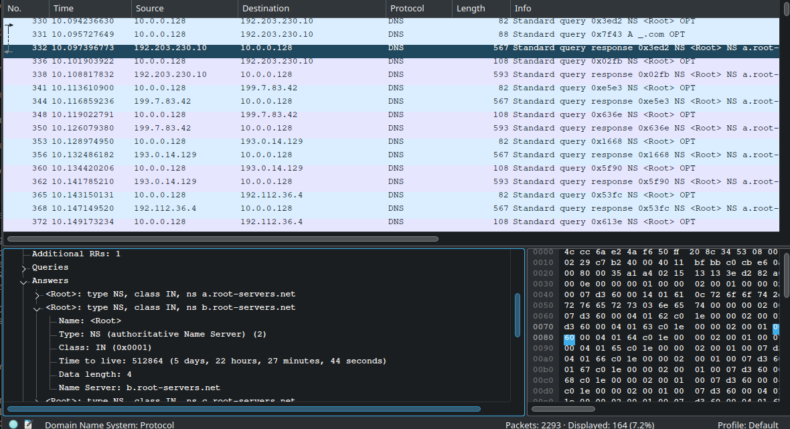

## BIND

## dig

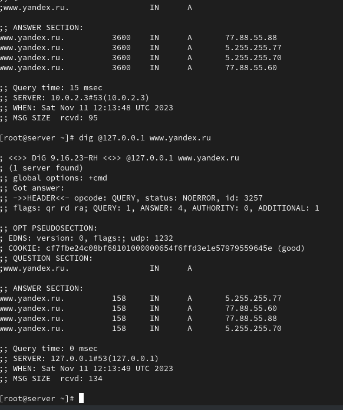

## nmcli

## BIND

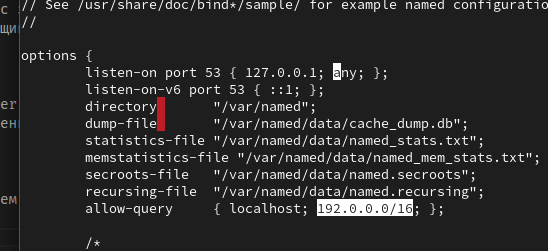

## BIND

## BIND

## BIND

## BIND

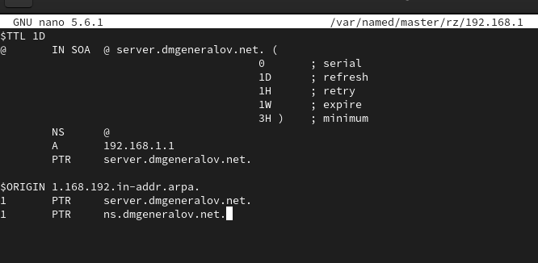

## BIND

## dig

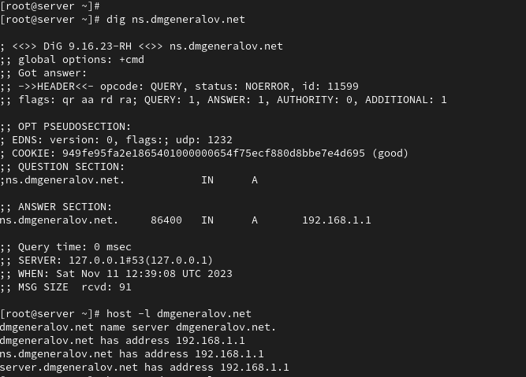

## host

## Vagrant

## Vagrant

## Vagrant

## Вывод

Я получил опыт настройки DNS-сервера BIND и сохранения сделанных настроек в систему Vagrant.
