---
## Front matter
title: "Отчет по лабораторной работе 2"
subtitle: ""
author: "Генералов Даниил, НПИбд-01-21, 1032202280"

## Generic otions
lang: ru-RU
toc-title: "Содержание"


## Pdf output format
toc: true # Table of contents
toc-depth: 2
lof: true # List of figures
lot: true # List of tables
fontsize: 12pt
linestretch: 1.5
papersize: a4
documentclass: scrreprt
## I18n polyglossia
polyglossia-lang:
  name: russian
  options:
	- spelling=modern
	- babelshorthands=true
polyglossia-otherlangs:
  name: english
## I18n babel
babel-lang: russian
babel-otherlangs: english
## Fonts
mainfont: PT Serif
romanfont: PT Serif
sansfont: PT Sans
monofont: PT Mono
mainfontoptions: Ligatures=TeX
romanfontoptions: Ligatures=TeX
sansfontoptions: Ligatures=TeX,Scale=MatchLowercase
monofontoptions: Scale=MatchLowercase,Scale=0.9
## Biblatex
biblatex: true
biblio-style: "gost-numeric"
biblatexoptions:
  - parentracker=true
  - backend=biber
  - hyperref=auto
  - language=auto
  - autolang=other*
  - citestyle=gost-numeric
## Pandoc-crossref LaTeX customization
figureTitle: "Рис."
tableTitle: "Таблица"
listingTitle: "Листинг"
lofTitle: "Список иллюстраций"
lotTitle: "Список таблиц"
lolTitle: "Листинги"
## Misc options
indent: true
header-includes:
  - \usepackage{indentfirst}
  - \usepackage{float} # keep figures where there are in the text
  - \floatplacement{figure}{H} # keep figures where there are in the text
---

# Цель работы

> Приобретение практических навыков по установке и конфигурированию DNS-сервера,
> усвоение принципов работы системы доменных имён.

# Задание

> 1. Установите на виртуальной машине server DNS-сервер bind и bind-utils (см. раздел 2.4.1).
> 2. Сконфигурируйте на виртуальной машине server кэширующий DNS-сервер (см. раздел 2.4.2).
> 3. Сконфигурируйте на виртуальной машине server первичный DNS-сервер (см. раздел 2.4.3).
> 4. При помощи утилит dig и host проанализируйте работу DNS-сервера (см. раздел 2.4.4).
> 5. Напишите скрипт для Vagrant, фиксирующий действия по установке и конфигурированию DNS-сервера во внутреннем окружении виртуальной машины server. Соответствующим образом внесите изменения в Vagrantfile (см. раздел 2.4.5).

# Выполнение лабораторной работы

Сначала я запустил сервер через Vagrant. Чтобы его файлы находились в правильной папке, я сначала сделал `make addbox`.

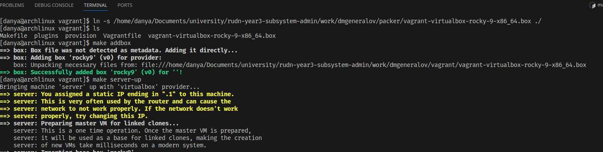

После запуска и входа в систему я установил bind и bind-utils.

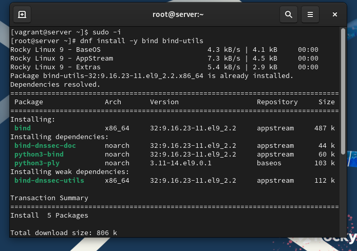

Можно проверить, что интернет и DNS работают.

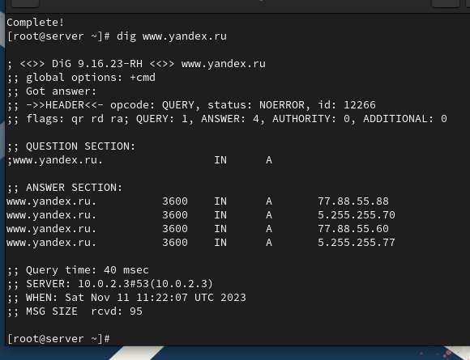

В /etc/resolv.conf находятся две строки: IP-адрес DNS-сервера и search-домен для данной сети.

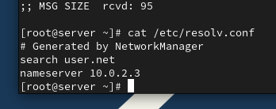

В /etc/named.conf хранятся настройки DNS-сервера: по каким портам и адресам стоит слушать (по умолчанию -- localhost и порт 53), каким хостам стоит разрешать делать запросы (опять же, только localhost), в каких папках и файлах находится информация, которую использует сервер, вроде статистики и кеша рекурсии (все в /var/named), а также путь, куда стоит писать логи, и какие зоны следует публиковать (по умолчанию -- только корневую зону в `named.ca` как zone hints).

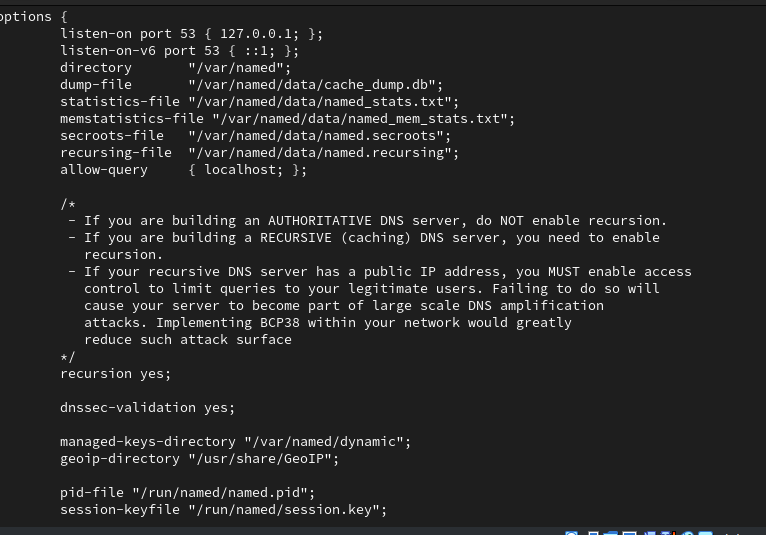

Файл `/var/named/named.ca` -- это лог команды `dig`, которая спрашивает информацию о корневой зоне.
Этот формат файла является также форматом зоны для named.
Здесь находятся А-записи для серверов корневой зоны, которые почти никогда не меняются и поэтому могут быть кешированы на такое долгое время, чтобы стать частью стандартной конфигурации сервера.

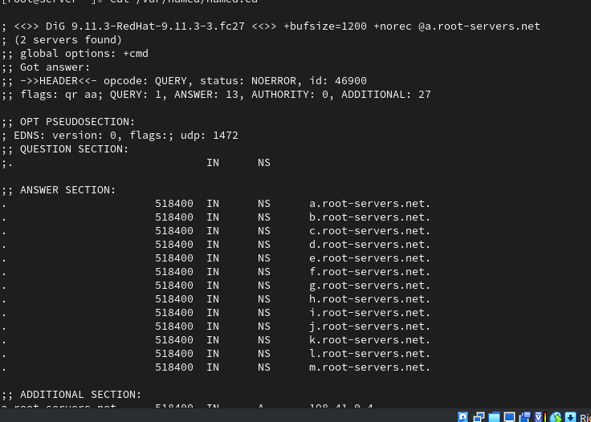

Файл `/var/named/named.localhost` определяет зону, для которой TTL равен одному дню, и зона называется `@`, что является ссылкой на название этой зоны (то есть зона -- `localhost`). Описывается, что для этих зон сервером имен является сам localhost, а IP-адресом -- 127.0.0.1. Эта зона существует, чтобы отвечать на запрос `localhost`-адреса через DNS.
Файл `/var/named/named.loopback` определяет обратную зону: он говорит, что зона `@` -- а именно `1.0.0.127.in-addr.arpa` -- связана PTR-записью с `localhost`.


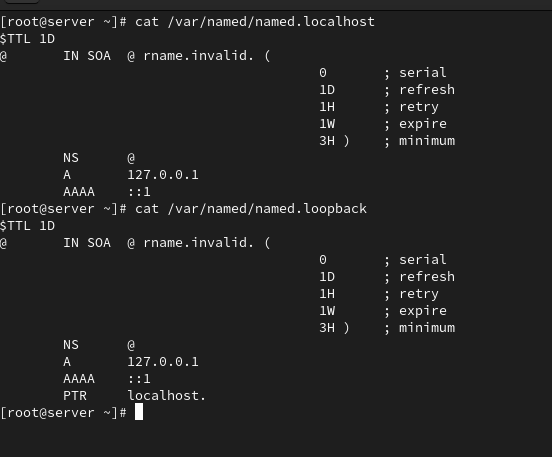

Теперь я запустил `named` и попробовал сделать запрос через системный resolver и через локальный.
Но локальный сервер отвечал ошибкой.

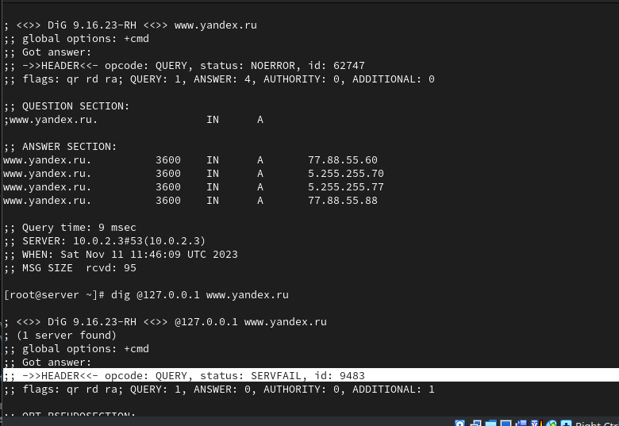

Если посмотреть в лог, то можно увидеть ошибки, связанные с тем, что сервер пытается использовать IPv6-DNS-сервера, чтобы получить ответ,
а IPv6 недоступен.

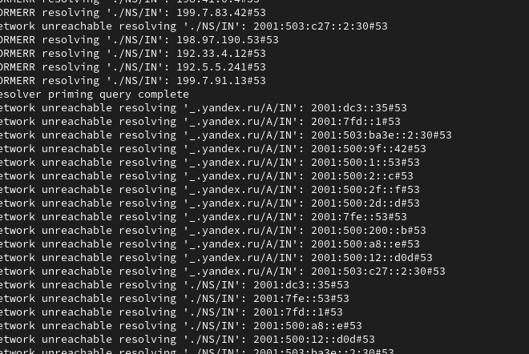

Чтобы исправить это, я настроил в `/etc/sysconfig/named`, чтобы серверу передавался параметр `-4`, который должен сделать так, чтобы использовался только IPv4.

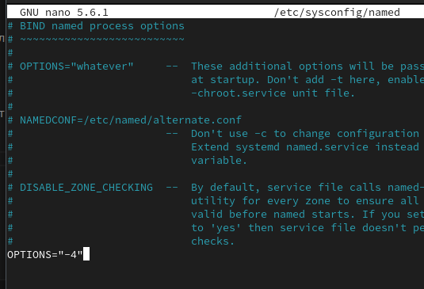

Теперь остались только сообщения о `FORMERR` -- только сейчас я понял, что это значит "format error".
Поэтому я попробовал использовать Wireshark на внешнем компьютере, чтобы понять, что происходит с трафиком DNS.
BIND спрашивает каждый из корневых серверов про NS для корня, и получает ответ, но этот ответ не нравится BIND.

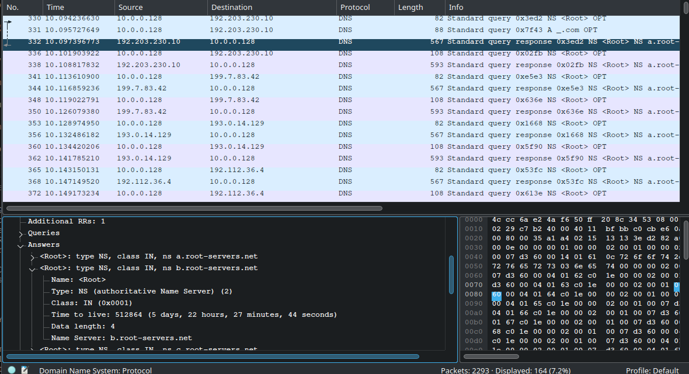

В этот момент я решил перейти к шагу, когда рекурсия заменяется forwarding, и перенаправлять все запросы на сервер 1.1.1.1, который работает для меня.
Для этого в настройках BIND я добавил forwarders и выключил DNSSEC.

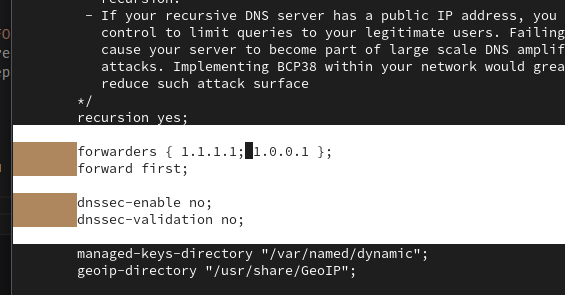

После перезагрузки BIND у меня наконец получилось сделать запрос к локальному серверу и получить ответ.
У этого ответа низкий TTL по сравнению с запросом к системному resolver,
потому что мы делаем forward на кеширующий сервер, который возвращает нам ответ, который он получил давно.

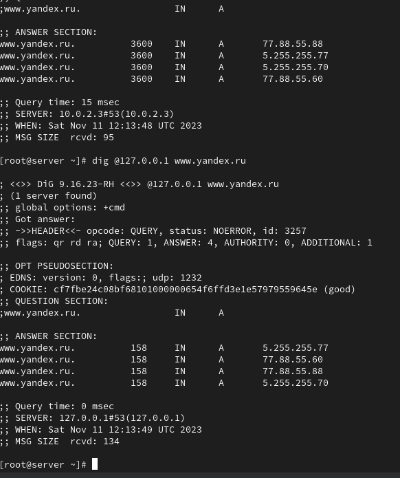

Теперь мы меняем настройки networkmanager, чтобы использовать этот сервер для всех сетевых соединений.
После перезагрузки networkmanager изменения применились к /etc/resolv.conf.

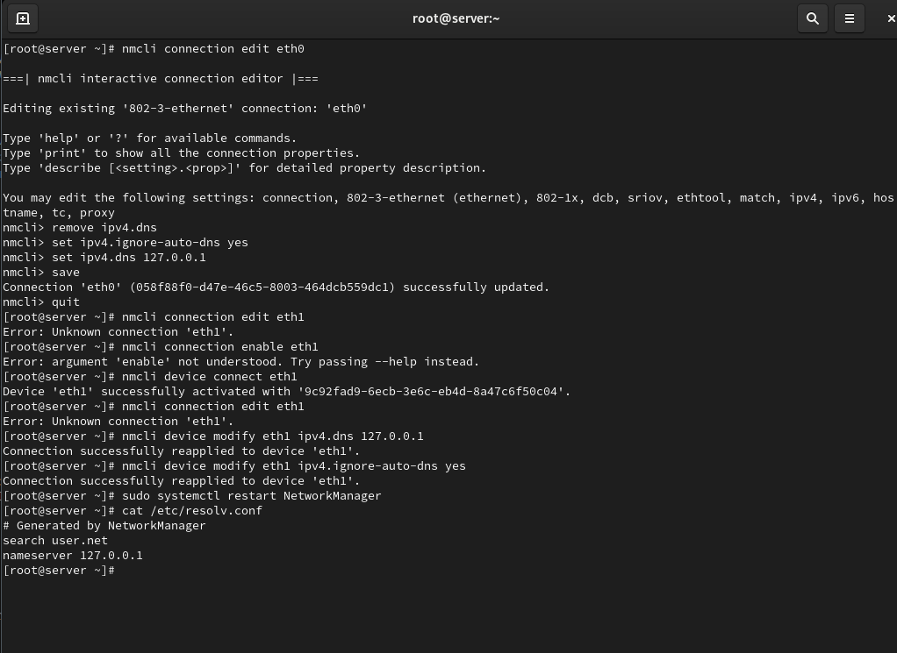

В настройках /etc/named.conf мы разрешаем доступ с всех устройств виртуальной сети.

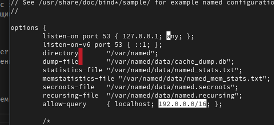

Теперь мы начинаем настройку авторитетной зоны для этого сервера.
Для этого сначала подключаем файл, где будет находится настройка этой зоны: `dmgeneralov.net`.

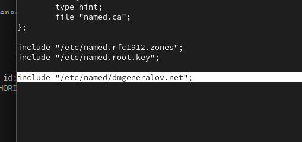

Затем в этом файле указываем прямую и обратную зоны, и где они будут находиться.

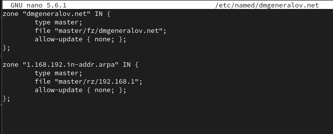

После этого создаем папки и файл прямой зоны.

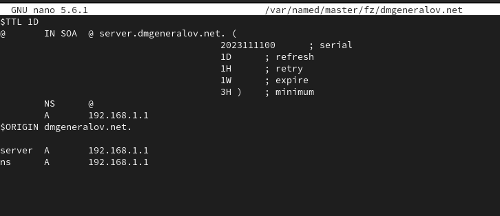

А затем файл обратной зоны.

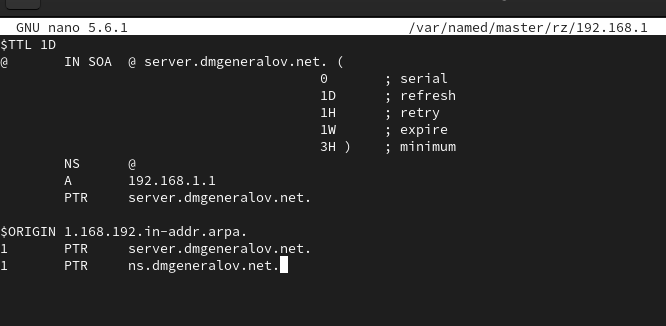

Теперь нужно разрешить BIND доступ к этим файлам. Для этого нужно сначала сменить владельца этих файлов, а затем с помощью `restorecon` вернуть стандартный SELinux-контекст всем файлам в папке.
После этого мы запускаем BIND, и он запускается без ошибок.

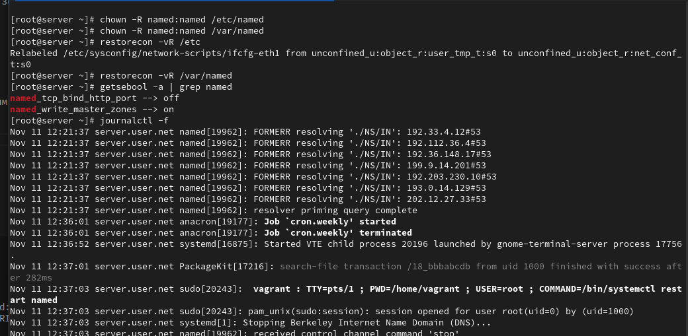

После этого можно проверить работу DNS-сервера.
Мы видим, что для `dmgeneralov.net` есть IP-адрес 192.168.1.1,
и тот же самый адрес имеет `server.dmgeneralov.net` и `ns.dmgeneralov.net`.

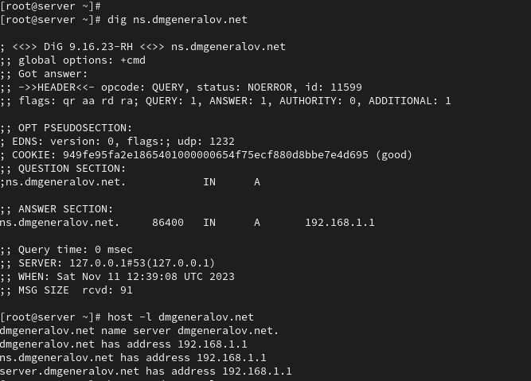

Отдельно говоря, `dmgeneralov.net` действительно указывает на 192.168.1.1,
и тот же самый адрес имеет `server.dmgeneralov.net` и `ns.dmgeneralov.net`.

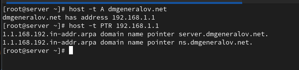

Теперь мы экспортировали из виртуальной машины все файлы конфигурации.

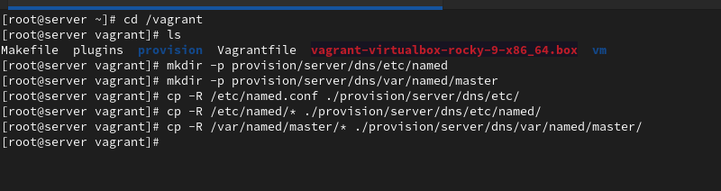

Создали скрипт `dns.sh`, который выполняет эту настройку автоматически.

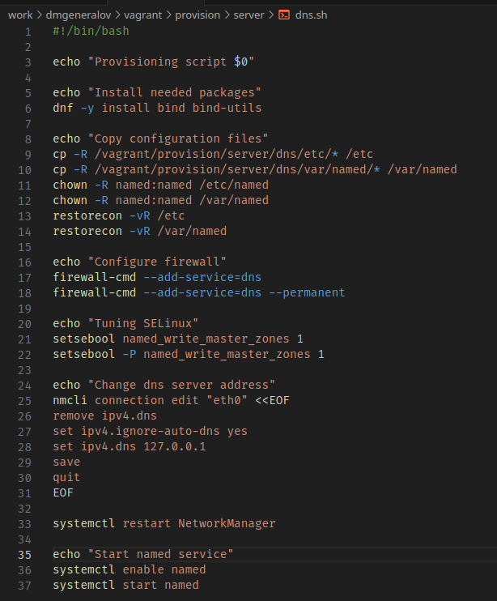

И добавили его как шаг настройки в Vagrantfile.

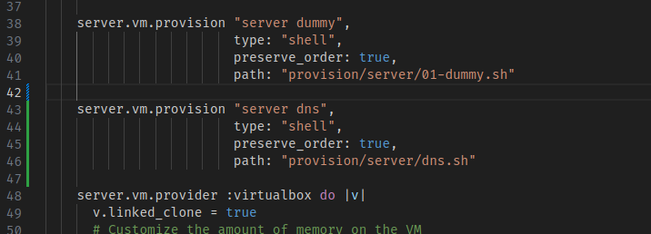

# Выводы

Я получил опыт настройки DNS-сервера BIND и сохранения сделанных настроек в систему Vagrant.

# Контрольные вопросы

1. Что такое DNS?
Протокол и система серверов, которые предоставляют доступ к базе данных, соотносящей доменные имена с IP-адресами и другой информацией.

2. Каково назначение кэширующего DNS-сервера?
Временно сохранять ответы от авторитетных DNS-серверов, чтобы сэкономить трафик и нагрузку на них.

3. Чем отличается прямая DNS-зона от обратной?
Прямая зона -- от имени к IP-адресу, а обратная -- от IP-адреса к имени.

4. В каких каталогах и файлах располагаются настройки DNS-сервера? Кратко охарактеризуйте, за что они отвечают.
`/etc/named` -- общие настройки сервера: какие интерфейсы слушать, какие протоколы, следует ли делать zone transfer...
`/var/named` -- файлы зоны, для которых сервер является авторитетным, и которые он отвечает сам.

5. Что указывается в файле resolv.conf?
IP-адрес DNS-серверов, которые стоит использовать для разрешения имен на этом компьютере, а также search-домен (потенциальный постфикс имен) и настройки механизма разрешения имен.

6. Какие типы записи описания ресурсов есть в DNS и для чего они используются?
Есть много различных, среди них:
- SOA: для этой зоны является авторитетом этот DNS-сервер и эта организация
- NS: для этой зоны авторитетным DNS-сервером является это имя
- A/AAAA: этот домен относится к этому IPv4/IPv6-адресу.
- PTR: для этого IP-адреса (заданого в in-addr.arpa зоне) существует A-запись от этого домена
- CNAME: обращения к данному домену должны быть переадресованы к другому домену
- MX: для почты, направленной на данный домен, следует связываться с сервером, находящимся по этому имени.

7. Для чего используется домен in-addr.arpa?
Поддомены этой зоны используются для обратных запросов (IP -> имя). По запросу `PTR 4.3.2.1.in-addr.arpa` можно узнать, какой домен указывает на IP-адрес 1.2.3.4.

8. Для чего нужен демон named?
Он слушает и отвечает на DNS-запросы, либо как авторитет для определенной зоны, либо рекурсивно.

9. В чём заключаются основные функции slave-сервера и master-сервера?
Master-сервер хранит авторитетную копию записей для данной зоны. Помимо обслуживания внешних запросов, он предоставляет zone-transfer для своих slave-серверов, которые могут быть использованы как резервные в случае недоступности master-сервера.

10. Какие параметры отвечают за время обновления зоны?
Этот параметр -- refresh в SOA-записи. Он указывает, после какого времени slave-сервер должен скачать новое состояние зоны.

11. Как обеспечить защиту зоны от скачивания и просмотра?
Для этого нужно запретить AXFR-операцию на DNS-сервере.

12. Какая запись RR применяется при создании почтовых серверов?
MX.

13. Как протестировать работу сервера доменных имён?
Использовать `dig example.com @192.168.1.1` или `host example.com 127.0.0.1`

14. Как запустить, перезапустить или остановить какую-либо службу в системе?
`systemctl start <service>`, `systemctl restart`, `systemctl stop`.

15. Как посмотреть отладочную информацию при запуске какого-либо сервиса или службы?
`systemctl status`

16. Где храниться отладочная информация по работе системы и служб? Как её посмотреть?
Она хранится в системном журнале и ее можно посмотреть с помощью `journalctl`.

17. Как посмотреть, какие файлы использует в своей работе тот или иной процесс? Приведите несколько примеров.
`lsof -p <pid>`, `ls -l /proc/<pid>/fd`.
18. Приведите несколько примеров по изменению сетевого соединения при помощи командного интерфейса nmcli.
Подключиться к Ethernet: `nmcli device connect enp3s0`
Отключиться от Ethernet: `nmcli device disconnect enp3s0`
Поменять IP-адрес подключения: `nmcli device modify enp3s0 ipv4.addresses "10.0.0.129"`


19. Что такое SELinux?
Система мандатного контроля доступа, которая используется для ограничения возможностей программ и пользователей в системе.

20. Что такое контекст (метка) SELinux?
Информация о том, кто имеет право выполнять какие операции с файлом.

21. Как восстановить контекст SELinux после внесения изменений в конфигурационные файлы?
`restorecon /etc/conf.d`

22. Как создать разрешающие правила политики SELinux из файлов журналов, содержащих сообщения о запрете операций?
```
audit2allow -M local << EOF
audit(...): avc:  denied  { write } for  pid=... comm="..." name="..." dev=... ino=... scontext=... tcontext=... tclass=...
EOF
semodule -i local.pp
```

23. Что такое булевый переключатель в SELinux?
Это значение, которое может быть true или false, и используется для настройки готовой SELinux-политики.

24. Как посмотреть список переключателей SELinux и их состояние?
`semanage boolean -l`

25. Как изменить значение переключателя SELinux?
`setsebool <boolean> on/off`