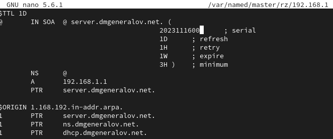

# Задача

> 1. Установите на виртуальной машине server DHCP-сервер (см. раздел 3.4.1).
> 2. Настройте виртуальную машину server в качестве DHCP-сервера для виртуальной внутренней сети (см. раздел 3.4.2).
> 3. Проверьте корректность работы DHCP-сервера в виртуальной внутренней сети путём запуска виртуальной машины client и применения соответствующих утилит диагностики (см. раздел 3.4.3).
> 4. Настройте обновление DNS-зоны при появлении в виртуальной внутренней сети новых узлов (см. раздел 3.4.4).
> 5. Проверьте корректность работы DHCP-сервера и обновления DNS-зоны в виртуальной внутренней сети путём запуска виртуальной машины client и применения соответствующих утилит диагностики (см. раздел 3.4.5).
> 6. Напишите скрипт для Vagrant, фиксирующий действия по установке и настройке DHCP-сервера во внутреннем окружении виртуальной машины server. Соответствующим образом внести изменения в Vagrantfile (см. раздел 3.4.6).

# Выполнение 

## Vagrant

## DHCP

## systemd

## DNS

## DNS

## Ping

## DHCP

## Vagrant

## Vagrant

## DHCP

## DHCP

## DNS

## DHCP

## DHCP

## DNS

## Vagrant

## Vagrant

## Vagrant

## Вывод

Я получил опыт настройки DHCP-сервера и подключения его к DNS-серверу для осуществления DDNS.
