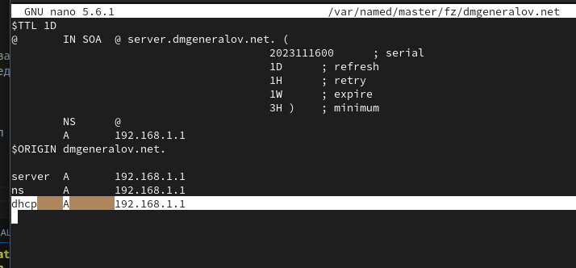
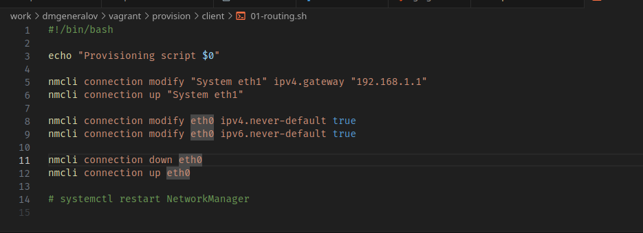
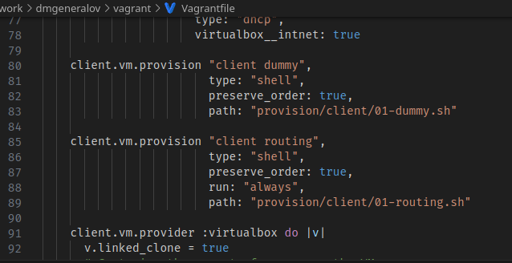
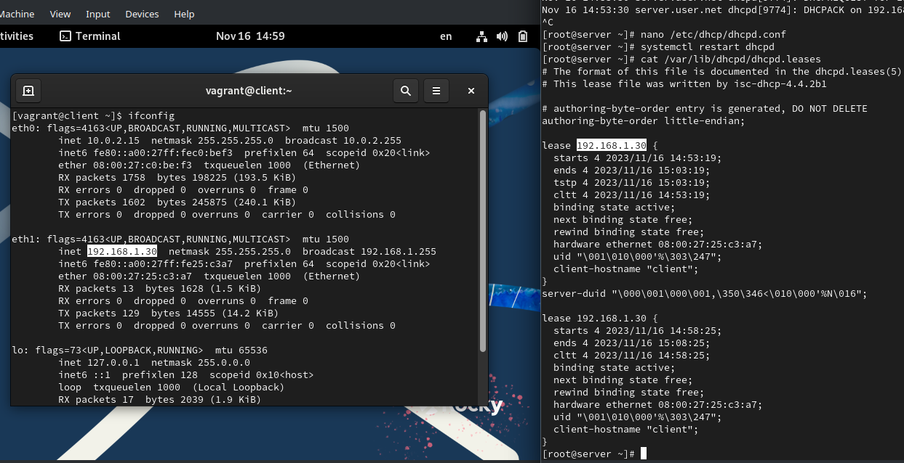
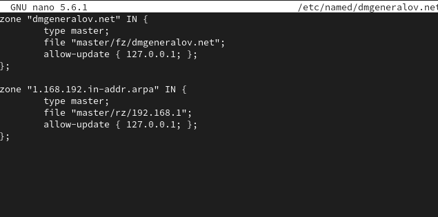
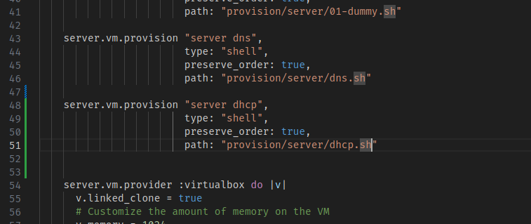

---
## Front matter
title: "Отчет по лабораторной работе 3"
subtitle: ""
author: "Генералов Даниил, НПИбд-01-21, 1032202280"

## Generic otions
lang: ru-RU
toc-title: "Содержание"

## Pdf output format
toc: true # Table of contents
toc-depth: 2
lof: true # List of figures
lot: true # List of tables
fontsize: 12pt
linestretch: 1.5
papersize: a4
documentclass: scrreprt
## I18n polyglossia
polyglossia-lang:
  name: russian
  options:
	- spelling=modern
	- babelshorthands=true
polyglossia-otherlangs:
  name: english
## I18n babel
babel-lang: russian
babel-otherlangs: english
## Fonts
mainfont: PT Serif
romanfont: PT Serif
sansfont: PT Sans
monofont: PT Mono
mainfontoptions: Ligatures=TeX
romanfontoptions: Ligatures=TeX
sansfontoptions: Ligatures=TeX,Scale=MatchLowercase
monofontoptions: Scale=MatchLowercase,Scale=0.9
## Biblatex
biblatex: true
biblio-style: "gost-numeric"
biblatexoptions:
  - parentracker=true
  - backend=biber
  - hyperref=auto
  - language=auto
  - autolang=other*
  - citestyle=gost-numeric
## Pandoc-crossref LaTeX customization
figureTitle: "Рис."
tableTitle: "Таблица"
listingTitle: "Листинг"
lofTitle: "Список иллюстраций"
lotTitle: "Список таблиц"
lolTitle: "Листинги"
## Misc options
indent: true
header-includes:
  - \usepackage{indentfirst}
  - \usepackage{float} # keep figures where there are in the text
  - \floatplacement{figure}{H} # keep figures where there are in the text
---

# Цель работы

> Приобретение практических навыков по установке и конфигурированию DHCP-сервера.

# Задание

> 1. Установите на виртуальной машине server DHCP-сервер (см. раздел 3.4.1).
> 2. Настройте виртуальную машину server в качестве DHCP-сервера для виртуальной внутренней сети (см. раздел 3.4.2).
> 3. Проверьте корректность работы DHCP-сервера в виртуальной внутренней сети путём запуска виртуальной машины client и применения соответствующих утилит диагностики (см. раздел 3.4.3).
> 4. Настройте обновление DNS-зоны при появлении в виртуальной внутренней сети новых узлов (см. раздел 3.4.4).
> 5. Проверьте корректность работы DHCP-сервера и обновления DNS-зоны в виртуальной внутренней сети путём запуска виртуальной машины client и применения соответствующих утилит диагностики (см. раздел 3.4.5).
> 6. Напишите скрипт для Vagrant, фиксирующий действия по установке и настройке DHCP-сервера во внутреннем окружении виртуальной машины server. Соответствующим образом внести изменения в Vagrantfile (см. раздел 3.4.6).

# Выполнение лабораторной работы

Сначала я запустил сервер с помощью Vagrant, и после того, как он запустился, установил пакет `dhcp-server`.

После этого я скопировал пример конфигурационного файла и настроил его: домен `dmgeneralov.net`, сервер DNS `ns.dmgeneralov.net`, сервер авторитативный для этой подсети и предоставляет подсеть `192.168.1.0/24` адресами от 30 до 199.

Затем, я настроил файл `/etc/systemd/system/dhcpd.service`: теперь dhcpd будет запускаться на интерфейсе `eth1`.

Затем создал новую запись в DNS-зоне: `dhcp.dmgeneralov.net` указывает на `192.168.1.1`.

Аналогично, `192.168.1.1` указывает на `dhcp.dmgeneralov.net`.

После этих настроек и перезагрузки DNS-сервера, новая запись теперь работает.

Теперь мы запускаем DHCP-сервер, начинаем следить за системными сообщениями.

Перед запуском клиента нужно настроить Vagrant-скрипт, чтобы трафик шел через eth1 по умолчанию.
К счастью, такой скрипт уже существует в системе.

Аналогично, он уже является частью настройки Vagrantfile.

Поэтому при запуске клиента автоматически произойдет подключение к сети в eth1, что будет видно в логах сервера.
Действительно, в логах видно, что клиент запрашивает IP-адрес, получает 192.168.1.30 и принимает его.
Однако ошибка в логах подсказывает, что я сделал опечатку в указании DNS-сервера в настройках, поэтому я изменил его и перезагрузил DHCP-сервер.

Также, на клиенте, команда `ifconfig` показывает, что клиент успешно получил IP-адрес 192.168.1.30, и в сервере есть файл, который описывает эту аренду, следовательно DHCP-сервер работает.

Теперь нужно настроить обновление DNS-зоны относитлельно этих аренд. Для этого нужно сначала разрешить это для адреса localhost.

Теперь нужно указать в DHCP-настройках, на каком именно DNS-сервере это нужно делать.

Новые DHCP-аренды теперь идут в настройки DNS-зоны.

Это можно проверить с помощью команды `dig`: на клиенте видна запись для client.dmgeneralov.net.
Правда, для этого потребовалось включить DNS в разрешения firewalld.
В ответе `dig` видно, что сервер 192.168.1.1 знает, что Адрес для client.dmgeneralov.net равен 192.168.1.30,
и эту информацию можно хранить в течении 300 секунд (5 минут).

Наконец, нужно сохранить все настройки в репозиторий. Для этого мы копируем все файлы DHCP и DNS в /vagrant.

После этого мы создаем скрипт, который настраивает это.

Наконец, добавляем этот скрипт в Vagrantfile для автоматической настройки.

# Выводы

Я получил опыт настройки DHCP-сервера и подключения его к DNS-серверу для осуществления DDNS.

# Контрольные вопросы

1. В каких файлах хранятся настройки сетевых подключений?

В системах, которые используют NetworkManager (вроде Rocky), перманентные настройки хранятся в файлах в `/etc/NetworkManager/system-connections`,
и они изменяются как результат выполнения `nmcli`-команд или других команд по настройке NetworkManager.

2. За что отвечает протокол DHCP?

Посредством этого протокола, новые хосты, которые подключаются к сети,
могут получить IP-адрес и другие необходимые настройки для работы в этой сети.

3. Поясните принцип работы протокола DHCP. Какими сообщениями обмениваются клиент и сервер, используя протокол DHCP?

Сначала DHCP-клиент отправляет широковещательный пакет с запросом информации.
DHCP-сервера отвечают на это сообщение, и в ответе указывают, какой IP-адрес они готовы предложить,
а также другие настройки (вроде адреса роутера, DNS-серверов, и TFTP-сервера и пути).
Клиент выбирает один из этих ответов, затем настраивает свой IP-адрес, и затем с этого IP-адреса отправляет серверу подтверждение, что он принял эту настройку, и в этот момент сервер запоминает, что этот IP-адрес теперь занят:
он записывает это в lease-файл, и обновляет DNS при необходимости.

4. В каких файлах обычно находятся настройки DHCP-сервера? За что отвечает каждый из файлов?

Настройки хранятся в файле `/etc/dhcp/dhcpd.conf`, который содержит описания DHCP-диапазонов, серверов для DDNS и параметров, которые отправлять клиентам.
Параметры запуска процесса сервера можно найти в `/etc/systemd/system/dhcpd.service`.
Выданные аренды IP-адресов можно найти в `/var/lib/dhcpd/dhcpd.leases` -- это не настройка пользователя, но это важный файл для DHCP-сервера, чтобы он не выдал один и тот же адрес нескольким клиентам.

5. Что такое DDNS? Для чего применяется DDNS?

Dynamic DNS -- это технология, с помощью которой информация DNS-сервера меняется без ручных изменений от администратора.
Одно из применений DDNS -- это использование динамических IP-адресов у серверов: каждый раз, когда IP-адрес сервера меняется,
он говорит об этом DDNS-провайдеру, и клиенты могут использовать доменное имя без изменений своей настройки.
Другое применение -- удобный доступ ко всем устройствам локальной сети (именно это делается в этой лабораторной работе).

6. Какую информацию можно получить, используя утилиту ifconfig? Приведите примеры с использованием различных опций.

У этой утилиты, в отличие от более новой утилиты `ip`, почти нет опций, которые изменяют отображение --
максимум можно ограничить вывод одним сетевым интерфейсом, указав его имя.
Для каждого интерфейса утилита выводит информацию о самом интерфейсе (вроде его MTU, MAC-адреса, длины очереди передачи),
так и о его настройке (его IPv4 и IPv6-адреса с сетевой маской и широковещательным адресом),
а также его состояние (флаги интерфейса, счетчики приема-передачи пакетов и байтов, а также ошибок)

7. Какую информацию можно получить, используя утилиту ping? Приведите примеры с использованием различных опций.

Первая строка имеет формат `PING dhcp.dmgeneralov.net (192.168.1.1) 56(84) bytes of data.` -- здесь указывается, какое имя мы пытаемся пинговать, и какой IP-адрес мы будем использовать.
Дальше, при успехе, мы получаем строки, которые указывают номер пакета, который мы получили в ответ, его TTL (64 - через сколько роутеров прошел пакет по пути до нас), и время в миллисекундах от отправки до получения.
В конце выводится сводная статистике: сколько пакетов было отправлено, сколько получено (и каков процент потерь), сколько времени это заняло,
а также статистика времени ответа (максимум, минимум, среднее, и среднеквадратичное отклонение).