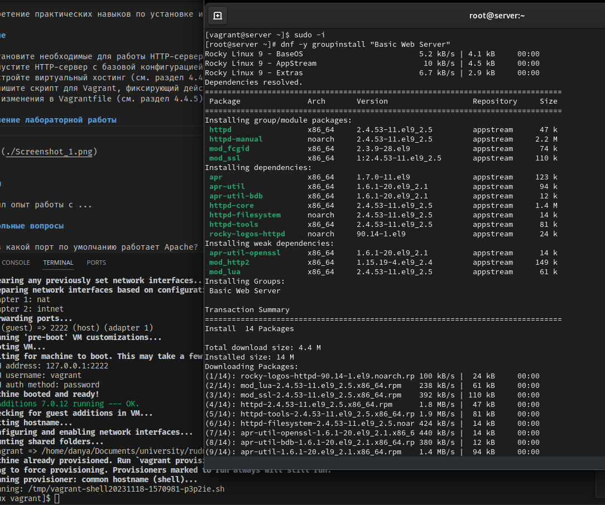
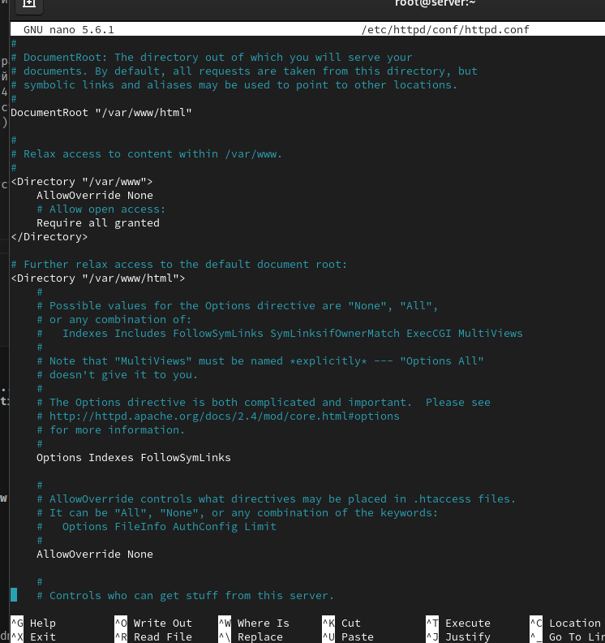
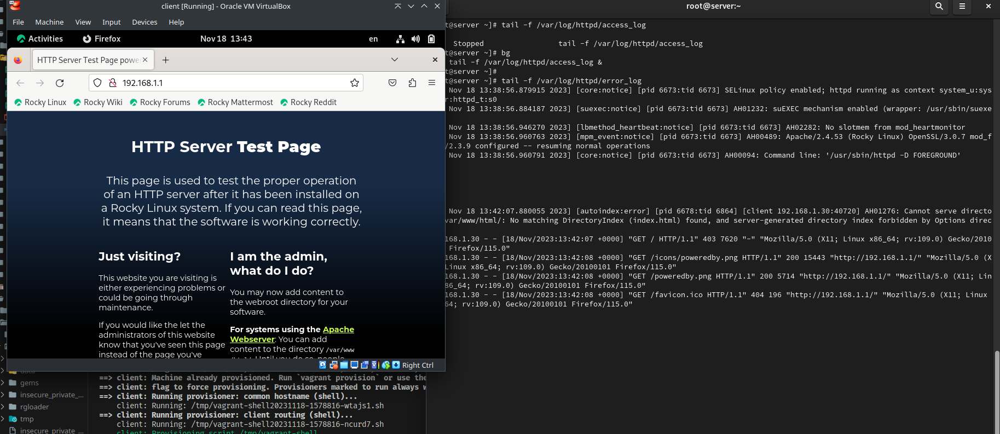
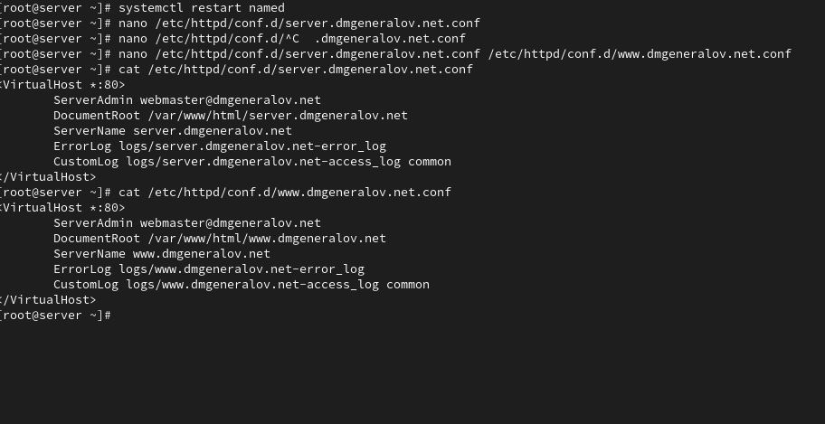
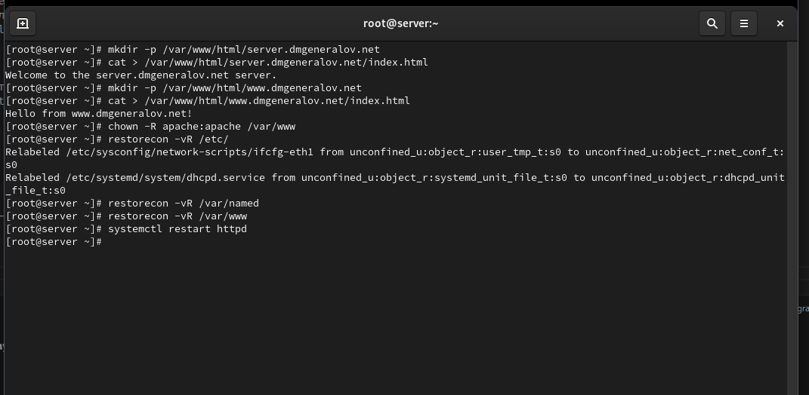
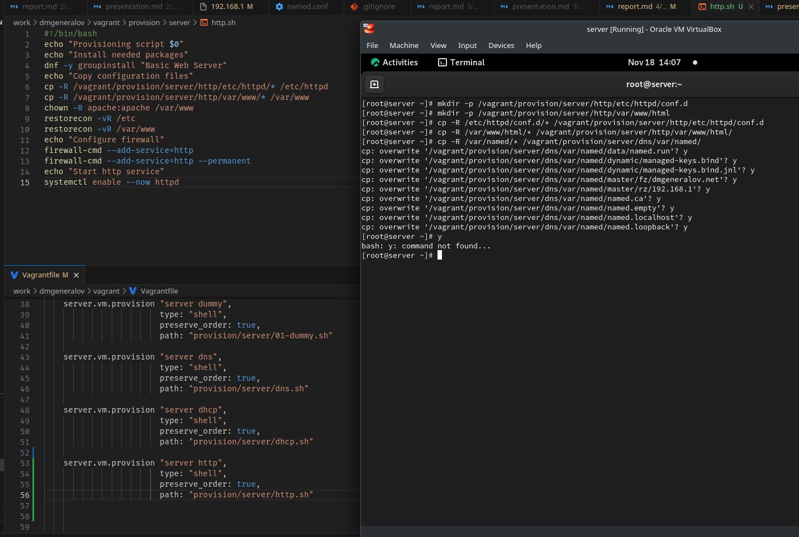

# Задача

> 1. Установите необходимые для работы HTTP-сервера пакеты (см. раздел 4.4.1).
> 2. Запустите HTTP-сервер с базовой конфигурацией и проанализируйте его работу (см. разделы 4.4.2 и 4.4.3).
> 3. Настройте виртуальный хостинг (см. раздел 4.4.4).
> 4. Напишите скрипт для Vagrant, фиксирующий действия по установке и настройке HTTP-сервера во внутреннем окружении виртуальной машины server. Соответствующим образом внесите изменения в Vagrantfile (см. раздел 4.4.5).

# Выполнение 

## DNF

## HTTPd

## HTTPd

## HTTPd

## HTTPd

## DNS

## DNS

## HTTPd

## HTTPd

## HTTPd

## Vagrant

## Вывод

Я получил опыт настройки сервера Apache, в частности настройки виртуального хостинга.
