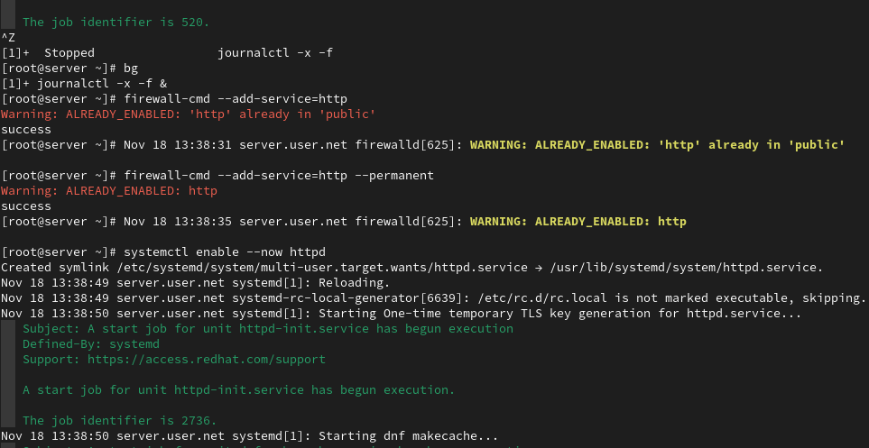

---
## Front matter
title: "Отчет по лабораторной работе 4"
subtitle: ""
author: "Генералов Даниил, НПИбд-01-21, 1032202280"

## Generic otions
lang: ru-RU
toc-title: "Содержание"

## Pdf output format
toc: true # Table of contents
toc-depth: 2
lof: true # List of figures
lot: true # List of tables
fontsize: 12pt
linestretch: 1.5
papersize: a4
documentclass: scrreprt
## I18n polyglossia
polyglossia-lang:
  name: russian
  options:
	- spelling=modern
	- babelshorthands=true
polyglossia-otherlangs:
  name: english
## I18n babel
babel-lang: russian
babel-otherlangs: english
## Fonts
mainfont: PT Serif
romanfont: PT Serif
sansfont: PT Sans
monofont: PT Mono
mainfontoptions: Ligatures=TeX
romanfontoptions: Ligatures=TeX
sansfontoptions: Ligatures=TeX,Scale=MatchLowercase
monofontoptions: Scale=MatchLowercase,Scale=0.9
## Biblatex
biblatex: true
biblio-style: "gost-numeric"
biblatexoptions:
  - parentracker=true
  - backend=biber
  - hyperref=auto
  - language=auto
  - autolang=other*
  - citestyle=gost-numeric
## Pandoc-crossref LaTeX customization
figureTitle: "Рис."
tableTitle: "Таблица"
listingTitle: "Листинг"
lofTitle: "Список иллюстраций"
lotTitle: "Список таблиц"
lolTitle: "Листинги"
## Misc options
indent: true
header-includes:
  - \usepackage{indentfirst}
  - \usepackage{float} # keep figures where there are in the text
  - \floatplacement{figure}{H} # keep figures where there are in the text
---

# Цель работы

> Приобретение практических навыков по установке и базовому конфигурированию HTTP-сервера Apache.

# Задание

> 1. Установите необходимые для работы HTTP-сервера пакеты (см. раздел 4.4.1).
> 2. Запустите HTTP-сервер с базовой конфигурацией и проанализируйте его работу (см. разделы 4.4.2 и 4.4.3).
> 3. Настройте виртуальный хостинг (см. раздел 4.4.4).
> 4. Напишите скрипт для Vagrant, фиксирующий действия по установке и настройке HTTP-сервера во внутреннем окружении виртуальной машины server. Соответствующим образом внесите изменения в Vagrantfile (см. раздел 4.4.5).

# Выполнение лабораторной работы

Сначала я запустил виртуальную машину сервера и установил группу пакетов "Basic Web Server", включая httpd и утилиты.

Это создало несколько файлов настройки. Например, `/etc/httpd/conf/httpd.conf` указывает основные настройки сервера (вроде того, какие порты используются и под именем какого пользователя следует запускать сервер), а также разрешения на доступ к определенным папкам: `/var/www/html` разрешен, а остальные папкс запрещены.

В папке `/etc/httpd/conf.d` находятся модули конфигурации, которые отвечают за отдельные части поведения сервера:
например, тут есть настройки для обслуживания https-запросов,
настройки для авто-индексирования, которое генерирует вывод информации о файлах в папках, которые не содержат `index.html`-файлов,
а также инструкции отображать пример HTML-страницы, если в папку с данными сервера еще ничего не было помещено.

Теперь можно запустить HTTP-сервер и увидеть в логах, что он успешно запустился.

После этого можно запустить клиент и попробовать подключиться к серверу, и увидеть страницу по умолчанию.
Из логов сервера можно увидеть:
- что сервер хотел отобразить файл index.html в папке /var/www/html, но его там не было обнаружено, и авто-индексирование выключено;
- что клиент 192.168.1.30 сделал несколько запросов по ссылкам /, /icons/poweredby.png, /poweredby.png, /favicon.ico, и получил коды ответа 403, 200, 200, 404;
- что клиент использовал браузер Mozilla/5.0 на Linux x86_64 на X11.

Теперь можно настроить виртуальный хостинг. Для этого нужно иметь несколько DNS-записей, которые указывают на сервер.
Мы добавляем запись www.dmgeneralov.net.

Мы также добавляем ее в обратную зону.

Затем создаем два файла настройки HTTP-сервера.

После этого создаем папки с содержимым веб-страницы, затем перезапускаем сервер.

На клиенте можно получить обе страницы, хотя они находятся на одном и том же сервере.

Наконец, мы сохраняем все изменения в Vagrantfile.

# Выводы

Я получил опыт настройки сервера Apache, в частности настройки виртуального хостинга.

# Контрольные вопросы

1. Через какой порт по умолчанию работает Apache?

Через порт 80 -- стандартный порт для незашифрованного HTTP, потому что клиентские программы будут пытаться подключиться именно к этому порту по умолчанию.

2. Под каким пользователем запускается Apache и к какой группе относится этот пользователь?

Это можно изменить в файле настройки сервера, но по умолчанию это пользователь `apache` и группа `apache`.

3. Где располагаются лог-файлы веб-сервера? Что можно по ним отслеживать?

В файле /var/log/httpd/error_log можно увидеть ошибки, которые получаются при обслуживании запросов, и по этому можно найти возможные проблемы настройки сервера или PHP-кода сайта;
в файле /var/log/httpd/access_log можно увидеть каждый запрос к серверу, что можно использовать для сбора статистики посещений сайта.

4. Где по умолчанию содержится контент веб-серверов?

/var/www/html

5. Каким образом реализуется виртуальный хостинг? Что он даёт?

Когда сервер получает HTTP-запрос, он смотрит на значение Host-заголовка, и в зависимости от него определяет, какие файлы стоит отправлять в ответ. Это позволяет размещать несколько сайтов на разных доменах, но на одном и том же сервере, чтобы экономить сервера и IP-адреса.