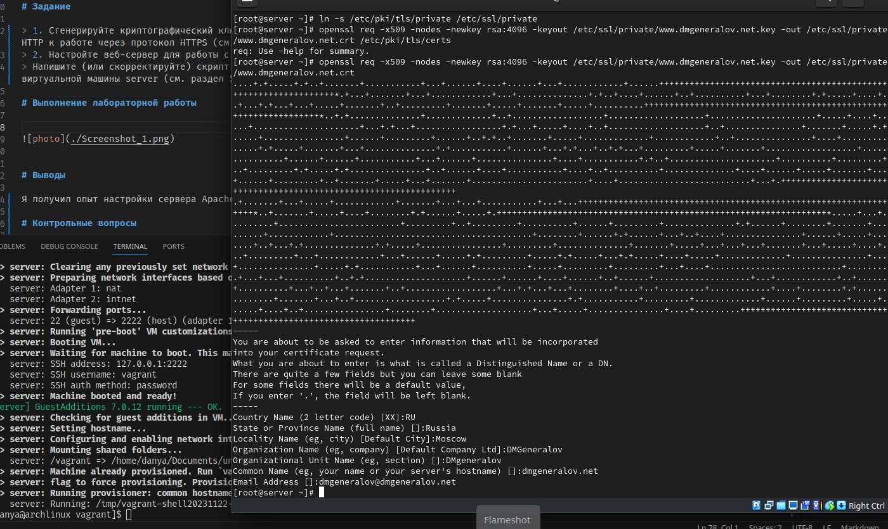

# Задача

> 1. Сгенерируйте криптографический ключ и самоподписанный сертификат безопасности для возможности перехода веб-сервера от работы через протокол HTTP к работе через протокол HTTPS (см. раздел 5.4.1).
> 2. Настройте веб-сервер для работы с PHP (см. раздел 5.4.2).
> 3. Напишите (или скорректируйте) скрипт для Vagrant, фиксирующий действия по расширенной настройке HTTP-сервера во внутреннем окружении виртуальной машины server (см. раздел 5.4.3).

# Выполнение 

## OpenSSL

## Apache

## Apache

## Firefox

## Firefox

## Firefox

## Firefox

## Вывод

> Я получил опыт настройки сервера Apache, чтобы он использовал HTTPS и PHP.
