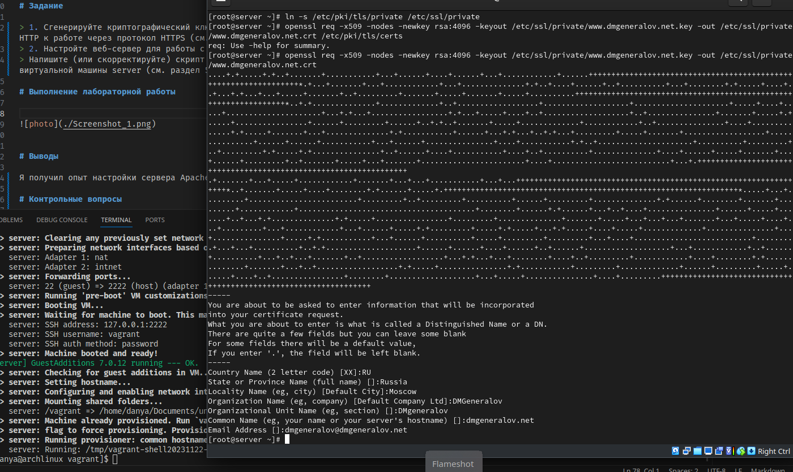
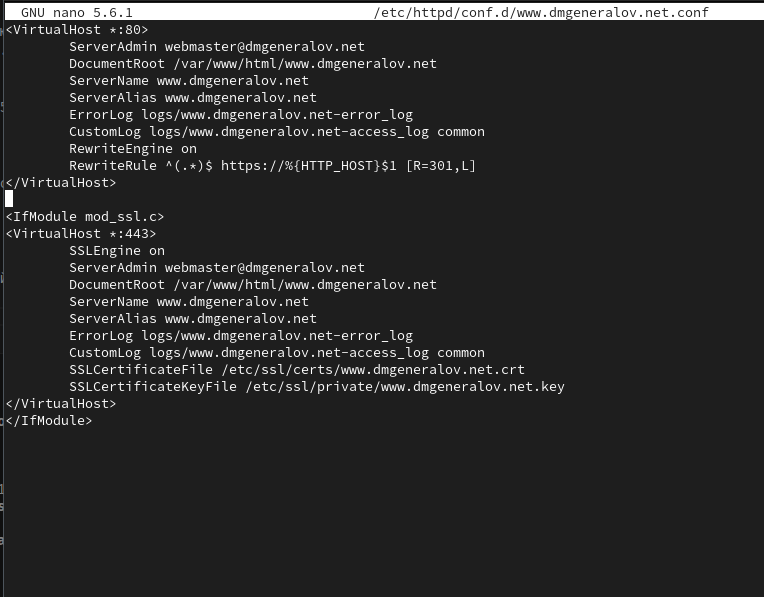
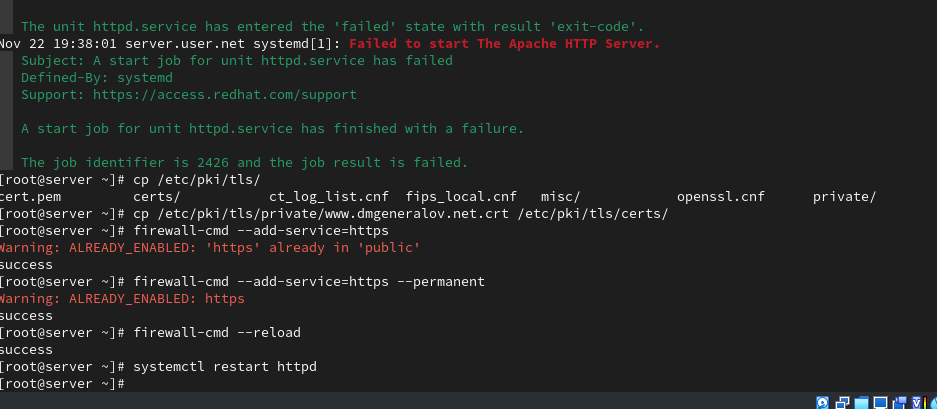
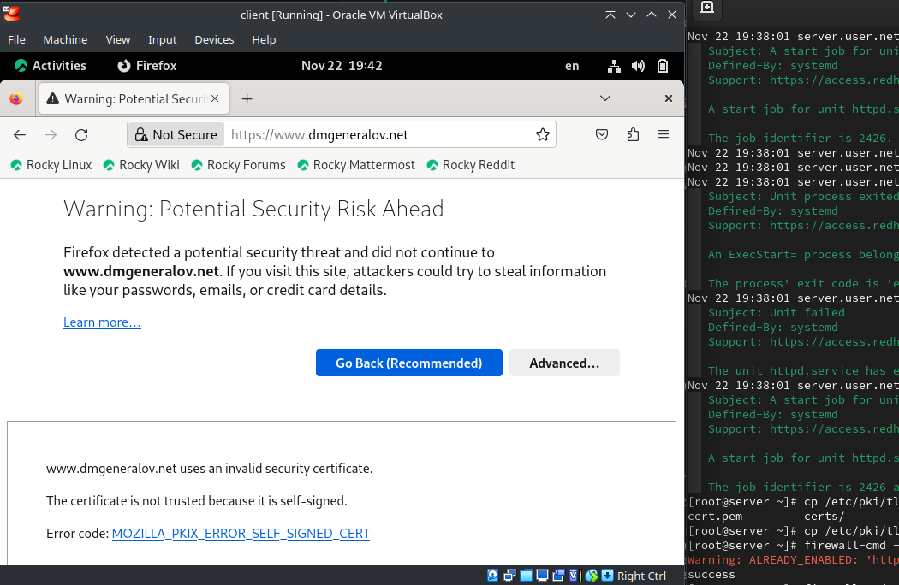
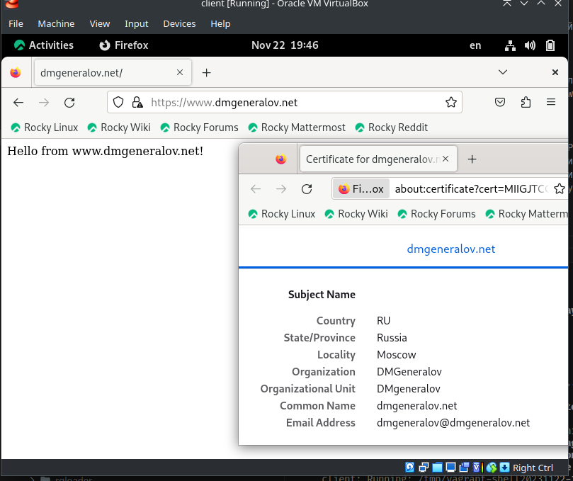
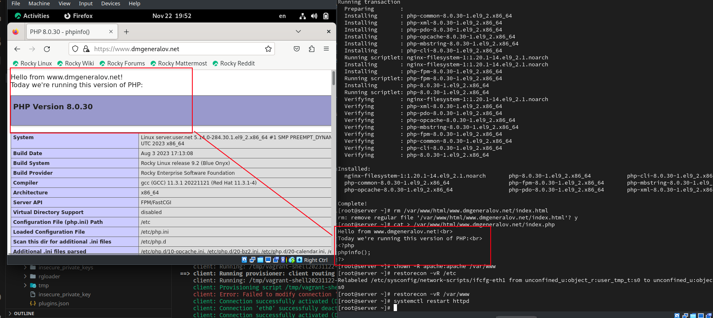
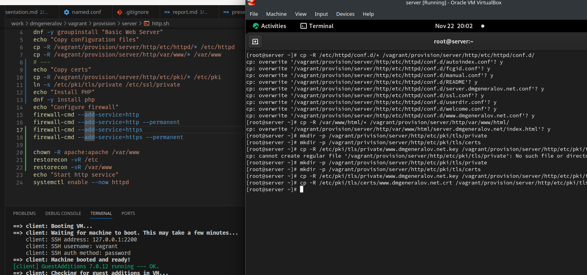

---
## Front matter
title: "Отчет по лабораторной работе 5"
subtitle: ""
author: "Генералов Даниил, НПИбд-01-21, 1032202280"

## Generic otions
lang: ru-RU
toc-title: "Содержание"

## Pdf output format
toc: true # Table of contents
toc-depth: 2
lof: true # List of figures
lot: true # List of tables
fontsize: 12pt
linestretch: 1.5
papersize: a4
documentclass: scrreprt
## I18n polyglossia
polyglossia-lang:
  name: russian
  options:
	- spelling=modern
	- babelshorthands=true
polyglossia-otherlangs:
  name: english
## I18n babel
babel-lang: russian
babel-otherlangs: english
## Fonts
mainfont: PT Serif
romanfont: PT Serif
sansfont: PT Sans
monofont: PT Mono
mainfontoptions: Ligatures=TeX
romanfontoptions: Ligatures=TeX
sansfontoptions: Ligatures=TeX,Scale=MatchLowercase
monofontoptions: Scale=MatchLowercase,Scale=0.9
## Biblatex
biblatex: true
biblio-style: "gost-numeric"
biblatexoptions:
  - parentracker=true
  - backend=biber
  - hyperref=auto
  - language=auto
  - autolang=other*
  - citestyle=gost-numeric
## Pandoc-crossref LaTeX customization
figureTitle: "Рис."
tableTitle: "Таблица"
listingTitle: "Листинг"
lofTitle: "Список иллюстраций"
lotTitle: "Список таблиц"
lolTitle: "Листинги"
## Misc options
indent: true
header-includes:
  - \usepackage{indentfirst}
  - \usepackage{float} # keep figures where there are in the text
  - \floatplacement{figure}{H} # keep figures where there are in the text
---

# Цель работы

> Приобретение практических навыков по расширенному конфигурированию HTTP-сервера Apache в части безопасности и возможности использования PHP.

# Задание

> 1. Сгенерируйте криптографический ключ и самоподписанный сертификат безопасности для возможности перехода веб-сервера от работы через протокол HTTP к работе через протокол HTTPS (см. раздел 5.4.1).
> 2. Настройте веб-сервер для работы с PHP (см. раздел 5.4.2).
> 3. Напишите (или скорректируйте) скрипт для Vagrant, фиксирующий действия по расширенной настройке HTTP-сервера во внутреннем окружении виртуальной машины server (см. раздел 5.4.3).

# Выполнение лабораторной работы

Первым делом после загрузки сервера я создал TLS-сертификат для домена dmgeneralov.net.

Этот сертификат и приватный ключ после этого я указал в настройках виртуального хоста.
Мы также настраиваем, чтобы виртуальный хост на HTTP перенаправлял на HTTPS-сайт.

После этого (после того, как я вспомнил скопировать сертификат в другую папку),
я разрешил доступ к HTTPS-порту в firewalld и перезагрузил веб-сервер.

Клиент замечает, что мы используем HTTPS,
но пишет ошибку из-за того, что сертификат не подписан известным ему сертификационным центром.
Мы игнорируем эту ошибку, используя принцип TOFU (trust on first use):
мы ожидаем, что первое соединение не будет перехвачено,
и поэтому мы сможем заметить, если оно будет перехвачено потом, потому что тогда сертификат будет другим (пусть и также неподписанным).

Продолжив соединение, мы видим содержимое веб-страницы из лабораторной 4.
Если просмотреть содержимое сертификата, то увидим,
что он имеет все те параметры, как мы указали при создании.

Теперь мы настраиваем сервер, чтобы он использовал PHP.
Для этого мы просто устанавливаем пакет php,
а затем создаем файл index.php,
и он автоматически будет использовать интерпретатор PHP, а не просто отправит содержимое страницы.

Наконец, мы (как обычно) сохраняем результаты нашей работы в внешнюю систему,
и в Vagrantfile.
Следует заметить, что мы также сохраняем сертификат и его приватный ключ --
в обычных условиях эти вещи являются важными секретами,
и их не следует сохранять (особенно в git, как это происходит у меня),
и вместо этого при возможности генерировать и подписывать их на сервере автоматически.

# Выводы

Я получил опыт настройки сервера Apache, чтобы он использовал HTTPS и PHP.

# Контрольные вопросы

1. В чём отличие HTTP от HTTPS?

HTTP -- протокол общения с веб-сервером, а HTTPS -- это тот же самый протокол поверх TLS-шифрования.
Из-за этого, трафик HTTP можно перехватить, прочитать и изменить,
в то время как HTTPS-трафик нельзя.

2. Каким образом обеспечивается безопасность контента веб-сервера при работе через HTTPS?

Прежде чем отправлять трафик по проводу, сервер шифрует его ключом, который он получил вместе с клиентом
с помощью надежной схемы обмена ключами (например Diffie-Hellman);
этот обмен ключами же может произойти только после того, как сервер докажет клиенту,
что он обладает приватным ключом от сертификата, выданного доверенным сертификационным центром.

3. Что такое сертификационный центр? Приведите пример.

Сертификационный центр -- это организация, которая занимается подписыванием сертификатов.
Имея подписанный сертификат и соответствующий приватный ключ, веб-сервер может доказать клиенту,
что он является тем, чье имя написано на сертификате,
и если клиент доверяет сертификационному центру,
то он транзитивно доверяет этому сертификату.

Например, Let's Encrypt -- автоматизированный сертификационный центр.
Чтобы получить у него сертификат на определенный домен,
требуется разместить на этом домене специальный файл с сгенерированным паролем.
Успешное выполнение этого доказывает, что владелец домена -- тот же самый сервер, который заказывает сертификат,
и, когда Let's Encrypt успешно подтверждает существование и содержимое файла,
то они подписывают ваш сертификат.
После этого можно показывать этот сертификат клиентам,
и, если они доверяют Let's Encrypt (или транзитивно, через Internet Security Research Group -- корню этой цепочки сертификатов),
то они могут быть уверены в безопасности соединения с этим сервером.