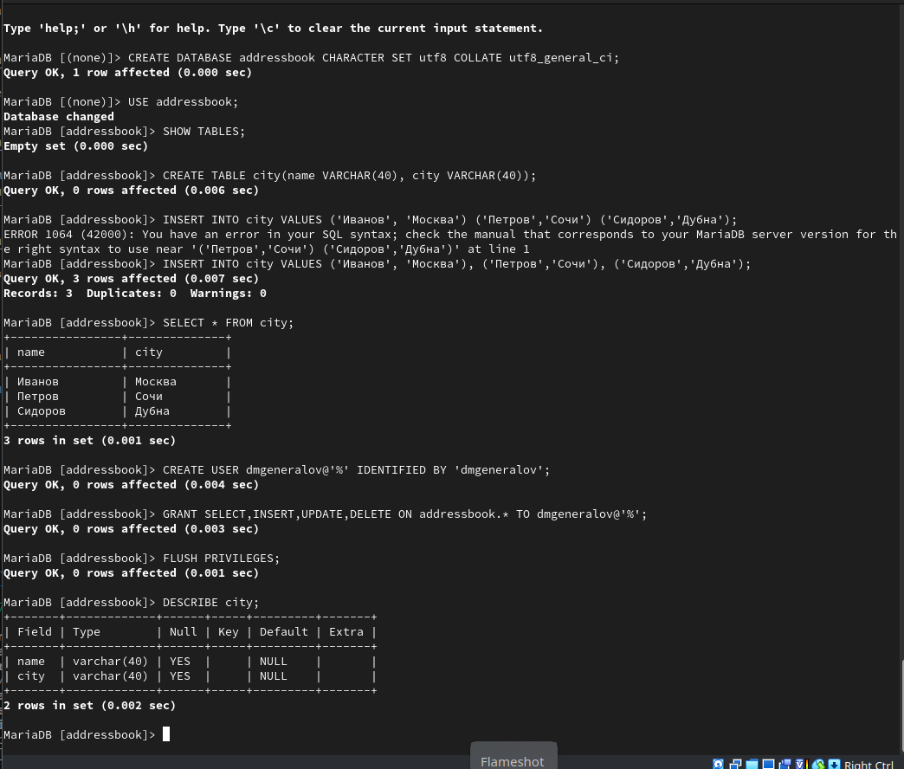

# Задача

> 1. Установите необходимые для работы MariaDB пакеты (см. раздел 6.4.1).
> 2. Настройте в качестве кодировки символов по умолчанию utf8 в базах данных.
> 3. В базе данных MariaDB создайте тестовую базу addressbook, содержащую таблицу city с полями name и city, т.е., например, для некоторого сотрудника указан город, в котором он работает (см. раздел 6.4.1).
> 4. Создайте резервную копию базы данных addressbook и восстановите из неё данные (см. раздел 6.4.1).
> 5. Напишите скрипт для Vagrant, фиксирующий действия по установке и настройке базы данных MariaDB во внутреннем окружении виртуальной машины server. Соответствующим образом внести изменения в Vagrantfile (см. раздел 6.4.5).

# Выполнение 

## MariaDB

## MariaDB

## MariaDB

## MariaDB

## MariaDB

## MariaDB

## MariaDB

## Vagrant

## Вывод

> Я получил опыт настройки и использования СУБД MariaDB.
