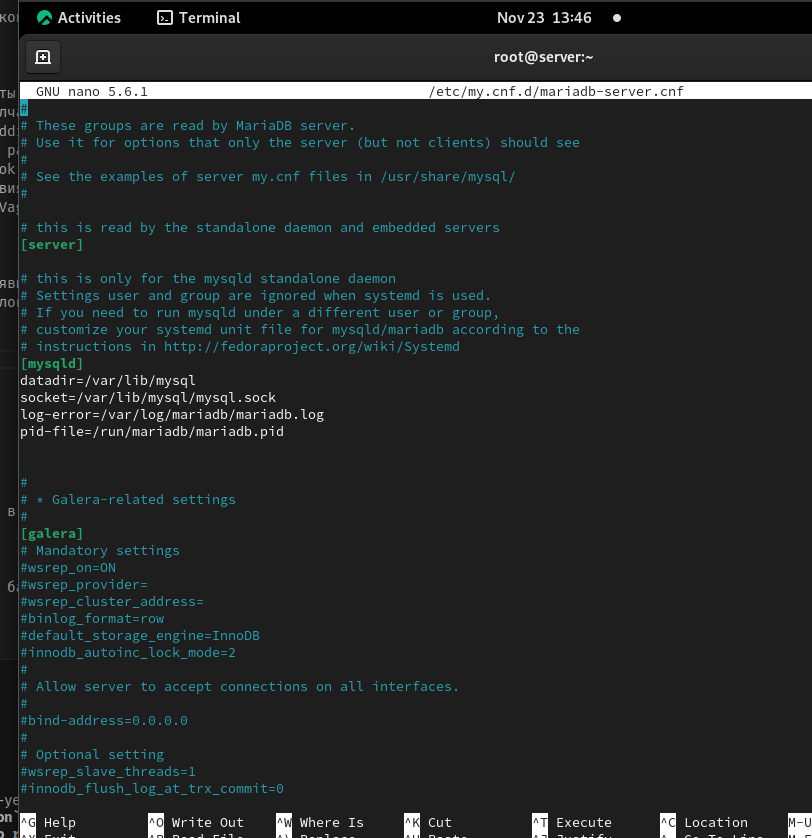
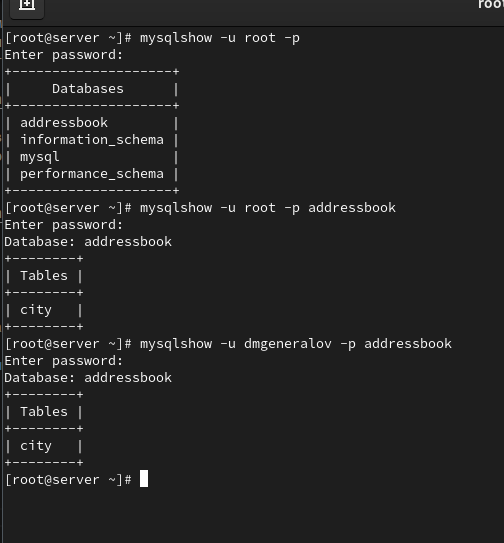
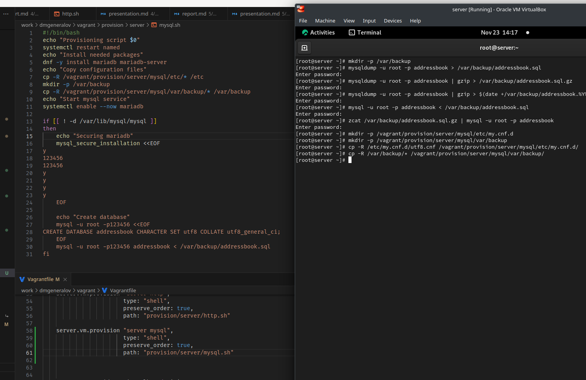

---
## Front matter
title: "Отчет по лабораторной работе 6"
subtitle: ""
author: "Генералов Даниил, НПИбд-01-21, 1032202280"

## Generic otions
lang: ru-RU
toc-title: "Содержание"


## Pdf output format
toc: true # Table of contents
toc-depth: 2
lof: true # List of figures
lot: true # List of tables
fontsize: 12pt
linestretch: 1.5
papersize: a4
documentclass: scrreprt
## I18n polyglossia
polyglossia-lang:
  name: russian
  options:
	- spelling=modern
	- babelshorthands=true
polyglossia-otherlangs:
  name: english
## I18n babel
babel-lang: russian
babel-otherlangs: english
## Fonts
mainfont: PT Serif
romanfont: PT Serif
sansfont: PT Sans
monofont: PT Mono
mainfontoptions: Ligatures=TeX
romanfontoptions: Ligatures=TeX
sansfontoptions: Ligatures=TeX,Scale=MatchLowercase
monofontoptions: Scale=MatchLowercase,Scale=0.9
## Biblatex
biblatex: true
biblio-style: "gost-numeric"
biblatexoptions:
  - parentracker=true
  - backend=biber
  - hyperref=auto
  - language=auto
  - autolang=other*
  - citestyle=gost-numeric
## Pandoc-crossref LaTeX customization
figureTitle: "Рис."
tableTitle: "Таблица"
listingTitle: "Листинг"
lofTitle: "Список иллюстраций"
lotTitle: "Список таблиц"
lolTitle: "Листинги"
## Misc options
indent: true
header-includes:
  - \usepackage{indentfirst}
  - \usepackage{float} # keep figures where there are in the text
  - \floatplacement{figure}{H} # keep figures where there are in the text
---

# Цель работы

> Приобретение практических навыков по установке и конфигурированию системы управления базами данных на примере программного обеспечения MariaDB.

# Задание

> 1. Установите необходимые для работы MariaDB пакеты (см. раздел 6.4.1).
> 2. Настройте в качестве кодировки символов по умолчанию utf8 в базах данных.
> 3. В базе данных MariaDB создайте тестовую базу addressbook, содержащую таблицу city с полями name и city, т.е., например, для некоторого сотрудника указан город, в котором он работает (см. раздел 6.4.1).
> 4. Создайте резервную копию базы данных addressbook и восстановите из неё данные (см. раздел 6.4.1).
> 5. Напишите скрипт для Vagrant, фиксирующий действия по установке и настройке базы данных MariaDB во внутреннем окружении виртуальной машины server. Соответствующим образом внести изменения в Vagrantfile (см. раздел 6.4.5).

# Выполнение лабораторной работы

После установки пакетов mariadb и mariadb-server появились файлы конфигурации MariaDB.
Файл `/etc/my.cnf` лишь содержит include других файлов


Среди файлов `/etc/my.cnf.d` самый интересный -- `mariadb-server.conf`.
Он содержит путь к папке с данными, сокету для общения с сервером,
PID-файлу и файлу логов.



После этого мы запускаем сервер, проверяем, что он слушает соединения, а затем запускаем скрипт для настройки безопасности сервера, где указываем пароль и удаляем тестовые БД и пользователей.


Теперь на сервере есть только системные базы данных -- `mysql`, `information_schema` и `performance_schema`,
которые содержат генерированную информацию про состояние сервера.


Затем мы изменяем сервер, чтобы он использовал UTF-8 кодировку.
Изначально он использовал latin1, что можно увидеть в выводе команды `status`.
Она также выводит другую информацию о текущем соединении -- например, что оно происходит через UNIX-сокет и не использует SSL.


Теперь мы используем командную строку, чтобы создать базу данных, таблицу внутри нее, и записи внутри нее.
После этого мы можем получить эти записи обратно с помощью SELECT-запроса, а также создать пользователя и дать ему разрешения на доступ к этой базе данных.


После этого можно закрыть эту консоль и попробовать использовать нового пользователя и увидеть, что база данных и таблица остались.



Наконец, мы делаем резервные копии базы данных, проверяем их восстанавливаемость, а затем экспортируем все настройки в Vagrant.



# Выводы

Я получил опыт настройки и использования СУБД MariaDB.

# Контрольные вопросы

1. Какая команда отвечает за настройки безопасности в MariaDB?

Скрипт `mysql_secure_installation` настраивает часто используемые настройки безопасности, вроде root-пароля,
удаления тестовых пользователей и разрешения доступа root только через UNIX-сокет.

2. Как настроить MariaDB для доступа через сеть?

Нужно создать пользователей кроме root, разрешить им доступ через сеть,
а затем настроить сервер, чтобы он слушал по TCP-сокету,
и разрешить доступ к порту 3306 в firewall.

3. Какая команда позволяет получить обзор доступных баз данных после входа в среду оболочки MariaDB?

`SHOW DATABASES` или `mysqlshow`

4. Какая команда позволяет узнать, какие таблицы доступны в базе данных?

`SHOW TABLES` или `mysqlshow database`

5. Какая команда позволяет узнать, какие поля доступны в таблице?

`DESCRIBE table`

6. Какая команда позволяет узнать, какие записи доступны в таблице?

`SELECT * FROM table`

7. Как удалить запись из таблицы?

`DELETE FROM table WHERE id=1`

8. Где расположены файлы конфигурации MariaDB? Что можно настроить с их помощью?

Они находятся в `/etc/my.cnf.d`, и с помощью них можно настраивать поведение серверов и клиентов.
Например, там мы настроили, чтобы они использовали кодировку UTF-8,
но там также можно указать путь к файлам базы данных,
а также настройки подключения (TCP, UNIX-сокет, SSL...)

9. Где располагаются файлы с базами данных MariaDB?

В пути, указанном в настройках под ключом `mysqld.datadir`; по умолчанию это `/var/lib/mysql`.

10. Как сделать резервную копию базы данных и затем её восстановить?

```
mysqldump -u root -p database > /tmp/database-backup.sql
mysql -u root -p database < /tmp/database-backup.sql
```
