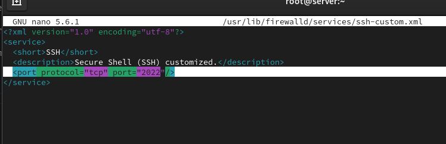
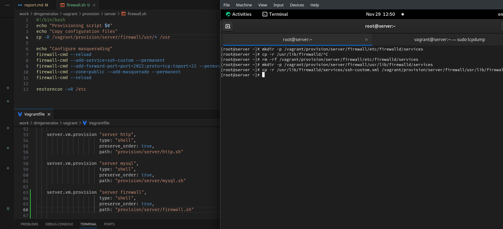

# Задача

> 1. Настройте межсетевой экран виртуальной машины server для доступа к серверу по протоколу SSH не через 22-й порт, а через порт 2022 (см. разделы 7.4.1 и 7.4.2).
> 2. Настройте Port Forwarding на виртуальной машине server (см. разделы 7.4.3).
> 3. Настройте маскарадинг на виртуальной машине server для организации доступа клиента к сети Интернет (см. раздел 7.4.3).
> 4. Напишите скрипт для Vagrant, фиксирующий действия по расширенной настройке межсетевого экрана. Соответствующим образом внести изменения в Vagrantfile (см. раздел 7.4.4).

# Выполнение 

## firewalld

## firewalld

## firewalld

## firewalld

## firewalld

## vagrant

## Вывод

Я получил опыт настройки port-forwarding и masquerading с помощью firewalld.
