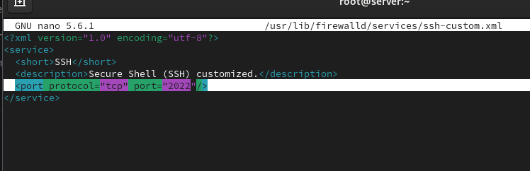
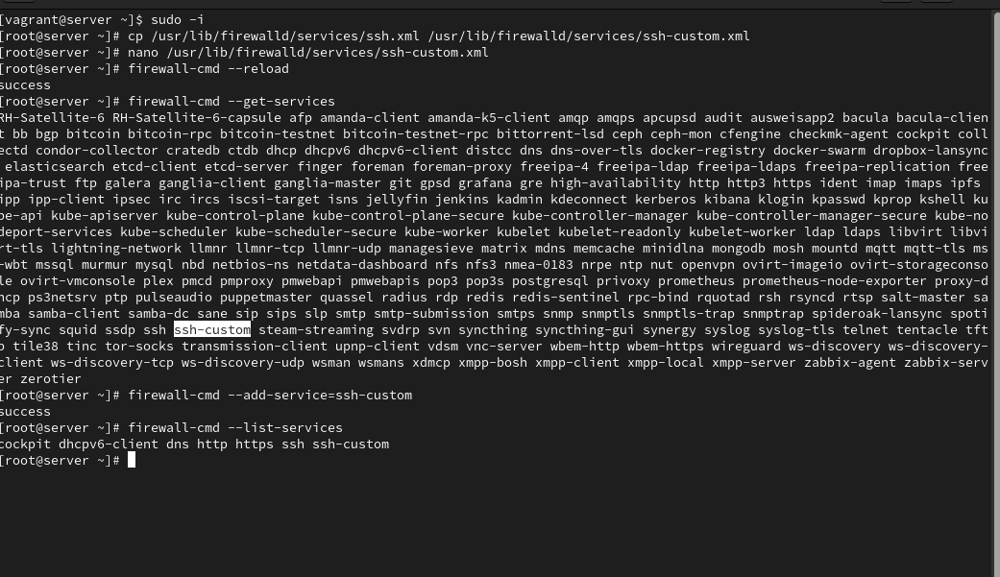
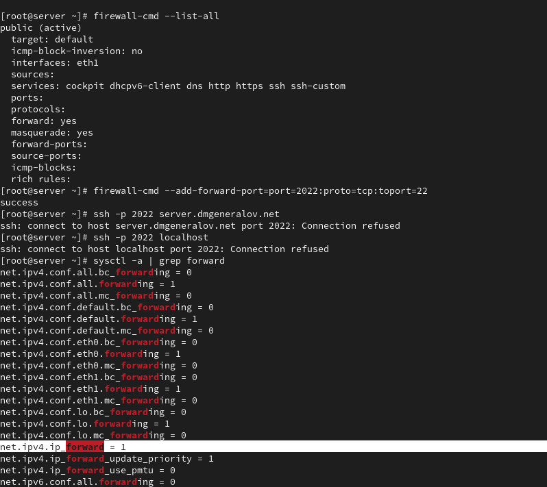
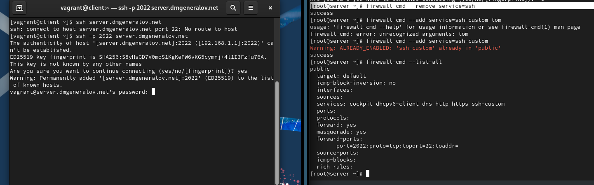
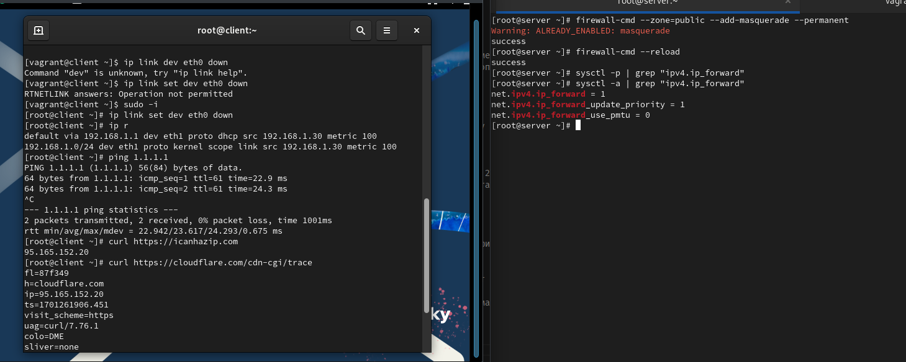
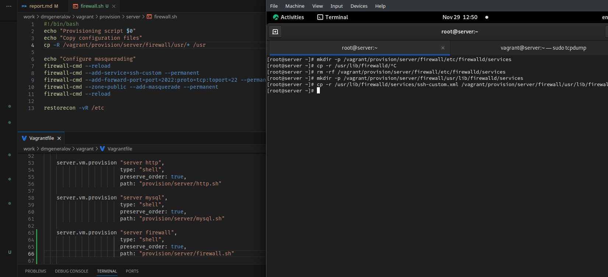

---
## Front matter
title: "Отчет по лабораторной работе 7"
subtitle: ""
author: "Генералов Даниил, НПИбд-01-21, 1032202280"

## Generic otions
lang: ru-RU
toc-title: "Содержание"

## Pdf output format
toc: true # Table of contents
toc-depth: 2
lof: true # List of figures
lot: true # List of tables
fontsize: 12pt
linestretch: 1.5
papersize: a4
documentclass: scrreprt
## I18n polyglossia
polyglossia-lang:
  name: russian
  options:
	- spelling=modern
	- babelshorthands=true
polyglossia-otherlangs:
  name: english
## I18n babel
babel-lang: russian
babel-otherlangs: english
## Fonts
mainfont: PT Serif
romanfont: PT Serif
sansfont: PT Sans
monofont: PT Mono
mainfontoptions: Ligatures=TeX
romanfontoptions: Ligatures=TeX
sansfontoptions: Ligatures=TeX,Scale=MatchLowercase
monofontoptions: Scale=MatchLowercase,Scale=0.9
## Biblatex
biblatex: true
biblio-style: "gost-numeric"
biblatexoptions:
  - parentracker=true
  - backend=biber
  - hyperref=auto
  - language=auto
  - autolang=other*
  - citestyle=gost-numeric
## Pandoc-crossref LaTeX customization
figureTitle: "Рис."
tableTitle: "Таблица"
listingTitle: "Листинг"
lofTitle: "Список иллюстраций"
lotTitle: "Список таблиц"
lolTitle: "Листинги"
## Misc options
indent: true
header-includes:
  - \usepackage{indentfirst}
  - \usepackage{float} # keep figures where there are in the text
  - \floatplacement{figure}{H} # keep figures where there are in the text
---

# Цель работы

> Получить навыки настройки межсетевого экрана в Linux в части переадресации портов и настройки Masquerading.

# Задание

> 1. Настройте межсетевой экран виртуальной машины server для доступа к серверу по протоколу SSH не через 22-й порт, а через порт 2022 (см. разделы 7.4.1 и 7.4.2).
> 2. Настройте Port Forwarding на виртуальной машине server (см. разделы 7.4.3).
> 3. Настройте маскарадинг на виртуальной машине server для организации доступа клиента к сети Интернет (см. раздел 7.4.3).
> 4. Напишите скрипт для Vagrant, фиксирующий действия по расширенной настройке межсетевого экрана. Соответствующим образом внести изменения в Vagrantfile (см. раздел 7.4.4).

# Выполнение лабораторной работы

Сначала мы копируем файл с настройками службы SSH и изменяем его номер порта.
В этом файле есть несколько полей, включая название и описание службы, 
а также список портов которые участвуют в службе.

После этого можно перезагрузить firewalld и увидеть эту службу в списке, а затем добавить ее.

Затем мы настраиваем переадресацию: соединения на порт 2022 перенаправляются на порт 22.
Однако, по какой-то причине, эта переадресация не работает:
порт 2022 остается закрытым.

Но оказалось, что эти правила применяются только к трафику извне,
например с клиента.
Поэтому я удалил службу ssh,
и теперь к серверу можно подключиться только через порт 2022.
(После этого я восстановил это,
потому что SSH используется для настройки виртуальной машины через Vagrant.)

После этого, когда masquerading аключен,
а на клиенте выключен интерфейс eth0,
мы все равно можем подключиться к интернету,
но через сервер.

Наконец, можно экспортировать настройки в Vagrant.

# Выводы

Я получил опыт настройки port-forwarding и masquerading с помощью firewalld.

# Контрольные вопросы

1. Где хранятся пользовательские файлы firewalld?

Файлы служб можно найти в `/usr/lib/firewalld/services`

2. Какую строку надо включить в пользовательский файл службы, чтобы указать порт TCP 2022?

`<port protocol="tcp" port="2022" />`

3. Какая команда позволяет вам перечислить все службы, доступные в настоящее время
на вашем сервере?

`firewall-cmd --get-services` показывает все службы, которые известны firewalld;
`firewall-cmd --list-services` показывает те службы, которые сейчас активны.

4. В чем разница между трансляцией сетевых адресов (NAT) и маскарадингом (masquerading)?

NAT -- это процесс изменения пакетов, проходящих через роутер, чтобы IP-адрес пакета был другим.
Source NAT -- это выполнение этой операции для пакетов, которые идут из внутренней сети во внешнюю,
а Destination NAT -- это аналогичный процесс для пакетов из внешней сети во внутреннюю.
Masquerading -- это особая форма Source NAT, при которой роутер сам определяет, какой IP-адрес прописать в исходящем пакете;
это позволяет динамически использовать IP-адрес внешнего интерфейса роутера.

5. Какая команда разрешает входящий трафик на порт 4404 и перенаправляет его в службу ssh по IP-адресу 10.0.0.10?

`firewall-cmd --add-forward-port=port=4404:proto=tcp:toaddr=10.0.0.10:toport=22`

6. Какая команда используется для включения маcкарадинга IP-пакетов для всех пакетов, выходящих в зону public?

`firewall-cmd --add-masquerade`