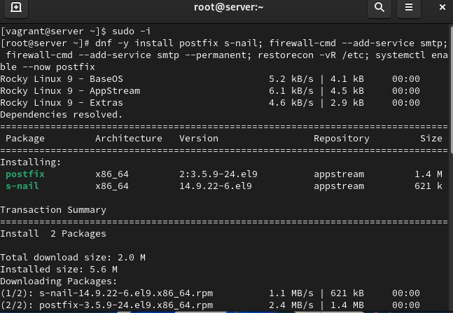
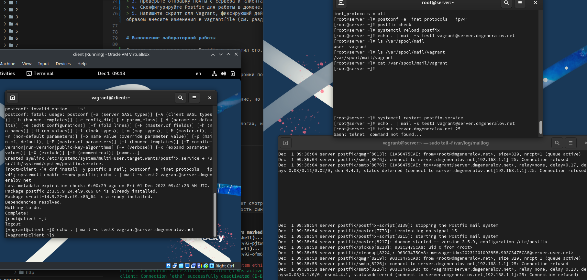
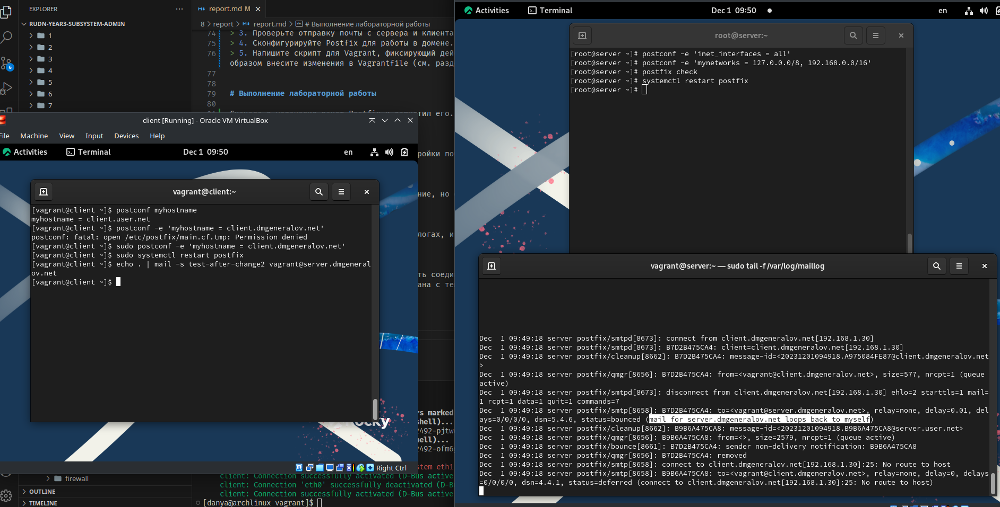
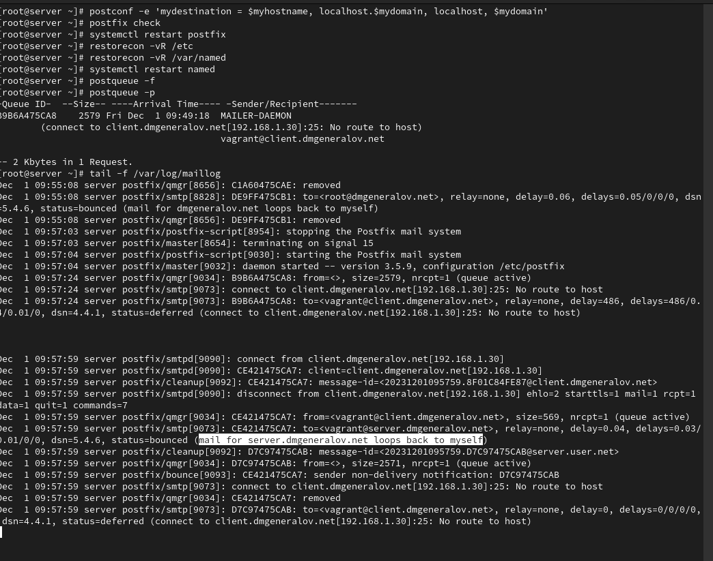
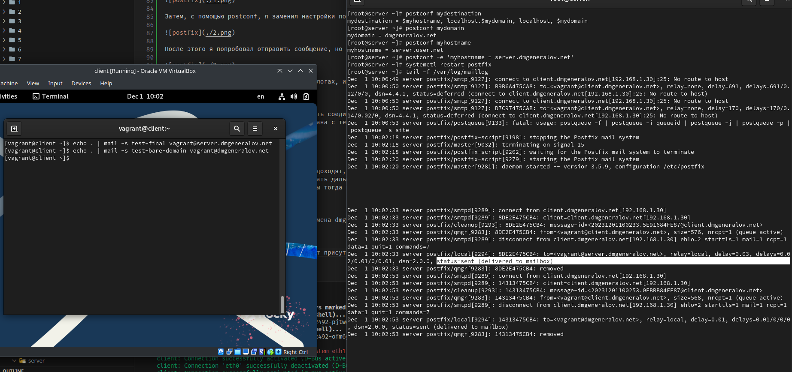
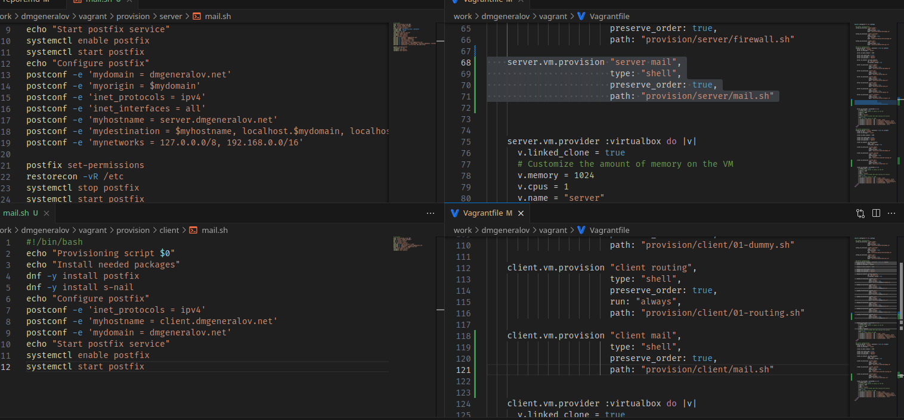

# Задача

> 1. Установите на виртуальной машине server SMTP-сервер postfix (см. раздел 8.4.1).
> 2. Сделайте первоначальную настройку postfix при помощи утилиты postconf, задав отправку писем не на локальный хост, а на сервер в домене (см. раздел 8.4.2).
> 3. Проверьте отправку почты с сервера и клиента (см. раздел 8.4.3).
> 4. Сконфигурируйте Postfix для работы в домене. Проверьте отправку почты с сервера и клиента (см. раздел 8.4.4).
> 5. Напишите скрипт для Vagrant, фиксирующий действия по установке и настройке Postfix во внутреннем окружении виртуальной машины server. Соответствующим образом внесите изменения в Vagrantfile (см. раздел 8.4.5).

# Выполнение 

## Postfix

## Postfix

## Postfix

## Postfix

## Postfix

## Postfix

## DNS

## Postfix

## Postfix

## Vagrant

## Вывод

Я получил опыт работы с настройкой SMTP-сервера Postfix.
