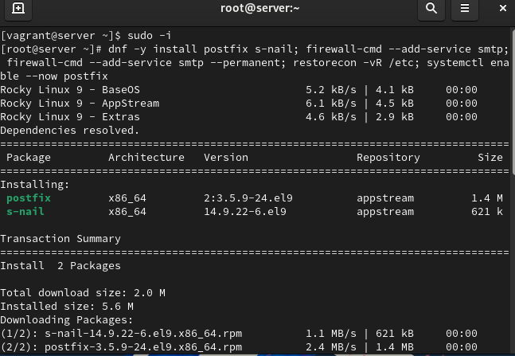
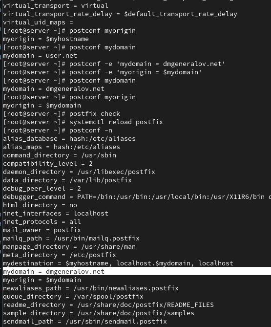
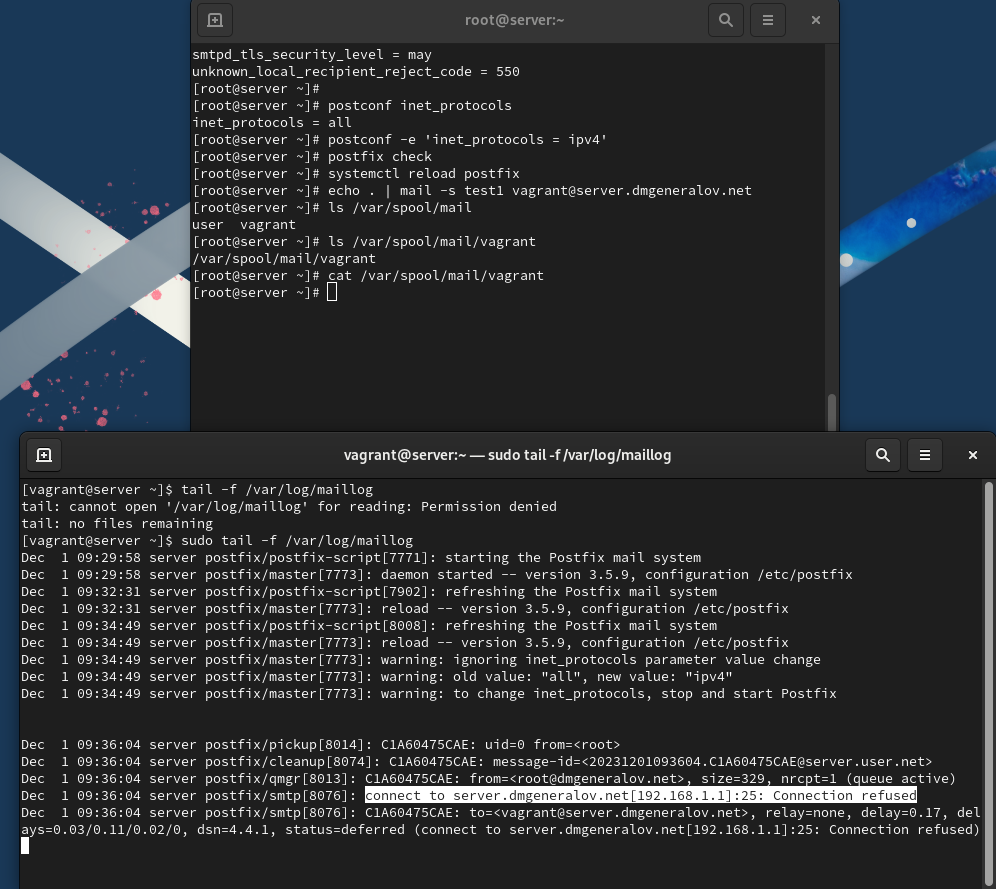
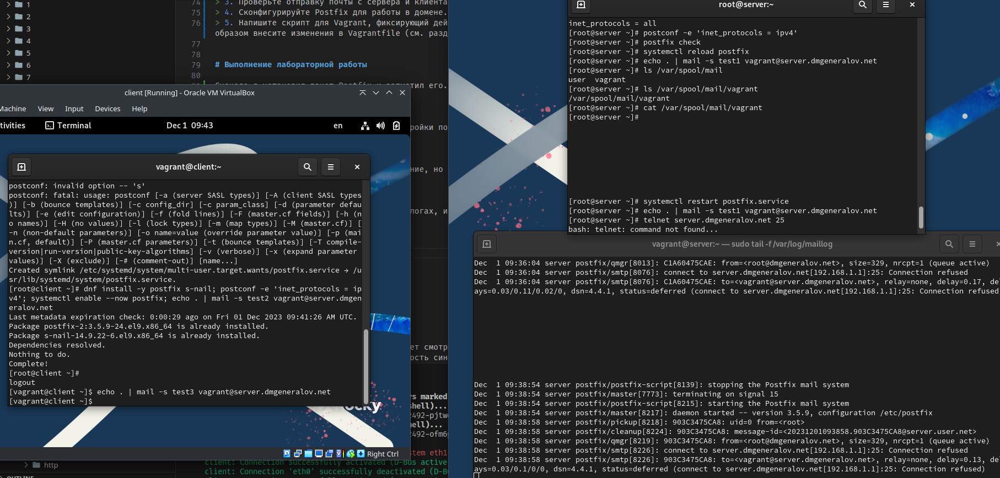
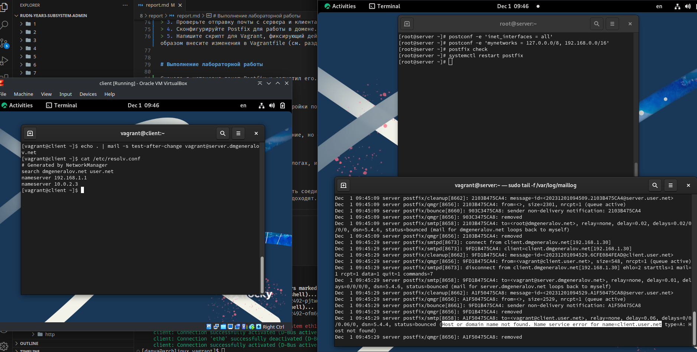
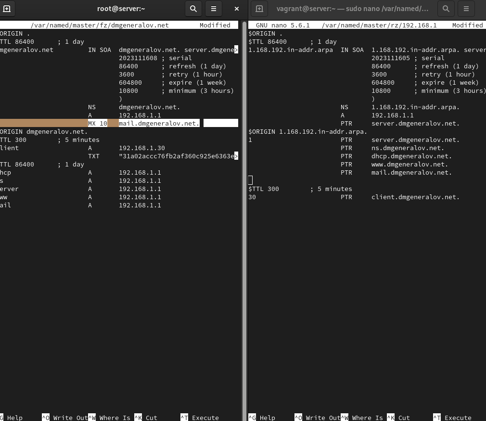
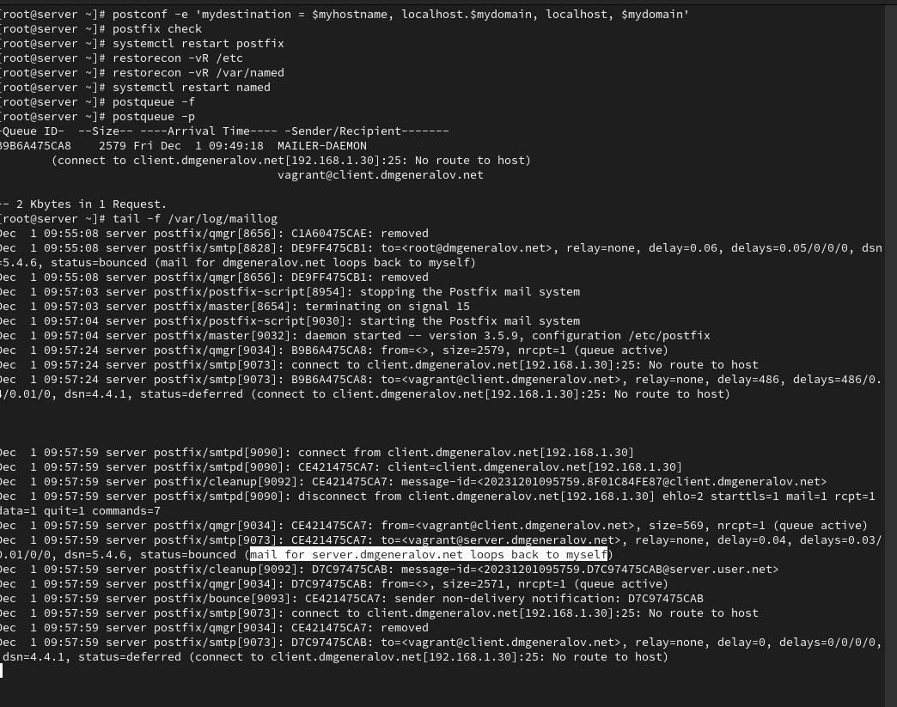
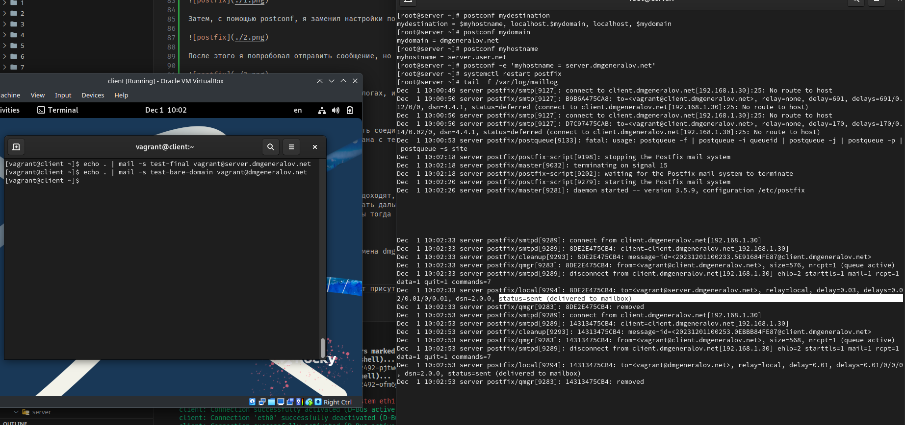
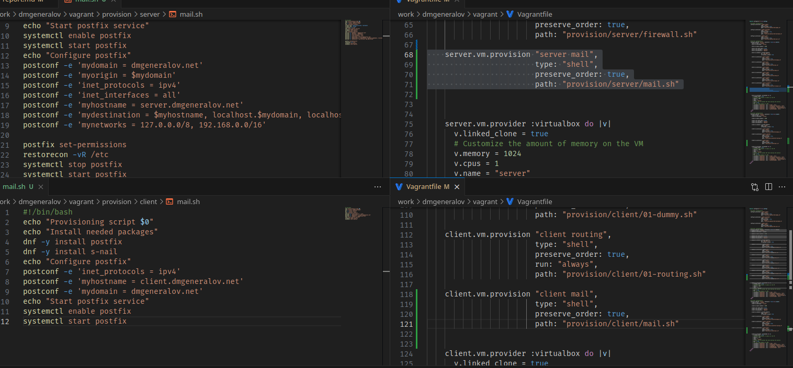

---
## Front matter
title: "Отчет по лабораторной работе 8"
subtitle: ""
author: "Генералов Даниил, НПИбд-01-21, 1032202280"

## Generic otions
lang: ru-RU
toc-title: "Содержание"


## Pdf output format
toc: true # Table of contents
toc-depth: 2
lof: true # List of figures
lot: true # List of tables
fontsize: 12pt
linestretch: 1.5
papersize: a4
documentclass: scrreprt
## I18n polyglossia
polyglossia-lang:
  name: russian
  options:
	- spelling=modern
	- babelshorthands=true
polyglossia-otherlangs:
  name: english
## I18n babel
babel-lang: russian
babel-otherlangs: english
## Fonts
mainfont: PT Serif
romanfont: PT Serif
sansfont: PT Sans
monofont: PT Mono
mainfontoptions: Ligatures=TeX
romanfontoptions: Ligatures=TeX
sansfontoptions: Ligatures=TeX,Scale=MatchLowercase
monofontoptions: Scale=MatchLowercase,Scale=0.9
## Biblatex
biblatex: true
biblio-style: "gost-numeric"
biblatexoptions:
  - parentracker=true
  - backend=biber
  - hyperref=auto
  - language=auto
  - autolang=other*
  - citestyle=gost-numeric
## Pandoc-crossref LaTeX customization
figureTitle: "Рис."
tableTitle: "Таблица"
listingTitle: "Листинг"
lofTitle: "Список иллюстраций"
lotTitle: "Список таблиц"
lolTitle: "Листинги"
## Misc options
indent: true
header-includes:
  - \usepackage{indentfirst}
  - \usepackage{float} # keep figures where there are in the text
  - \floatplacement{figure}{H} # keep figures where there are in the text
---

# Цель работы

> Приобретение практических навыков по установке и конфигурированию SMTP-сервера.

# Задание

> 1. Установите на виртуальной машине server SMTP-сервер postfix (см. раздел 8.4.1).
> 2. Сделайте первоначальную настройку postfix при помощи утилиты postconf, задав отправку писем не на локальный хост, а на сервер в домене (см. раздел 8.4.2).
> 3. Проверьте отправку почты с сервера и клиента (см. раздел 8.4.3).
> 4. Сконфигурируйте Postfix для работы в домене. Проверьте отправку почты с сервера и клиента (см. раздел 8.4.4).
> 5. Напишите скрипт для Vagrant, фиксирующий действия по установке и настройке Postfix во внутреннем окружении виртуальной машины server. Соответствующим образом внесите изменения в Vagrantfile (см. раздел 8.4.5).


# Выполнение лабораторной работы

Сначала я установил пакет Postfix и запустил его.



Затем, с помощью postconf, я заменил настройки почтового домена.



После этого я попробовал отправить сообщение, но оно не было доставлено, потому что сервер Postfix не смог соединиться сам с собой.



Сообщения с клиента даже не появляются в логах, и поэтому также не доставляются.



Это потому что сервер не настроен принимать соединения из внешней сети.
Если настроить это, то теперь ошибка связана с тем, что клиент отправляет свои сообщения с `client.user.net`,
когда должен с `client.dmgeneralov.net`.




После изменения имени клиента, сообщения доходят,
но Postfix на сервере пытается их передавать дальше, а не принимать как свои,
и не может этого сделать, потому что он бы тогда передавал их по циклу.


После этого я настраиваю MX-запись для домена dmgeneralov.net.



После настройки и перезагрузки, продолжает присутствовать эта же ошибка.



Но проблема была в том, что на сервере mydestination был настроен неправильно,
и сервер думал, что эти письма не ему.
После изменения этого сообщения стали доставляться.



Наконец, мы экспортируем настройки в Vagrantfile.




# Выводы

Я получил опыт работы с настройкой SMTP-сервера Postfix.

# Контрольные вопросы

1. В каком каталоге и в каком файле следует смотреть конфигурацию Postfix?

`/etc/postfix/main.cf`, но мы использовали утилиту `postconf`, которая также соблюдает синтаксис файла.

2. Каким образом можно проверить корректность синтаксиса в конфигурационном файле Postfix?

`postfix check`

3. В каких параметрах конфигурации Postfix требуется внести изменения в значениях
для настройки возможности отправки писем не на локальный хост, а на доменные
адреса?

Нужно указать этот домен как один из элементов `mydestination`,
например поменяв значение `mydomain`.

4. Приведите примеры работы с утилитой mail по отправке письма, просмотру имеющихся писем, удалению письма.

```
$ mail
s-nail version v14.9.22.  Type `?' for help
/var/spool/mail/vagrant: 1 message
/var/spool/mail/vagrant: 1 message
▸   1 vagrant@client.dmgen  2023-12-01 10:15   19/752   "test-bare-domain      "
& mail 'hello@example.com'
Subject: Hello World
.

^D
-------
(Preliminary) Envelope contains:
To: 'hello@example.com'
Subject: Hello World
Send this message [yes/no, empty: recompose]? yes
& delete 1
```

5. Приведите примеры работы с утилитой postqueue. Как посмотреть очередь сообщений? Как определить число сообщений в очереди? Как отправить все сообщения,находящиеся в очереди? Как удалить письмо из очереди?

Посмотреть: `postqueue -p`, число сообщений -- в последней строке вывода.
Отправить все сообщения: `postqueue -f`
Удалить из очереди: `sudo postsuper -d B9B6A475CA8`