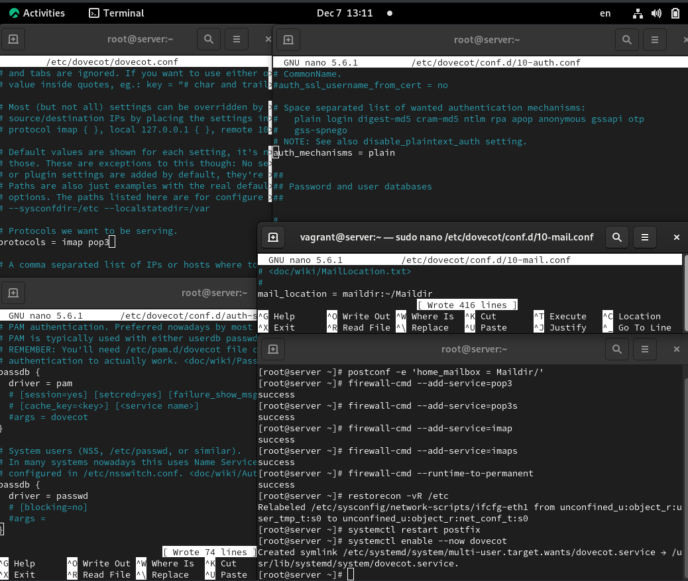
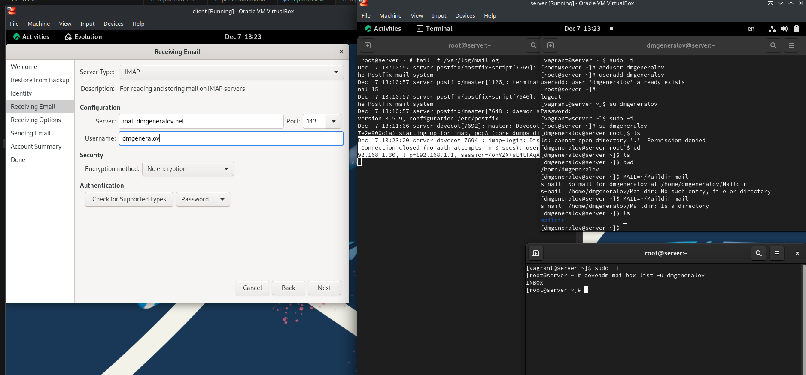
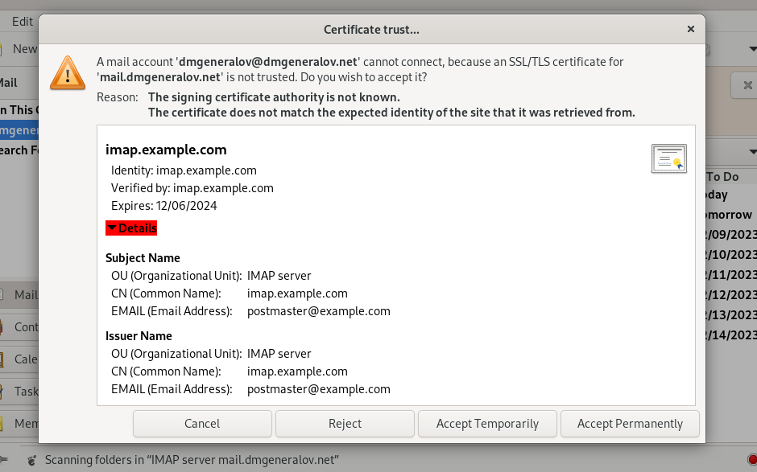
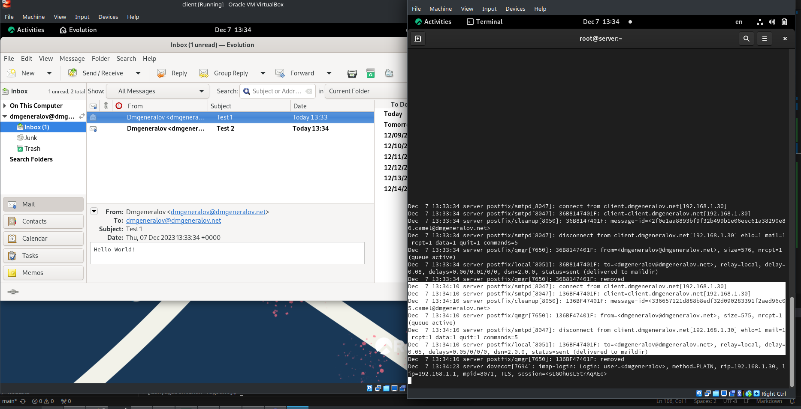
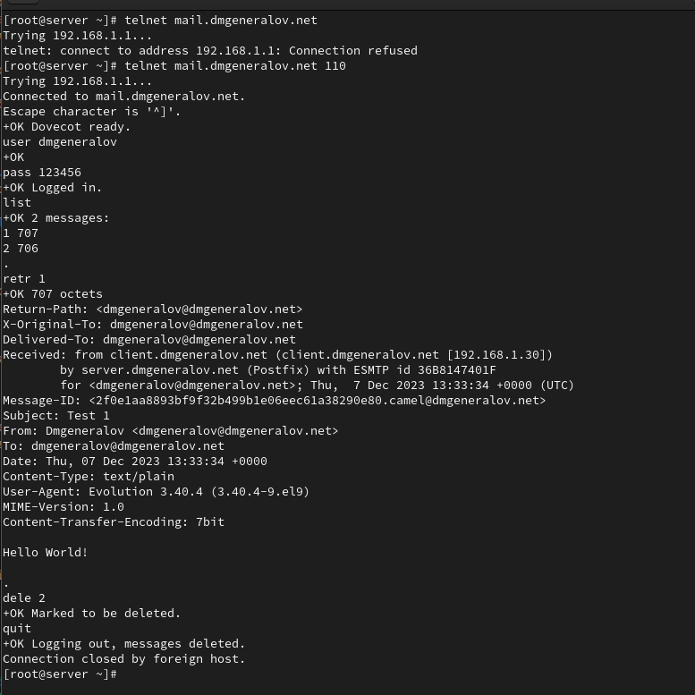
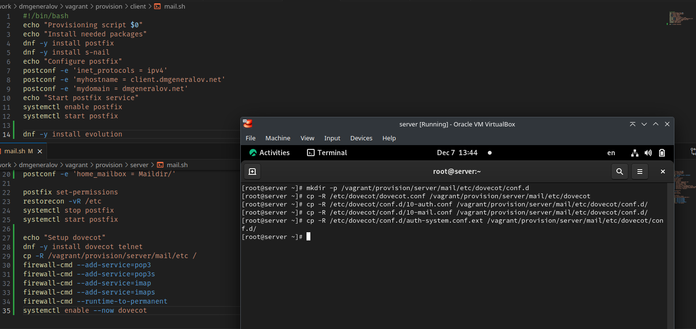

# Задача

> 1. Установите на виртуальной машине server Dovecot и Telnet для дальнейшей проверки корректности работы почтового сервера (см. раздел 9.4.1).
> 2. Настройте Dovecot (см. раздел 9.4.2).
> 3. Установите на виртуальной машине client программу для чтения почты Evolution и настройте её для манипуляций с почтой вашего пользователя. Проверьте корректность работы почтового сервера как с виртуальной машины server, так и с виртуальной машины client (см. раздел 9.4.3).
> 4. Измените скрипт для Vagrant, фиксирующий действия по установке и настройке Postfix и Dovecote во внутреннем окружении виртуальной машины server, создайте скрипт для Vagrant, фиксирующий действия по установке Evolution во внутреннем окружении виртуальной машины client. Соответствующим образом внесите изменения в Vagrantfile (см. раздел 9.4.4).

# Выполнение 

## Dovecot

## Dovecot

## Evolution

## Evolution

## Dovecot

## Dovecot

## Vagrant

## Вывод

Я получил опыт настройки Dovecot, а также использования POP3-команд в ручном режиме.
