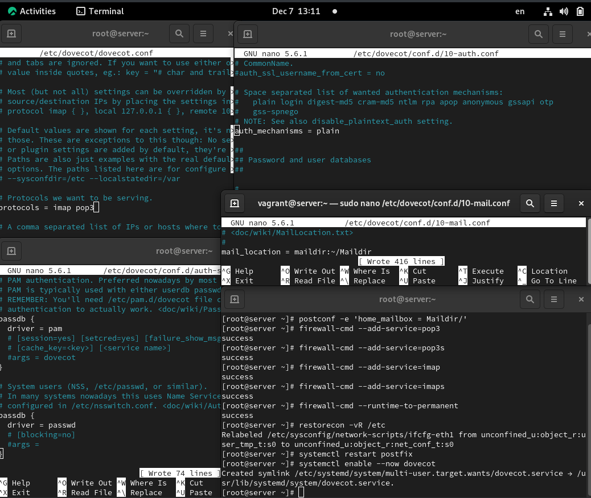
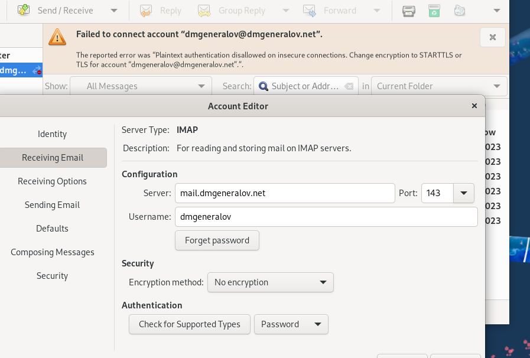
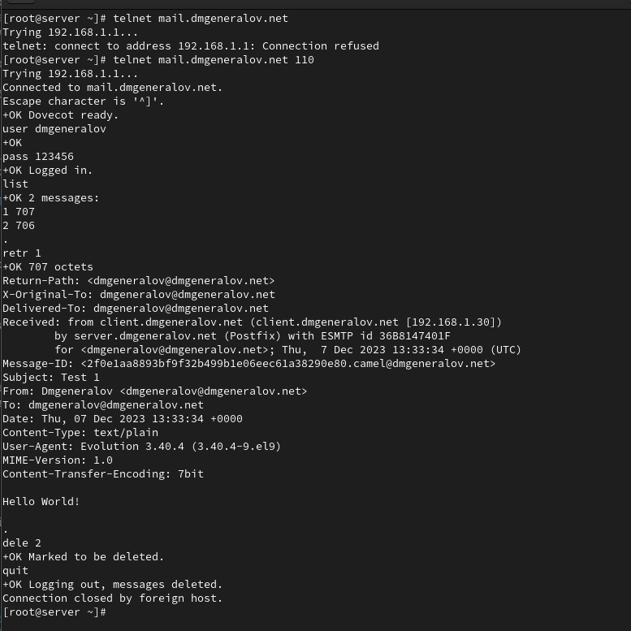
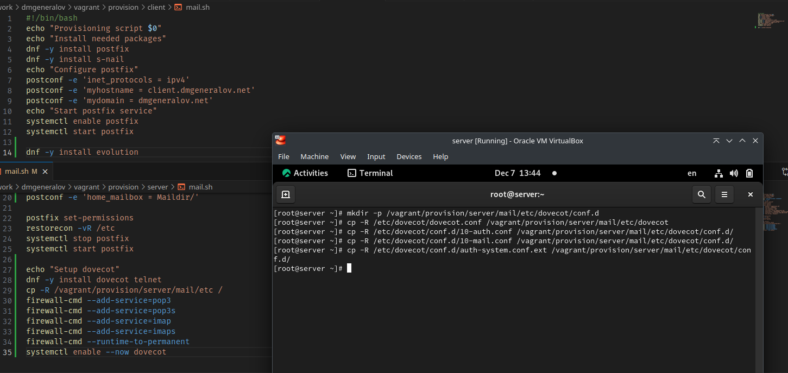

---
## Front matter
title: "Отчет по лабораторной работе 9"
subtitle: ""
author: "Генералов Даниил, НПИбд-01-21, 1032202280"

## Generic otions
lang: ru-RU
toc-title: "Содержание"


## Pdf output format
toc: true # Table of contents
toc-depth: 2
lof: true # List of figures
lot: true # List of tables
fontsize: 12pt
linestretch: 1.5
papersize: a4
documentclass: scrreprt
## I18n polyglossia
polyglossia-lang:
  name: russian
  options:
	- spelling=modern
	- babelshorthands=true
polyglossia-otherlangs:
  name: english
## I18n babel
babel-lang: russian
babel-otherlangs: english
## Fonts
mainfont: PT Serif
romanfont: PT Serif
sansfont: PT Sans
monofont: PT Mono
mainfontoptions: Ligatures=TeX
romanfontoptions: Ligatures=TeX
sansfontoptions: Ligatures=TeX,Scale=MatchLowercase
monofontoptions: Scale=MatchLowercase,Scale=0.9
## Biblatex
biblatex: true
biblio-style: "gost-numeric"
biblatexoptions:
  - parentracker=true
  - backend=biber
  - hyperref=auto
  - language=auto
  - autolang=other*
  - citestyle=gost-numeric
## Pandoc-crossref LaTeX customization
figureTitle: "Рис."
tableTitle: "Таблица"
listingTitle: "Листинг"
lofTitle: "Список иллюстраций"
lotTitle: "Список таблиц"
lolTitle: "Листинги"
## Misc options
indent: true
header-includes:
  - \usepackage{indentfirst}
  - \usepackage{float} # keep figures where there are in the text
  - \floatplacement{figure}{H} # keep figures where there are in the text
---

# Цель работы

> Приобретение практических навыков по установке и простейшему конфигурированию POP3/IMAP-сервера.

# Задание

> 1. Установите на виртуальной машине server Dovecot и Telnet для дальнейшей проверки корректности работы почтового сервера (см. раздел 9.4.1).
> 2. Настройте Dovecot (см. раздел 9.4.2).
> 3. Установите на виртуальной машине client программу для чтения почты Evolution и настройте её для манипуляций с почтой вашего пользователя. Проверьте корректность работы почтового сервера как с виртуальной машины server, так и с виртуальной машины client (см. раздел 9.4.3).
> 4. Измените скрипт для Vagrant, фиксирующий действия по установке и настройке Postfix и Dovecote во внутреннем окружении виртуальной машины server, создайте скрипт для Vagrant, фиксирующий действия по установке Evolution во внутреннем окружении виртуальной машины client. Соответствующим образом внесите изменения в Vagrantfile (см. раздел 9.4.4).


# Выполнение лабораторной работы

Сразу после установки пакетов `dovecot` и `telnet`,
мы делаем начальную настройку Dovecot:
мы указываем в главном файле конфигурации, что Dovecot должен обслуживать протоколы IMAP и POP3,
в файле настройки аутентификации -- что следует использовать `plain`-аутентификацию,
в настройках взаимодействия с системной аутентификацией -- что следует находить пользователей из файла `/etc/passwd`,
а их пароли обрабатывать через PAM-стек;
и в файле настройки почты -- что почту для каждого пользователя следует искать в папке `/home/<user>/Maildir`.
Мы также настраиваем Postfix, чтобы он хранил почту именно там,
а также разрешаем IMAP/POP3 в firewall-cmd, и запускаем обе службы.



После этого мы запускаем клиент и устанавливаем на нем Evolution.
Я также создал пользователя `dmgeneralov` на сервере, и у него по умолчанию есть только папка `INBOX` (но программа `mail` не обрабатывает maildir-почту по умолчанию),
и настраиваю Evolution, чтобы он подключался к этому серверу с plain-аутентификацией без шифрования.


Однако после завершения настройки, происходит ошибка по поводу того, что plaintext-соеднения не могут использовать plain-аутентификацию.



Вместо этого требуется использовать STARTTLS, и тогда потребуется доверять самоподписанному сертификату от сервера.


После этого я могу отправлять письма себе и получать их на том же компьютере.
Логи почтовых сервисов показывают, что письмо приходит по SMTP, доставляется в maildir, а затем Dovecot получает соединения от почтового клиента, которые позволяют ему увидеть новое письмо.


Я также могу подключиться к Dovecot с помощью telnet, и прочитать письма и удалить их с помощью текстовых команд там.



Наконец, мы экспортируем настройки в Vagrant.
Поскольку Vagrantfile уже указывает на файлы `client/mail.sh` и `server/mail.sh`, то достаточно только добавить туда соответствующие команды.



# Выводы

Я получил опыт настройки Dovecot, а также использования POP3-команд в ручном режиме.

# Контрольные вопросы

1. За что отвечает протокол SMTP?

За доставку сообщений от клиентов до серверов и между серверами.

2. За что отвечает протокол IMAP?

За доступ к почтовому ящику, размещенному на сервере, в том числе управление папками писем.

3. За что отвечает протокол POP3?

За скачивание почты с временного хранения на сервере, чтобы она постоянно находилась на клиентских устройствах.

4. В чём назначение Dovecot?

Это сервер, который предоставляет клиентам доступ к их почтовому ящику через IMAP или POP3, после того, как она была доставлена до этого почтового ящика другими службами.

5. В каких файлах обычно находятся настройки работы Dovecot? За что отвечает каждый из файлов?

`/etc/dovecot/dovecot.conf` -- главный файл настройки, содержит список протоколов которые следует использовать.
`/etc/dovecot/conf.d` содержит все компонентные файлы настройки, в том числе `10-mail.conf` для настройки способов доступа к почте, `10-auth.conf` для способов аутентификации для клиентов, `auth-system.conf.ext` для настроек получения информации о пользователях из системы.

6. В чём назначение Postfix?

Доставка почты другим серверам по SMTP, либо же в локальный почтовый ящик.

7. Какие методы аутентификации пользователей можно использовать в Dovecot и в чём их отличие?

Есть несколько разных механизмов. `anonymous` - нулевая аутентификация, которая связывает все подключения с одним почтовым ящиком; `plain` и `login` отправляют пароль в незашифрованном виде; `cram-md5`, `ntlm`, ... используют интерактивный режим с хешами паролей, а `digest-md5`, `apop` используют хеши неинтерактивно. `gssapi`, `otp` и `gss-spnego` используют внешние серверы аутентификации: Kerberos и OAuth, соответственно.

8. Приведите пример заголовка письма с пояснениями его полей.

```
Return-Path: <bounces+163895106537499@outbound.intercom.stackoverflow.email>
Delivered-To: danya@danya02.ru
Received: from danya02.ru
	by danya02.ru with LMTP
	id OQ3GEBkcaWUEGSsAnxPdmQ
	(envelope-from <bounces+163895106537499@outbound.intercom.stackoverflow.email>)
	for <danya@danya02.ru>; Thu, 30 Nov 2023 23:34:49 +0000
Received: from mta-174-84-115.intercom.com.sparkpostmail.com (mta-174-84-115.intercom.com.sparkpostmail.com [192.174.84.115])
	by danya02.ru (Postfix) with ESMTPS id 190DE250982
	for <danya@danya02.ru>; Thu, 30 Nov 2023 23:34:43 +0000 (GMT)
To: danya@danya02.ru
Reply-To: Stack Overflow <do-not-reply@stackoverflow.email>
Message-ID: <cf18e0de-52efef12-1701387274-163895106537499@outbound.intercom.stackoverflow.email>
Subject: [Rescheduled] Planned maintenance for Stack Overflow for Teams is now 2023-12-12
From: "Stack Overflow" <do-not-reply@stackoverflow.email>
Date: Thu, 30 Nov 2023 23:34:34 +0000
```

`Return-Path`: в случае невозможности доставить письмо, сервер должен направить его сюда.
`Delivered-To`: мой сервер добавляет это, когда он считает, что письмо предназначено для него.
`Received`: каждый сервер в последовательности передачи добавляет этот заголовок, чтобы указать, через какие сервера проходило письмо.
`To`: email-адрес получателя.
`Reply-To`: если пользователь нажмет 'ответить', куда следует направить ответное письмо?
`Message-ID`: идентификатор письма на стороне отправителя.
`Subject`: тема письма, которую стоит показывать пользователю.
`From`: email-адрес - источник письма.
`Date`: дата создания письма.

9. Приведите примеры использования команд для работы с почтовыми протоколами через терминал (например через telnet).

```
[root@server ~]# telnet mail.dmgeneralov.net 110
Trying 192.168.1.1...
Connected to mail.dmgeneralov.net.
Escape character is '^]'.
+OK Dovecot ready.
user dmgeneralov
+OK
pass 123456
+OK Logged in.
list
+OK 2 messages:
1 707
2 706
.
retr 1
+OK 707 octets
Return-Path: <dmgeneralov@dmgeneralov.net>
X-Original-To: dmgeneralov@dmgeneralov.net
Delivered-To: dmgeneralov@dmgeneralov.net
Received: from client.dmgeneralov.net (client.dmgeneralov.net [192.168.1.30])
	by server.dmgeneralov.net (Postfix) with ESMTP id 36B8147401F
	for <dmgeneralov@dmgeneralov.net>; Thu,  7 Dec 2023 13:33:34 +0000 (UTC)
Message-ID: <2f0e1aa8893bf9f32b499b1e06eec61a38290e80.camel@dmgeneralov.net>
Subject: Test 1
From: Dmgeneralov <dmgeneralov@dmgeneralov.net>
To: dmgeneralov@dmgeneralov.net
Date: Thu, 07 Dec 2023 13:33:34 +0000
Content-Type: text/plain
User-Agent: Evolution 3.40.4 (3.40.4-9.el9) 
MIME-Version: 1.0
Content-Transfer-Encoding: 7bit

Hello World!

.
dele 2
+OK Marked to be deleted.
quit
+OK Logging out, messages deleted.
Connection closed by foreign host.
[root@server ~]# telnet mail.dmgeneralov.net 25
Trying 192.168.1.1...
Connected to mail.dmgeneralov.net.
Escape character is '^]'.
220 server.dmgeneralov.net ESMTP Postfix
HELO mail.dmgeneralov.net
250 server.dmgeneralov.net
MAIL FROM: alice@example.com
250 2.1.0 Ok
RCPT TO: dmgeneralov@dmgeneralov.net
250 2.1.5 Ok
DATA
354 End data with <CR><LF>.<CR><LF>
From: alice@example.com
To: dmgeneralov@dmgeneralov.net
Subject: An exciting investment opportunity for you!

Spam spam spam, lovely spam...

.
250 2.0.0 Ok: queued as 4FB3247401F
QUIT
221 2.0.0 Bye
Connection closed by foreign host.
```

10. Приведите примеры с пояснениями по работе с doveadm.

`doveadm mailbox list -u dmgeneralov` - посмотреть список почтовых папок для пользователя.
`doveadm quota get -A` - посмотреть использованный объем для почтовых ящиков всех пользователей.
`doveadm who` - посмотреть список пользователей, которые подключены к серверу сейчас.